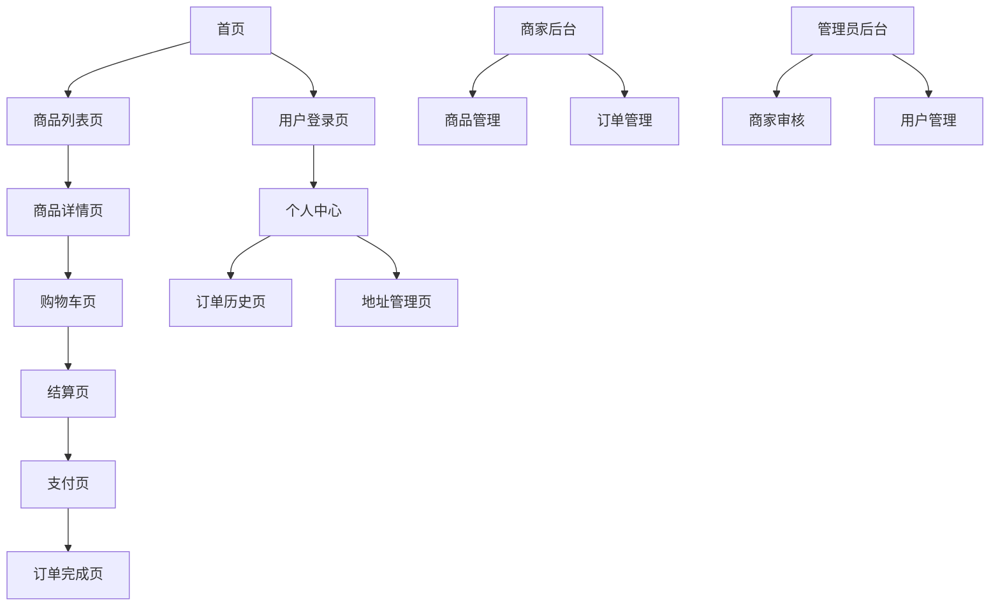

# 基于Spring Cloud的电商网站产品需求文档

## 1. 产品概述

本项目旨在打造一个面向中国消费者的现代化电商平台，采用Spring Cloud微服务架构，整体设计风格参考淘宝和京东，提供简洁现代的购物体验。平台支持多端访问，特别针对移动端进行了优化，为用户提供流畅的购物流程和丰富的商品展示。

产品解决了传统电商平台功能复杂、界面繁琐的问题，为消费者、商家和平台管理员提供了清晰易用的操作界面。通过微服务架构确保系统的高可用性和可扩展性，满足大规模用户访问需求。

目标是成为中国市场领先的现代化电商平台，提供优质的用户体验和完善的商业生态。

## 2. 核心功能

### 2.1 用户角色

| 角色 | 注册方式 | 核心权限 |
|------|----------|----------|
| 普通用户 | 手机号注册 | 浏览商品、购买下单、评价商品、查看订单 |
| 商家用户 | 平台审核入驻 | 商品管理、订单处理、店铺运营、数据查看 |
| 平台管理员 | 系统分配 | 商家审核、用户管理、系统监控、权限控制 |

### 2.2 功能模块

我们的电商平台包含以下核心页面：

1. **首页**：轮播图展示、新品推荐区域、热销商品列表、新用户注册弹窗
2. **用户认证页面**：手机号注册登录、验证码验证、密码找回
3. **商品展示页面**：商品分类列表、搜索筛选、商品详情展示
4. **购物流程页面**：购物车管理、订单结算、支付处理、地址管理
5. **商家管理页面**：商品上架管理、价格调整、订单处理、店铺设置
6. **管理员页面**：商家入驻审核、用户权限管理、系统监控
7. **个人中心页面**：订单历史、个人信息、地址管理、客服联系

### 2.3 页面详情

| 页面名称 | 模块名称 | 功能描述 |
|----------|----------|----------|
| 首页 | 轮播图模块 | 展示平台活动和热门商品，支持自动轮播和手动切换 |
| 首页 | 新品推荐 | 基于算法推荐新上架商品，支持个性化展示 |
| 首页 | 热销商品 | 展示销量排行榜商品，实时更新数据 |
| 首页 | 新用户弹窗 | 检测新用户并展示注册优惠信息 |
| 注册登录页 | 手机验证 | 支持手机号注册登录，短信验证码验证 |
| 注册登录页 | 密码管理 | 密码设置、找回密码、安全验证 |
| 商品列表页 | 分类筛选 | 多级分类导航、价格区间筛选、品牌筛选 |
| 商品列表页 | 搜索功能 | 关键词搜索、智能联想、搜索历史 |
| 商品详情页 | 商品展示 | 高清图片轮播、商品参数、库存状态 |
| 商品详情页 | 用户评价 | 评价列表、评分统计、图片评价 |
| 购物车页 | 商品管理 | 添加删除商品、数量调整、批量操作 |
| 结算页 | 订单确认 | 商品清单、收货地址选择、配送方式 |
| 支付页 | 支付方式 | 支持支付宝、微信支付、银行卡等多种支付方式 |
| 商家后台 | 商品管理 | 商品上架下架、价格修改、库存管理 |
| 商家后台 | 订单处理 | 订单查看、发货处理、售后服务 |
| 管理员后台 | 商家审核 | 商家入驻申请审核、资质验证 |
| 管理员后台 | 用户管理 | 用户权限设置、账号冻结封禁 |
| 个人中心 | 订单历史 | 历史订单查询、订单状态跟踪 |
| 个人中心 | 地址管理 | 收货地址增删改查、默认地址设置 |
| 个人中心 | 客服联系 | 邮件联系官方、在线客服入口 |

## 3. 核心流程

### 用户购物流程
用户首先在首页浏览商品推荐，通过搜索或分类找到目标商品，查看商品详情和用户评价后加入购物车。在购物车中确认商品信息，进入结算页面选择收货地址和配送方式，最后选择支付方式完成订单。

### 商家运营流程
商家通过入驻审核后，可以在商家后台上传商品信息，设置价格和库存，商品审核通过后上架销售。商家需要及时处理订单，安排发货，并处理用户的售后需求。

### 管理员管理流程
管理员负责审核商家入驻申请，监控平台运营数据，处理用户投诉和纠纷，维护平台秩序。对违规用户和商家进行相应的处罚措施。

## 4. 用户界面设计

### 4.1 设计风格

- **主色调**：#FF6B35（活力橙）作为主色，#1890FF（科技蓝）作为辅助色
- **按钮样式**：圆角矩形按钮，支持渐变效果和悬停动画
- **字体规范**：主标题18px，副标题16px，正文14px，使用系统默认字体
- **布局风格**：卡片式布局，顶部导航栏，响应式网格系统
- **图标风格**：使用线性图标，统一的视觉风格，避免使用emoji

### 4.2 页面设计概览

| 页面名称 | 模块名称 | UI元素 |
|----------|----------|--------|
| 首页 | 轮播图模块 | 全屏轮播图，指示器，自动播放控制，渐变遮罩效果 |
| 首页 | 商品推荐 | 网格布局商品卡片，商品图片，价格标签，快速购买按钮 |
| 商品列表页 | 筛选栏 | 侧边栏筛选器，价格滑块，多选标签，重置按钮 |
| 商品详情页 | 图片展示 | 大图预览，缩略图导航，放大镜效果，360度展示 |
| 购物车页 | 商品列表 | 商品卡片，数量选择器，删除按钮，批量选择 |
| 结算页 | 地址选择 | 地址卡片，新增地址按钮，默认地址标识 |
| 支付页 | 支付方式 | 支付图标，单选按钮，安全提示，倒计时 |
| 商家后台 | 数据看板 | 图表展示，数据卡片，趋势分析，实时更新 |
| 管理员后台 | 审核列表 | 表格布局，状态标签，操作按钮，批量处理 |

### 4.3 响应式设计

平台采用移动端优先的响应式设计策略，确保在手机、平板和桌面端都有良好的用户体验。移动端采用底部导航栏，桌面端使用顶部导航菜单。所有交互元素都针对触屏操作进行了优化，支持手势操作和触摸反馈。

## 5. 技术实现要求

### 5.1 前端技术栈
- Vue3 + Composition API
- Element Plus UI组件库
- Pinia状态管理
- Vue Router路由管理
- Axios HTTP客户端
- Vite构建工具

### 5.2 后端技术栈
- Spring Cloud微服务架构
- Spring Boot应用框架
- MySQL数据库
- Redis缓存
- RabbitMQ消息队列
- Nacos服务注册与配置中心

### 5.3 部署与运维
- Docker容器化部署
- Nginx反向代理
- 日志监控与告警
- 自动化CI/CD流程

### 5.4 安全与性能
- JWT身份认证
- HTTPS安全传输
- 接口限流与防刷
- 数据库读写分离
- CDN静态资源加速

## 6. 开发优先级

### 第一阶段（核心功能）
- 用户注册登录系统
- 商品展示与搜索
- 购物车与订单流程
- 基础支付功能

### 第二阶段（商家功能）
- 商家入驻与审核
- 商品管理后台
- 订单处理系统
- 数据统计分析

### 第三阶段（管理功能）
- 管理员后台
- 用户权限管理
- 系统监控告警
- 客服支持系统

### 第四阶段（优化完善）
- 性能优化
- 用户体验提升
- 移动端适配
- 安全加固

## 7. 验收标准

- 所有核心功能正常运行，无重大bug
- 页面加载速度小于3秒
- 移动端适配完整，操作流畅
- 支付流程安全可靠
- 用户界面美观现代
- 代码质量符合规范
- 系统稳定性达到99.9%
- 用户满意度达到90%以上