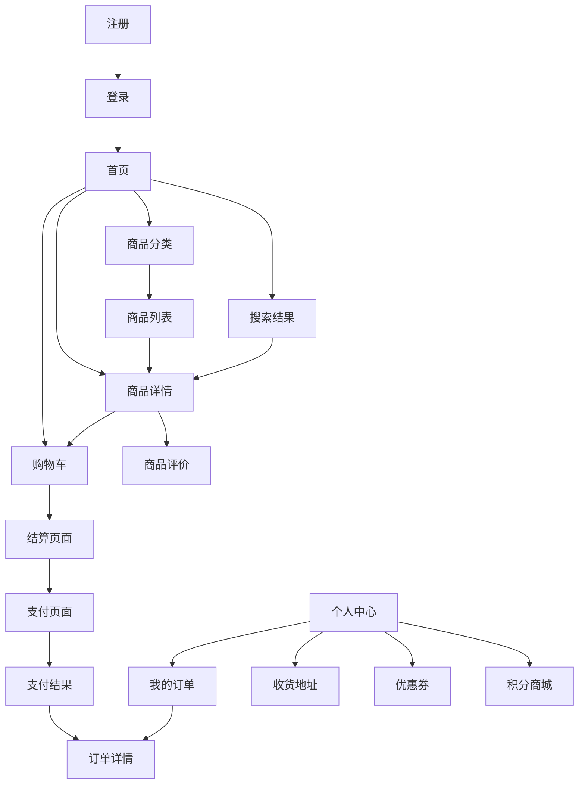

# 在线商城前端页面开发计划

## 1. 现有页面完成情况分析

### 1.1 已完成页面
| 页面名称 | 文件路径 | 完成度 | 功能状态 |
|---------|---------|-------|---------|
| 首页 | `/views/Home.vue` | 95% | 功能完整，包含轮播图、商品分类、秒杀活动等 |
| 登录页 | `/views/auth/login.vue` | 90% | 支持密码登录和短信验证码登录 |
| 注册页 | `/views/auth/register.vue` | 85% | 基础注册功能 |
| 购物车 | `/views/cart/index.vue` | 80% | 购物车基础功能 |
| 商品分类 | `/views/category/index.vue` | 70% | 分类展示页面 |
| 商品详情 | `/views/product/detail.vue` | 75% | 商品详情展示 |
| 搜索结果 | `/views/search/index.vue` | 70% | 商品搜索功能 |
| 结算页面 | `/views/checkout/index.vue` | 60% | 订单结算流程 |
| 个人中心 | `/views/user/index.vue` | 80% | 用户信息管理 |
| 个人信息 | `/views/user/profile.vue` | 75% | 用户资料编辑 |
| 我的订单 | `/views/user/orders.vue` | 70% | 订单管理 |
| 修改密码 | `/views/user/password.vue` | 85% | 密码修改功能 |
| 收货地址 | `/views/user/addresses.vue` | 75% | 地址管理 |
| 404错误页 | `/views/error/404.vue` | 100% | 错误页面 |
| 500错误页 | `/views/error/500.vue` | 100% | 错误页面 |

### 1.2 缺失页面
- 管理员后台页面（`/views/admin/`目录存在但内容未知）
- 商品列表页面（分类商品展示）
- 订单详情页面
- 支付页面
- 支付结果页面
- 商品评价页面
- 优惠券页面
- 积分商城页面
- 客服页面

## 2. 页面开发优先级

### 2.1 高优先级（核心购物流程）
1. **商品列表页面** - 完善分类商品展示
2. **订单详情页面** - 订单状态跟踪
3. **支付页面** - 支付流程
4. **支付结果页面** - 支付成功/失败反馈

### 2.2 中优先级（用户体验提升）
1. **商品评价页面** - 用户评价系统
2. **优惠券页面** - 营销功能
3. **积分商城页面** - 会员权益
4. **客服页面** - 用户服务

### 2.3 低优先级（管理功能）
1. **管理员后台页面** - 商品管理、订单管理、用户管理

## 3. 详细页面功能需求

### 3.1 商品列表页面 (`/views/product/list.vue`)
**功能需求：**
- 商品网格/列表展示切换
- 商品筛选（价格、品牌、属性）
- 商品排序（价格、销量、评价）
- 分页功能
- 商品收藏功能
- 快速加入购物车

**设计要求：**
- 响应式布局，支持移动端
- 商品卡片设计简洁美观
- 筛选条件侧边栏
- 面包屑导航

### 3.2 订单详情页面 (`/views/order/detail.vue`)
**功能需求：**
- 订单基本信息展示
- 订单状态跟踪
- 物流信息查询
- 订单操作（取消、确认收货、申请退款）
- 商品评价入口

**设计要求：**
- 订单状态时间轴
- 清晰的信息层级
- 操作按钮突出显示

### 3.3 支付页面 (`/views/payment/index.vue`)
**功能需求：**
- 订单信息确认
- 支付方式选择（支付宝、微信、银行卡）
- 优惠券使用
- 积分抵扣
- 支付密码输入

**设计要求：**
- 安全可信的视觉设计
- 支付流程清晰
- 支付方式图标明显

### 3.4 支付结果页面 (`/views/payment/result.vue`)
**功能需求：**
- 支付成功/失败状态显示
- 订单信息展示
- 后续操作引导
- 分享功能

**设计要求：**
- 状态图标清晰
- 成功页面要有庆祝感
- 失败页面要有安慰感

### 3.5 商品评价页面 (`/views/product/reviews.vue`)
**功能需求：**
- 评价列表展示
- 评价筛选（好评、中评、差评）
- 图片评价展示
- 评价点赞功能
- 商家回复展示

**设计要求：**
- 评价卡片设计
- 星级评分显示
- 图片预览功能

### 3.6 优惠券页面 (`/views/coupon/index.vue`)
**功能需求：**
- 可用优惠券列表
- 已使用/已过期优惠券
- 优惠券领取
- 优惠券使用规则展示

**设计要求：**
- 优惠券卡片设计
- 状态标识清晰
- 领取按钮突出

## 4. 页面间导航关系

## 5. 与后端API集成计划

### 5.1 商品相关API
- `GET /api/products` - 商品列表
- `GET /api/products/{id}` - 商品详情
- `GET /api/products/{id}/reviews` - 商品评价
- `POST /api/products/{id}/reviews` - 提交评价

### 5.2 订单相关API
- `GET /api/orders` - 订单列表
- `GET /api/orders/{id}` - 订单详情
- `POST /api/orders` - 创建订单
- `PUT /api/orders/{id}/status` - 更新订单状态

### 5.3 支付相关API
- `POST /api/payments/create` - 创建支付
- `GET /api/payments/{id}/status` - 查询支付状态
- `POST /api/payments/callback` - 支付回调

### 5.4 优惠券相关API
- `GET /api/coupons` - 优惠券列表
- `POST /api/coupons/{id}/claim` - 领取优惠券
- `POST /api/coupons/{id}/use` - 使用优惠券

## 6. 开发时间规划

### 第一阶段（1-2周）
- 完善商品列表页面
- 开发订单详情页面
- 优化现有页面的用户体验

### 第二阶段（2-3周）
- 开发支付相关页面
- 完善商品评价功能
- 集成支付API

### 第三阶段（1-2周）
- 开发营销相关页面（优惠券、积分）
- 完善用户中心功能
- 整体测试和优化

### 第四阶段（1周）
- 管理员后台开发
- 最终测试和部署准备

## 7. 技术要求

### 7.1 前端技术栈
- Vue 3 + Composition API
- Element Plus UI组件库
- Vue Router 4 路由管理
- Pinia 状态管理
- Axios HTTP客户端
- Vite 构建工具

### 7.2 代码规范
- 使用TypeScript（可选）
- ESLint代码检查
- Prettier代码格式化
- 组件化开发
- 响应式设计

### 7.3 性能优化
- 路由懒加载
- 图片懒加载
- 组件缓存
- API请求缓存
- 代码分割

## 8. 测试计划

### 8.1 单元测试
- 组件功能测试
- 工具函数测试
- API接口测试

### 8.2 集成测试
- 页面流程测试
- 用户操作测试
- 跨浏览器测试

### 8.3 用户体验测试
- 移动端适配测试
- 加载性能测试
- 用户交互测试

## 9. 部署计划

### 9.1 开发环境
- 本地开发服务器
- 热重载功能
- 开发工具集成

### 9.2 测试环境
- 测试服务器部署
- 自动化测试集成
- 性能监控

### 9.3 生产环境
- CDN部署
- 缓存策略
- 监控告警

---

**备注：** 此开发计划基于当前项目结构分析制定，具体实施时可根据实际需求和资源情况进行调整。