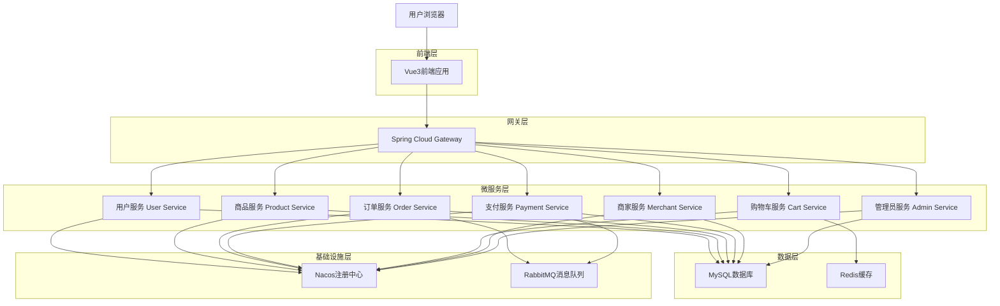
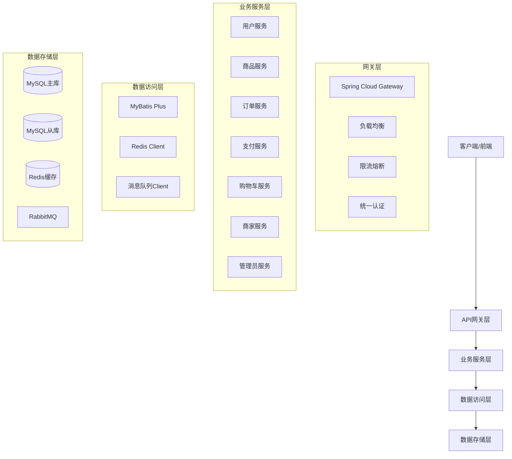
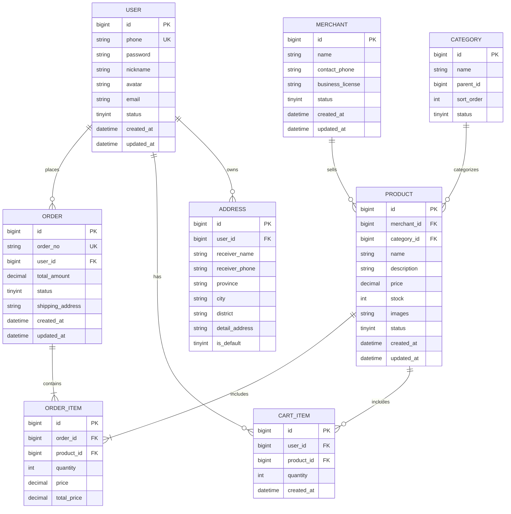

# 基于Spring Cloud的电商网站技术架构文档

## 1. 架构设计



## 2. 技术描述

- **前端**: Vue3@3.3.8 + Element Plus@2.4.2 + Pinia@2.1.7 + Vue Router@4.2.5 + Vite@4.5.0
- **后端**: Spring Cloud@2023.0.0 + Spring Boot@3.2.0 + Spring Security + MyBatis Plus
- **数据库**: MySQL@8.0 + Redis@7.0
- **消息队列**: RabbitMQ@3.12
- **服务治理**: Nacos@2.3.0 (注册中心 + 配置中心)
- **网关**: Spring Cloud Gateway@4.1.0
- **容器化**: Docker + Docker Compose

## 3. 路由定义

| 路由 | 用途 |
|------|------|
| / | 首页，展示轮播图、新品推荐、热销商品 |
| /login | 登录页面，支持手机号登录 |
| /register | 注册页面，手机号注册验证 |
| /products | 商品列表页，分类筛选和搜索 |
| /product/:id | 商品详情页，展示商品信息和用户评价 |
| /cart | 购物车页面，商品管理和批量操作 |
| /checkout | 结算页面，地址选择和订单确认 |
| /payment | 支付页面，多种支付方式选择 |
| /orders | 订单历史页面，订单状态跟踪 |
| /profile | 个人中心，用户信息和地址管理 |
| /merchant | 商家后台首页，数据看板 |
| /merchant/products | 商家商品管理页面 |
| /merchant/orders | 商家订单管理页面 |
| /admin | 管理员后台首页 |
| /admin/merchants | 商家审核管理页面 |
| /admin/users | 用户权限管理页面 |
| /contact | 客服联系页面，邮件支持 |

## 4. API定义

### 4.1 核心API

**用户认证相关**
```
POST /api/auth/login
```

请求参数:
| 参数名 | 参数类型 | 是否必需 | 描述 |
|--------|----------|----------|------|
| phone | string | true | 用户手机号 |
| password | string | true | 用户密码 |
| verifyCode | string | false | 短信验证码（可选） |

响应参数:
| 参数名 | 参数类型 | 描述 |
|--------|----------|------|
| success | boolean | 登录是否成功 |
| token | string | JWT访问令牌 |
| userInfo | object | 用户基本信息 |

请求示例:
```json
{
  "phone": "13800138000",
  "password": "123456",
  "verifyCode": "8888"
}
```

**商品查询相关**
```
GET /api/products
```

请求参数:
| 参数名 | 参数类型 | 是否必需 | 描述 |
|--------|----------|----------|------|
| page | number | false | 页码，默认1 |
| size | number | false | 每页数量，默认20 |
| category | string | false | 商品分类ID |
| keyword | string | false | 搜索关键词 |
| minPrice | number | false | 最低价格 |
| maxPrice | number | false | 最高价格 |

响应参数:
| 参数名 | 参数类型 | 描述 |
|--------|----------|------|
| success | boolean | 请求是否成功 |
| data | array | 商品列表数据 |
| total | number | 商品总数 |
| page | number | 当前页码 |

**订单处理相关**
```
POST /api/orders
```

请求参数:
| 参数名 | 参数类型 | 是否必需 | 描述 |
|--------|----------|----------|------|
| items | array | true | 订单商品列表 |
| addressId | string | true | 收货地址ID |
| paymentMethod | string | true | 支付方式 |
| remark | string | false | 订单备注 |

响应参数:
| 参数名 | 参数类型 | 描述 |
|--------|----------|------|
| success | boolean | 创建是否成功 |
| orderId | string | 订单ID |
| paymentUrl | string | 支付链接 |

**支付处理相关**
```
POST /api/payments/create
```

请求参数:
| 参数名 | 参数类型 | 是否必需 | 描述 |
|--------|----------|----------|------|
| orderId | string | true | 订单ID |
| paymentMethod | string | true | 支付方式(alipay/wechat/bank) |
| amount | number | true | 支付金额 |

响应参数:
| 参数名 | 参数类型 | 描述 |
|--------|----------|------|
| success | boolean | 创建是否成功 |
| paymentId | string | 支付单ID |
| qrCode | string | 支付二维码 |
| redirectUrl | string | 支付跳转链接 |

## 5. 服务架构图



## 6. 数据模型

### 6.1 数据模型定义



### 6.2 数据定义语言

**用户表 (users)**
```sql
-- 创建用户表
CREATE TABLE users (
    id BIGINT PRIMARY KEY AUTO_INCREMENT,
    phone VARCHAR(20) UNIQUE NOT NULL COMMENT '手机号',
    password VARCHAR(255) NOT NULL COMMENT '密码哈希',
    nickname VARCHAR(50) NOT NULL COMMENT '用户昵称',
    avatar VARCHAR(255) COMMENT '头像URL',
    email VARCHAR(100) COMMENT '邮箱地址',
    status TINYINT DEFAULT 1 COMMENT '状态：1正常 0冻结',
    created_at TIMESTAMP DEFAULT CURRENT_TIMESTAMP,
    updated_at TIMESTAMP DEFAULT CURRENT_TIMESTAMP ON UPDATE CURRENT_TIMESTAMP
);

-- 创建索引
CREATE INDEX idx_users_phone ON users(phone);
CREATE INDEX idx_users_status ON users(status);
CREATE INDEX idx_users_created_at ON users(created_at DESC);

-- 初始化数据
INSERT INTO users (phone, password, nickname, email, status) VALUES
('13800138000', '$2a$10$N.zmdr9k7uOCQb376NoUnuTJ8iKXIGfKx6Oj.P1.xRwxlr6pMzYAa', '测试用户', 'test@example.com', 1);
```

**商品表 (products)**
```sql
-- 创建商品表
CREATE TABLE products (
    id BIGINT PRIMARY KEY AUTO_INCREMENT,
    merchant_id BIGINT NOT NULL COMMENT '商家ID',
    category_id BIGINT NOT NULL COMMENT '分类ID',
    name VARCHAR(200) NOT NULL COMMENT '商品名称',
    description TEXT COMMENT '商品描述',
    price DECIMAL(10,2) NOT NULL COMMENT '商品价格',
    stock INT DEFAULT 0 COMMENT '库存数量',
    images JSON COMMENT '商品图片JSON数组',
    status TINYINT DEFAULT 1 COMMENT '状态：1上架 0下架',
    created_at TIMESTAMP DEFAULT CURRENT_TIMESTAMP,
    updated_at TIMESTAMP DEFAULT CURRENT_TIMESTAMP ON UPDATE CURRENT_TIMESTAMP
);

-- 创建索引
CREATE INDEX idx_products_merchant_id ON products(merchant_id);
CREATE INDEX idx_products_category_id ON products(category_id);
CREATE INDEX idx_products_status ON products(status);
CREATE INDEX idx_products_price ON products(price);
CREATE INDEX idx_products_created_at ON products(created_at DESC);

-- 初始化数据
INSERT INTO products (merchant_id, category_id, name, description, price, stock, images, status) VALUES
(1, 1, 'iPhone 15 Pro', '苹果最新旗舰手机', 7999.00, 100, '["https://example.com/iphone1.jpg"]', 1),
(1, 2, 'MacBook Pro', '专业级笔记本电脑', 12999.00, 50, '["https://example.com/macbook1.jpg"]', 1);
```

**订单表 (orders)**
```sql
-- 创建订单表
CREATE TABLE orders (
    id BIGINT PRIMARY KEY AUTO_INCREMENT,
    order_no VARCHAR(32) UNIQUE NOT NULL COMMENT '订单号',
    user_id BIGINT NOT NULL COMMENT '用户ID',
    total_amount DECIMAL(10,2) NOT NULL COMMENT '订单总金额',
    status TINYINT DEFAULT 1 COMMENT '订单状态：1待付款 2已付款 3已发货 4已完成 5已取消',
    shipping_address JSON NOT NULL COMMENT '收货地址JSON',
    remark VARCHAR(500) COMMENT '订单备注',
    created_at TIMESTAMP DEFAULT CURRENT_TIMESTAMP,
    updated_at TIMESTAMP DEFAULT CURRENT_TIMESTAMP ON UPDATE CURRENT_TIMESTAMP
);

-- 创建索引
CREATE INDEX idx_orders_user_id ON orders(user_id);
CREATE INDEX idx_orders_status ON orders(status);
CREATE INDEX idx_orders_created_at ON orders(created_at DESC);
CREATE INDEX idx_orders_order_no ON orders(order_no);
```

**订单项表 (order_items)**
```sql
-- 创建订单项表
CREATE TABLE order_items (
    id BIGINT PRIMARY KEY AUTO_INCREMENT,
    order_id BIGINT NOT NULL COMMENT '订单ID',
    product_id BIGINT NOT NULL COMMENT '商品ID',
    quantity INT NOT NULL COMMENT '购买数量',
    price DECIMAL(10,2) NOT NULL COMMENT '商品单价',
    total_price DECIMAL(10,2) NOT NULL COMMENT '小计金额'
);

-- 创建索引
CREATE INDEX idx_order_items_order_id ON order_items(order_id);
CREATE INDEX idx_order_items_product_id ON order_items(product_id);
```

**购物车表 (cart_items)**
```sql
-- 创建购物车表
CREATE TABLE cart_items (
    id BIGINT PRIMARY KEY AUTO_INCREMENT,
    user_id BIGINT NOT NULL COMMENT '用户ID',
    product_id BIGINT NOT NULL COMMENT '商品ID',
    quantity INT NOT NULL COMMENT '商品数量',
    created_at TIMESTAMP DEFAULT CURRENT_TIMESTAMP,
    UNIQUE KEY uk_user_product (user_id, product_id)
);

-- 创建索引
CREATE INDEX idx_cart_items_user_id ON cart_items(user_id);
CREATE INDEX idx_cart_items_created_at ON cart_items(created_at DESC);
```

**商家表 (merchants)**
```sql
-- 创建商家表
CREATE TABLE merchants (
    id BIGINT PRIMARY KEY AUTO_INCREMENT,
    name VARCHAR(100) NOT NULL COMMENT '商家名称',
    contact_phone VARCHAR(20) NOT NULL COMMENT '联系电话',
    contact_email VARCHAR(100) COMMENT '联系邮箱',
    business_license VARCHAR(255) COMMENT '营业执照',
    status TINYINT DEFAULT 0 COMMENT '状态：0待审核 1正常 2冻结',
    created_at TIMESTAMP DEFAULT CURRENT_TIMESTAMP,
    updated_at TIMESTAMP DEFAULT CURRENT_TIMESTAMP ON UPDATE CURRENT_TIMESTAMP
);

-- 创建索引
CREATE INDEX idx_merchants_status ON merchants(status);
CREATE INDEX idx_merchants_created_at ON merchants(created_at DESC);

-- 初始化数据
INSERT INTO merchants (name, contact_phone, contact_email, business_license, status) VALUES
('苹果官方旗舰店', '400-666-8800', 'apple@example.com', 'BL123456789', 1);
```

**分类表 (categories)**
```sql
-- 创建分类表
CREATE TABLE categories (
    id BIGINT PRIMARY KEY AUTO_INCREMENT,
    name VARCHAR(50) NOT NULL COMMENT '分类名称',
    parent_id BIGINT DEFAULT 0 COMMENT '父分类ID',
    sort_order INT DEFAULT 0 COMMENT '排序',
    status TINYINT DEFAULT 1 COMMENT '状态：1启用 0禁用'
);

-- 创建索引
CREATE INDEX idx_categories_parent_id ON categories(parent_id);
CREATE INDEX idx_categories_sort_order ON categories(sort_order);

-- 初始化数据
INSERT INTO categories (name, parent_id, sort_order, status) VALUES
('数码电子', 0, 1, 1),
('手机通讯', 1, 1, 1),
('电脑办公', 1, 2, 1),
('家用电器', 0, 2, 1);
```

**地址表 (addresses)**
```sql
-- 创建地址表
CREATE TABLE addresses (
    id BIGINT PRIMARY KEY AUTO_INCREMENT,
    user_id BIGINT NOT NULL COMMENT '用户ID',
    receiver_name VARCHAR(50) NOT NULL COMMENT '收货人姓名',
    receiver_phone VARCHAR(20) NOT NULL COMMENT '收货人电话',
    province VARCHAR(20) NOT NULL COMMENT '省份',
    city VARCHAR(20) NOT NULL COMMENT '城市',
    district VARCHAR(20) NOT NULL COMMENT '区县',
    detail_address VARCHAR(200) NOT NULL COMMENT '详细地址',
    is_default TINYINT DEFAULT 0 COMMENT '是否默认地址：1是 0否',
    created_at TIMESTAMP DEFAULT CURRENT_TIMESTAMP,
    updated_at TIMESTAMP DEFAULT CURRENT_TIMESTAMP ON UPDATE CURRENT_TIMESTAMP
);

-- 创建索引
CREATE INDEX idx_addresses_user_id ON addresses(user_id);
CREATE INDEX idx_addresses_is_default ON addresses(is_default);
```