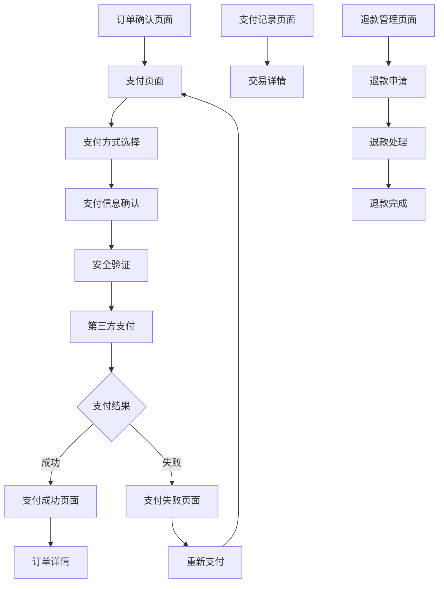

# 支付服务产品需求文档

## 1. Product Overview
支付服务是在线商城系统的核心金融模块，为用户提供安全、便捷的多渠道支付解决方案。
- 主要解决用户在线支付需求，支持主流支付方式，确保交易安全和资金流转的可靠性。
- 目标是构建高可用、高安全性的支付平台，支撑电商业务的快速发展和用户体验提升。

## 2. Core Features

### 2.1 User Roles
| Role | Registration Method | Core Permissions |
|------|---------------------|------------------|
| 普通用户 | 系统注册用户 | 发起支付、查看支付记录、申请退款 |
| 商户管理员 | 商户认证注册 | 查看收款记录、处理退款、查看支付统计 |
| 系统管理员 | 内部分配权限 | 支付配置管理、风控规则设置、全局数据查看 |

### 2.2 Feature Module
我们的支付服务需求包含以下主要页面：
1. **支付页面**：支付方式选择、支付信息确认、支付密码输入。
2. **支付结果页面**：支付成功/失败提示、订单状态显示、后续操作引导。
3. **支付记录页面**：历史支付记录、交易详情查看、支付状态跟踪。
4. **退款管理页面**：退款申请、退款进度查询、退款记录管理。
5. **支付统计页面**：支付数据分析、收入统计图表、支付方式分布。

### 2.3 Page Details
| Page Name | Module Name | Feature description |
|-----------|-------------|---------------------|
| 支付页面 | 支付方式选择 | 显示可用支付方式（支付宝、微信、银行卡），支持快捷支付和扫码支付 |
| 支付页面 | 支付信息确认 | 展示订单金额、商品信息、收款方信息，确保支付信息准确性 |
| 支付页面 | 安全验证 | 支付密码验证、短信验证码、人脸识别等多重安全验证 |
| 支付结果页面 | 结果展示 | 显示支付成功/失败状态，提供交易流水号和时间戳 |
| 支付结果页面 | 操作引导 | 支付成功后跳转订单详情，失败后提供重试或更换支付方式选项 |
| 支付记录页面 | 记录列表 | 按时间倒序显示支付记录，支持按状态、金额、时间筛选 |
| 支付记录页面 | 交易详情 | 显示完整交易信息，包括商品详情、支付渠道、手续费等 |
| 退款管理页面 | 退款申请 | 选择退款原因、填写退款金额、上传凭证材料 |
| 退款管理页面 | 进度跟踪 | 实时显示退款处理进度，包括审核、处理、到账各阶段 |
| 支付统计页面 | 数据概览 | 显示总交易额、成功率、平均交易金额等关键指标 |
| 支付统计页面 | 图表分析 | 交易趋势图、支付方式占比、时段分布等可视化分析 |

## 3. Core Process

### 普通用户支付流程
用户在订单确认页面选择支付方式 → 跳转到支付页面确认支付信息 → 进行安全验证（密码/短信/生物识别） → 调用第三方支付接口 → 等待支付结果 → 显示支付成功/失败页面 → 返回订单详情或重新支付

### 商户管理员流程
登录商户后台 → 查看收款记录和统计数据 → 处理用户退款申请 → 设置支付配置参数 → 导出财务报表

### 系统管理员流程
登录管理后台 → 配置支付渠道参数 → 设置风控规则和限额 → 监控支付系统状态 → 处理异常交易和投诉

## 4. User Interface Design

### 4.1 Design Style
- **主色调**：蓝色系 (#1890FF) 体现信任和安全感，辅助色为绿色 (#52C41A) 表示成功状态
- **按钮样式**：圆角矩形按钮，主要按钮使用渐变效果，次要按钮使用边框样式
- **字体**：主标题使用 18px 粗体，正文使用 14px 常规字体，金额数字使用等宽字体
- **布局风格**：卡片式布局，清晰的信息层级，充足的留白空间
- **图标风格**：使用线性图标风格，支付方式图标使用官方标准图标

### 4.2 Page Design Overview
| Page Name | Module Name | UI Elements |
|-----------|-------------|-------------|
| 支付页面 | 支付方式选择 | 卡片式支付方式列表，每个支付方式包含图标、名称和选择状态，使用蓝色边框高亮选中项 |
| 支付页面 | 支付信息确认 | 订单信息卡片，包含商品缩略图、金额高亮显示（红色大字体），确认按钮使用主色调 |
| 支付结果页面 | 结果展示 | 大图标状态指示（成功绿色勾号/失败红色叉号），状态文字使用对应颜色，交易号使用灰色小字 |
| 支付记录页面 | 记录列表 | 时间轴式布局，每条记录包含时间、金额、状态标签，状态使用不同颜色区分（成功绿色、失败红色、处理中橙色） |
| 退款管理页面 | 退款申请 | 表单式布局，退款原因使用下拉选择，金额输入框带有格式验证，上传区域使用虚线边框 |
| 支付统计页面 | 数据概览 | 仪表盘式布局，关键指标使用大数字显示，配色使用渐变卡片，图表使用蓝色系配色方案 |

### 4.3 Responsiveness
支付服务采用移动优先的响应式设计，支持桌面端和移动端自适应。移动端优化触摸交互，支付按钮区域增大，支持指纹和面部识别等生物识别支付方式。桌面端提供更丰富的数据展示和批量操作功能。