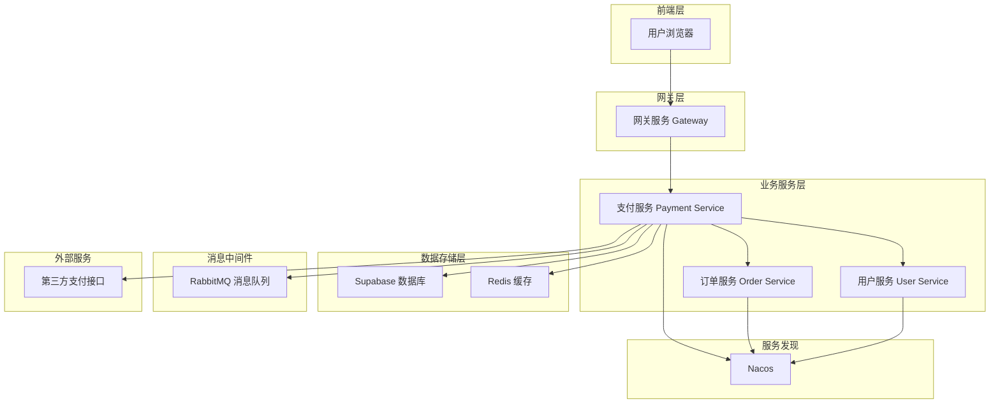
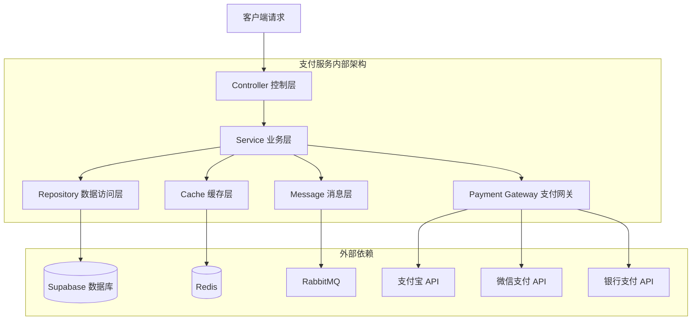
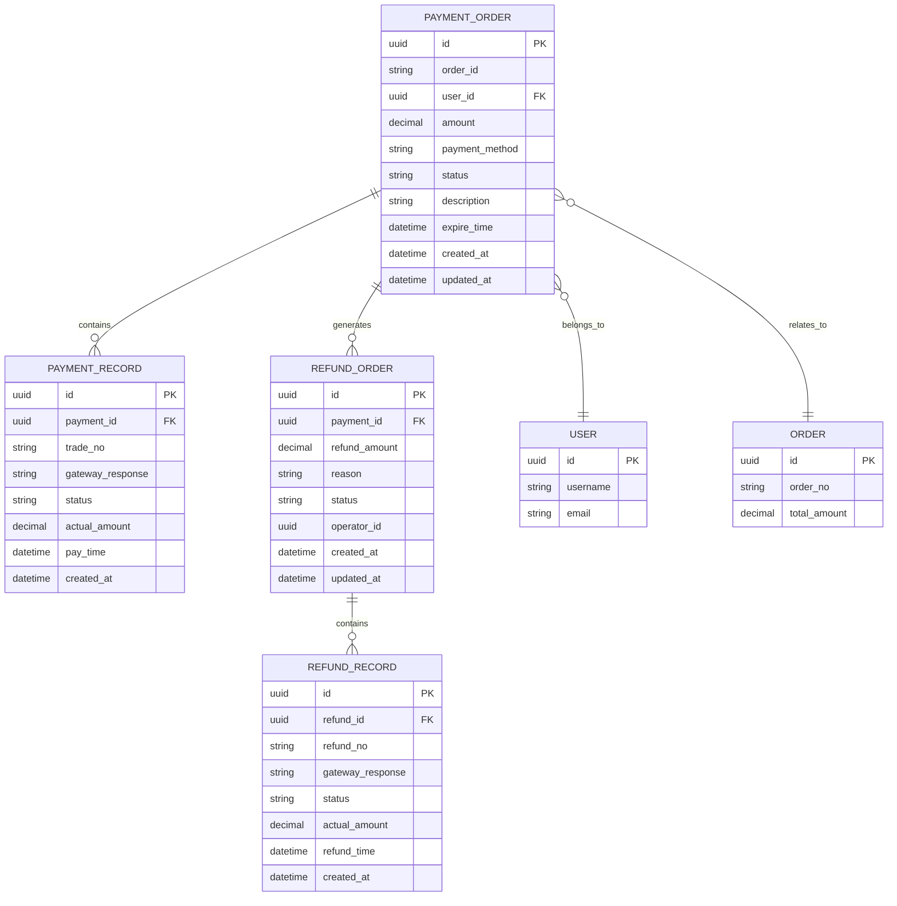

# 支付服务技术架构文档

## 1. Architecture design



## 2. Technology Description

- Frontend: React@18 + Ant Design@5 + TypeScript + Vite
- Backend: Spring Boot@2.7.x + Spring Cloud@2021.0.x + MyBatis-Plus@3.5.x
- Database: Supabase (PostgreSQL) + Redis@7.0
- Message Queue: RabbitMQ@3.11
- Service Discovery: Nacos@2.2.x
- Security: Spring Security + JWT + PCI DSS 合规
- Monitoring: Micrometer + Prometheus + Grafana

## 3. Route definitions

| Route | Purpose |
|-------|---------|
| /payment/create | 创建支付订单，生成支付参数 |
| /payment/callback | 接收第三方支付回调通知 |
| /payment/query | 查询支付状态和支付记录 |
| /payment/cancel | 取消支付订单 |
| /payment/refund | 发起退款申请 |
| /payment/refund/query | 查询退款状态 |
| /payment/methods | 获取可用支付方式列表 |
| /payment/statistics | 获取支付统计数据 |
| /payment/webhook | 处理支付平台 Webhook 通知 |

## 4. API definitions

### 4.1 Core API

#### 创建支付订单
```
POST /api/payment/create
```

Request:
| Param Name | Param Type | isRequired | Description |
|------------|------------|------------|-------------|
| orderId | string | true | 订单ID |
| amount | decimal | true | 支付金额（分为单位） |
| paymentMethod | string | true | 支付方式（ALIPAY/WECHAT/BANK_CARD） |
| userId | string | true | 用户ID |
| description | string | false | 支付描述 |
| returnUrl | string | false | 支付成功返回URL |
| notifyUrl | string | false | 异步通知URL |

Response:
| Param Name | Param Type | Description |
|------------|------------|-------------|
| paymentId | string | 支付订单ID |
| paymentUrl | string | 支付跳转URL |
| qrCode | string | 支付二维码（扫码支付） |
| expireTime | datetime | 支付过期时间 |

Example:
```json
{
  "orderId": "ORDER_20241201_001",
  "amount": 9999,
  "paymentMethod": "ALIPAY",
  "userId": "user_123",
  "description": "商品购买支付"
}
```

#### 支付回调处理
```
POST /api/payment/callback/{paymentMethod}
```

Request:
| Param Name | Param Type | isRequired | Description |
|------------|------------|------------|-------------|
| paymentId | string | true | 支付订单ID |
| tradeNo | string | true | 第三方交易号 |
| status | string | true | 支付状态 |
| amount | decimal | true | 实际支付金额 |
| signature | string | true | 签名验证 |

Response:
| Param Name | Param Type | Description |
|------------|------------|-------------|
| success | boolean | 处理结果 |
| message | string | 处理消息 |

#### 查询支付状态
```
GET /api/payment/query/{paymentId}
```

Response:
| Param Name | Param Type | Description |
|------------|------------|-------------|
| paymentId | string | 支付订单ID |
| status | string | 支付状态 |
| amount | decimal | 支付金额 |
| paymentMethod | string | 支付方式 |
| createTime | datetime | 创建时间 |
| payTime | datetime | 支付时间 |

#### 发起退款
```
POST /api/payment/refund
```

Request:
| Param Name | Param Type | isRequired | Description |
|------------|------------|------------|-------------|
| paymentId | string | true | 原支付订单ID |
| refundAmount | decimal | true | 退款金额 |
| reason | string | true | 退款原因 |
| userId | string | true | 申请用户ID |

Response:
| Param Name | Param Type | Description |
|------------|------------|-------------|
| refundId | string | 退款订单ID |
| status | string | 退款状态 |
| estimatedTime | datetime | 预计到账时间 |

## 5. Server architecture diagram



## 6. Data model

### 6.1 Data model definition



### 6.2 Data Definition Language

#### 支付订单表 (payment_orders)
```sql
-- 创建支付订单表
CREATE TABLE payment_orders (
    id UUID PRIMARY KEY DEFAULT gen_random_uuid(),
    order_id VARCHAR(64) NOT NULL COMMENT '业务订单ID',
    user_id UUID NOT NULL COMMENT '用户ID',
    amount DECIMAL(15,2) NOT NULL COMMENT '支付金额',
    payment_method VARCHAR(20) NOT NULL COMMENT '支付方式',
    status VARCHAR(20) DEFAULT 'PENDING' COMMENT '支付状态',
    description VARCHAR(255) COMMENT '支付描述',
    return_url VARCHAR(500) COMMENT '返回URL',
    notify_url VARCHAR(500) COMMENT '通知URL',
    expire_time TIMESTAMP WITH TIME ZONE COMMENT '过期时间',
    created_at TIMESTAMP WITH TIME ZONE DEFAULT NOW(),
    updated_at TIMESTAMP WITH TIME ZONE DEFAULT NOW()
);

-- 创建索引
CREATE INDEX idx_payment_orders_order_id ON payment_orders(order_id);
CREATE INDEX idx_payment_orders_user_id ON payment_orders(user_id);
CREATE INDEX idx_payment_orders_status ON payment_orders(status);
CREATE INDEX idx_payment_orders_created_at ON payment_orders(created_at DESC);

-- 设置权限
GRANT SELECT ON payment_orders TO anon;
GRANT ALL PRIVILEGES ON payment_orders TO authenticated;
```

#### 支付记录表 (payment_records)
```sql
-- 创建支付记录表
CREATE TABLE payment_records (
    id UUID PRIMARY KEY DEFAULT gen_random_uuid(),
    payment_id UUID NOT NULL REFERENCES payment_orders(id),
    trade_no VARCHAR(64) COMMENT '第三方交易号',
    gateway_response TEXT COMMENT '网关响应',
    status VARCHAR(20) NOT NULL COMMENT '记录状态',
    actual_amount DECIMAL(15,2) COMMENT '实际支付金额',
    pay_time TIMESTAMP WITH TIME ZONE COMMENT '支付时间',
    created_at TIMESTAMP WITH TIME ZONE DEFAULT NOW()
);

-- 创建索引
CREATE INDEX idx_payment_records_payment_id ON payment_records(payment_id);
CREATE INDEX idx_payment_records_trade_no ON payment_records(trade_no);
CREATE INDEX idx_payment_records_pay_time ON payment_records(pay_time DESC);

-- 设置权限
GRANT SELECT ON payment_records TO anon;
GRANT ALL PRIVILEGES ON payment_records TO authenticated;
```

#### 退款订单表 (refund_orders)
```sql
-- 创建退款订单表
CREATE TABLE refund_orders (
    id UUID PRIMARY KEY DEFAULT gen_random_uuid(),
    payment_id UUID NOT NULL REFERENCES payment_orders(id),
    refund_amount DECIMAL(15,2) NOT NULL COMMENT '退款金额',
    reason VARCHAR(255) NOT NULL COMMENT '退款原因',
    status VARCHAR(20) DEFAULT 'PENDING' COMMENT '退款状态',
    operator_id UUID COMMENT '操作员ID',
    created_at TIMESTAMP WITH TIME ZONE DEFAULT NOW(),
    updated_at TIMESTAMP WITH TIME ZONE DEFAULT NOW()
);

-- 创建索引
CREATE INDEX idx_refund_orders_payment_id ON refund_orders(payment_id);
CREATE INDEX idx_refund_orders_status ON refund_orders(status);
CREATE INDEX idx_refund_orders_created_at ON refund_orders(created_at DESC);

-- 设置权限
GRANT SELECT ON refund_orders TO anon;
GRANT ALL PRIVILEGES ON refund_orders TO authenticated;
```

#### 退款记录表 (refund_records)
```sql
-- 创建退款记录表
CREATE TABLE refund_records (
    id UUID PRIMARY KEY DEFAULT gen_random_uuid(),
    refund_id UUID NOT NULL REFERENCES refund_orders(id),
    refund_no VARCHAR(64) COMMENT '退款流水号',
    gateway_response TEXT COMMENT '网关响应',
    status VARCHAR(20) NOT NULL COMMENT '记录状态',
    actual_amount DECIMAL(15,2) COMMENT '实际退款金额',
    refund_time TIMESTAMP WITH TIME ZONE COMMENT '退款时间',
    created_at TIMESTAMP WITH TIME ZONE DEFAULT NOW()
);

-- 创建索引
CREATE INDEX idx_refund_records_refund_id ON refund_records(refund_id);
CREATE INDEX idx_refund_records_refund_no ON refund_records(refund_no);
CREATE INDEX idx_refund_records_refund_time ON refund_records(refund_time DESC);

-- 设置权限
GRANT SELECT ON refund_records TO anon;
GRANT ALL PRIVILEGES ON refund_records TO authenticated;
```

#### 初始化数据
```sql
-- 插入支付方式配置数据
INSERT INTO payment_orders (order_id, user_id, amount, payment_method, status, description)
VALUES 
    ('TEST_ORDER_001', gen_random_uuid(), 9999, 'ALIPAY', 'SUCCESS', '测试支付订单'),
    ('TEST_ORDER_002', gen_random_uuid(), 19999, 'WECHAT', 'PENDING', '微信支付测试');
```