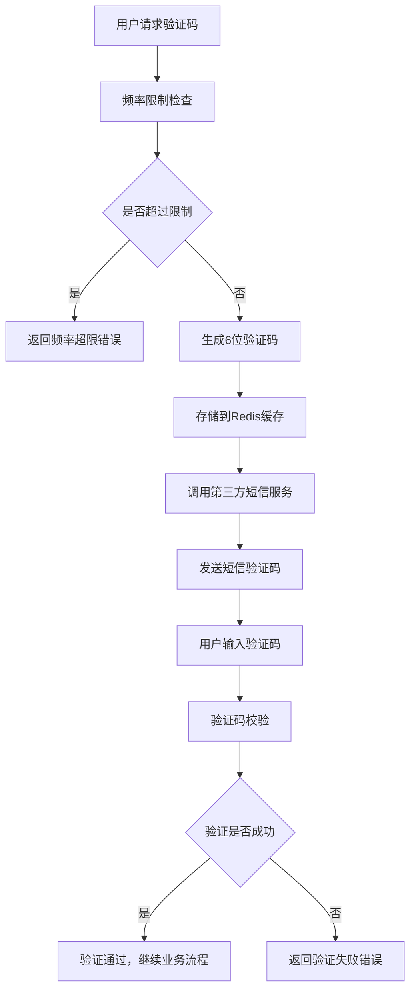

# 短信验证码服务 - 产品需求文档

## 1. 产品概述

短信验证码服务是SpringCloud电商项目中的核心安全组件，为用户注册、登录、密码重置等关键业务流程提供安全可靠的手机号验证功能。该服务通过集成第三方短信推送平台，实现高效、安全的验证码发送与验证机制。

- 主要目的：为电商平台提供安全的手机号验证服务，防止恶意注册和提升账户安全性
- 目标用户：所有需要进行手机号验证的平台用户
- 市场价值：提升用户账户安全性，降低虚假注册率，增强平台可信度

## 2. 核心功能

### 2.1 用户角色

| 角色 | 注册方法 | 核心权限 |
|------|----------|----------|
| 普通用户 | 手机号注册 | 可请求验证码、验证手机号 |
| 系统管理员 | 后台分配 | 可查看验证码发送统计、管理黑名单 |

### 2.2 功能模块

短信验证码服务包含以下核心页面和功能：

1. **验证码发送接口**：处理验证码生成和发送请求
2. **验证码验证接口**：验证用户输入的验证码是否正确
3. **管理后台页面**：查看发送统计和系统配置

### 2.3 页面详情

| 页面名称 | 模块名称 | 功能描述 |
|----------|----------|----------|
| 验证码发送接口 | 验证码生成模块 | 生成6位数字验证码，检查频率限制，调用第三方短信服务发送 |
| 验证码发送接口 | 频率控制模块 | 实现每分钟1次的发送频率限制，防止恶意请求 |
| 验证码发送接口 | 安全防护模块 | IP限制、参数校验、防爆破攻击机制 |
| 验证码验证接口 | 验证码校验模块 | 验证用户输入验证码的正确性和有效期 |
| 验证码验证接口 | 缓存管理模块 | 管理Redis中的验证码存储和过期机制 |
| 管理后台页面 | 统计报表模块 | 显示验证码发送成功率、频率统计等数据 |
| 管理后台页面 | 系统配置模块 | 配置服务参数、黑名单管理 |

## 3. 核心流程

### 用户验证码使用流程

用户在注册或登录时需要进行手机号验证，流程如下：
1. 用户输入手机号并点击"获取验证码"
2. 系统检查频率限制和安全规则
3. 生成6位数字验证码并存储到Redis
4. 调用第三方短信服务发送验证码
5. 用户收到短信并输入验证码
6. 系统验证验证码的正确性和有效期
7. 验证成功后继续后续业务流程

### 管理员监控流程

管理员可以通过后台监控验证码服务的运行状态：
1. 登录管理后台
2. 查看验证码发送统计报表
3. 监控异常发送行为
4. 配置系统参数和黑名单

## 4. 用户界面设计

### 4.1 设计风格

- **主色调**：#1890ff（蓝色）、#52c41a（绿色成功）、#ff4d4f（红色错误）
- **按钮样式**：圆角按钮，悬停效果，禁用状态灰色
- **字体**：系统默认字体，主要文字14px，提示文字12px
- **布局风格**：简洁的表单布局，响应式设计
- **图标风格**：线性图标，统一的视觉风格

### 4.2 页面设计概览

| 页面名称 | 模块名称 | UI元素 |
|----------|----------|---------|
| 验证码输入表单 | 手机号输入框 | 输入框样式：边框#d9d9d9，聚焦时#1890ff，错误时#ff4d4f |
| 验证码输入表单 | 获取验证码按钮 | 蓝色按钮，倒计时状态显示剩余秒数，禁用状态灰色 |
| 验证码输入表单 | 验证码输入框 | 6位数字输入框，自动聚焦，输入完成自动验证 |
| 管理后台 | 统计图表 | 使用ECharts展示发送量趋势，成功率饼图 |
| 管理后台 | 配置表单 | 简洁的配置项表单，实时保存功能 |

### 4.3 响应式设计

- **桌面端优先**：主要面向PC端管理后台
- **移动端适配**：验证码输入表单支持移动端触摸操作
- **触摸优化**：按钮大小适合手指点击，输入框支持数字键盘