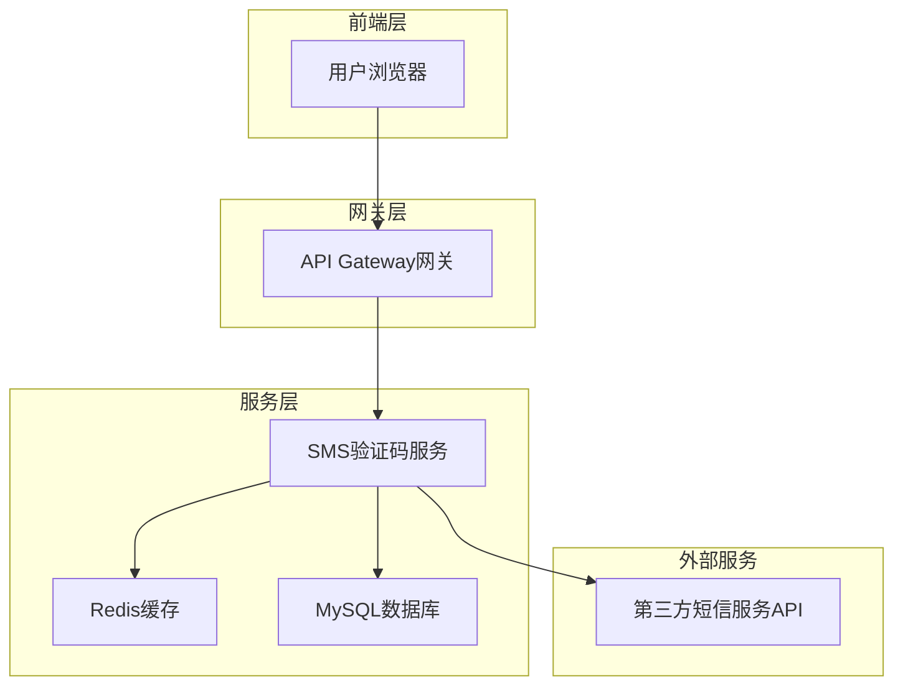
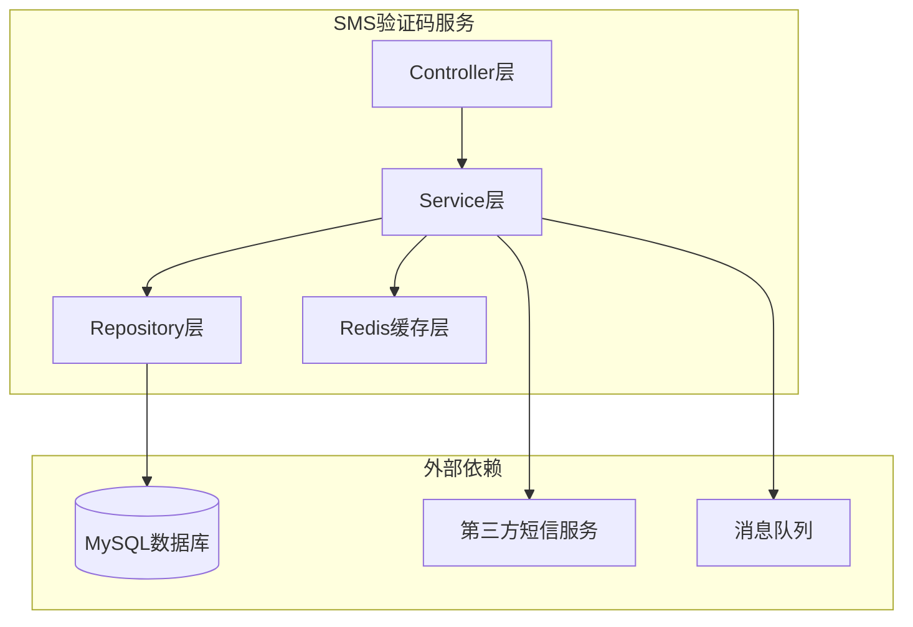
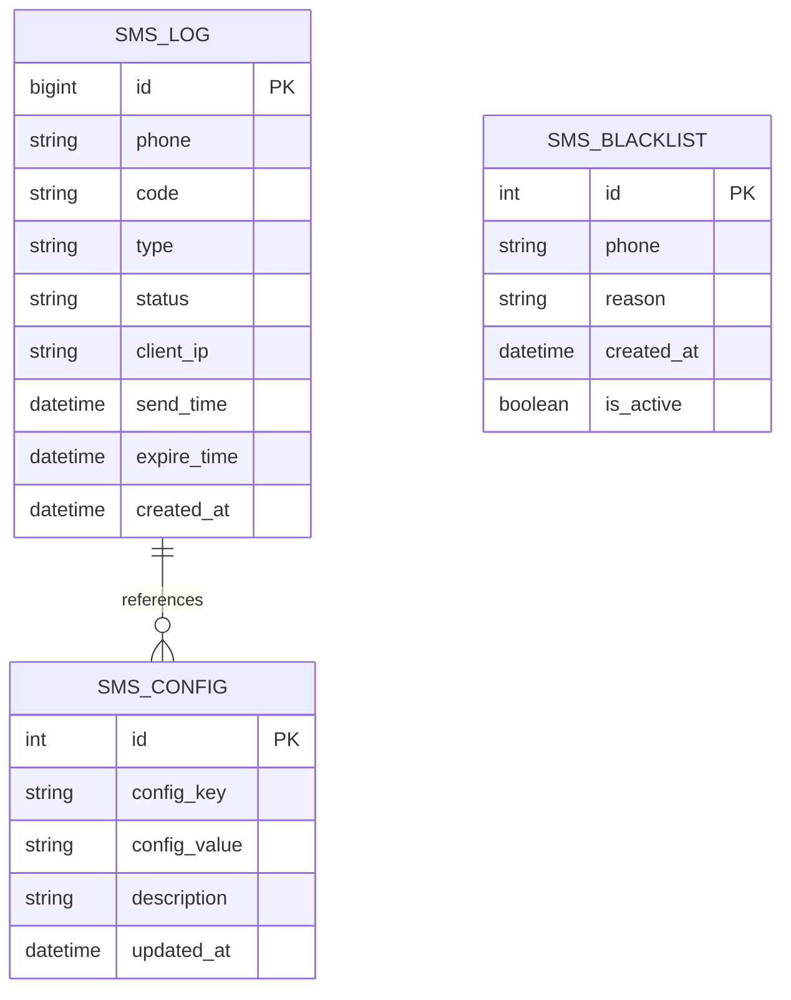

# 短信验证码服务 - 技术架构文档

## 1. 架构设计



## 2. 技术描述

- **前端**：Vue@3 + Element Plus + Axios
- **后端**：Spring Boot@3.2.5 + Spring Cloud@2023.0.1
- **缓存**：Redis@7.0（存储验证码和频率限制）
- **数据库**：MySQL@8.0（存储发送日志和配置）
- **消息队列**：RocketMQ（异步短信发送）
- **监控**：Spring Boot Actuator + Micrometer

## 3. 路由定义

| 路由 | 用途 |
|------|------|
| /api/sms/send | 发送验证码接口 |
| /api/sms/verify | 验证验证码接口 |
| /api/sms/admin/stats | 管理后台统计数据 |
| /api/sms/admin/config | 系统配置管理 |
| /api/sms/admin/blacklist | 黑名单管理 |

## 4. API定义

### 4.1 核心API

**发送验证码**
```
POST /api/sms/send
```

请求参数：
| 参数名 | 参数类型 | 是否必需 | 描述 |
|--------|----------|----------|------|
| phone | string | true | 手机号码（11位数字） |
| type | string | true | 验证码类型（register/login/reset） |
| clientIp | string | false | 客户端IP地址 |

响应参数：
| 参数名 | 参数类型 | 描述 |
|--------|----------|------|
| success | boolean | 发送是否成功 |
| message | string | 响应消息 |
| data | object | 响应数据 |

请求示例：
```json
{
  "phone": "18612345678",
  "type": "register",
  "clientIp": "192.168.1.100"
}
```

响应示例：
```json
{
  "success": true,
  "message": "验证码发送成功",
  "data": {
    "expireTime": 180,
    "nextSendTime": 60
  }
}
```

**验证验证码**
```
POST /api/sms/verify
```

请求参数：
| 参数名 | 参数类型 | 是否必需 | 描述 |
|--------|----------|----------|------|
| phone | string | true | 手机号码 |
| code | string | true | 6位验证码 |
| type | string | true | 验证码类型 |

响应参数：
| 参数名 | 参数类型 | 描述 |
|--------|----------|------|
| success | boolean | 验证是否成功 |
| message | string | 验证结果消息 |

## 5. 服务架构图



## 6. 数据模型

### 6.1 数据模型定义



### 6.2 数据定义语言

**短信发送日志表 (sms_log)**
```sql
-- 创建表
CREATE TABLE sms_log (
    id BIGINT PRIMARY KEY AUTO_INCREMENT,
    phone VARCHAR(11) NOT NULL COMMENT '手机号码',
    code VARCHAR(6) NOT NULL COMMENT '验证码',
    type VARCHAR(20) NOT NULL COMMENT '验证码类型',
    status VARCHAR(20) DEFAULT 'pending' COMMENT '发送状态',
    client_ip VARCHAR(45) COMMENT '客户端IP',
    send_time DATETIME DEFAULT CURRENT_TIMESTAMP COMMENT '发送时间',
    expire_time DATETIME COMMENT '过期时间',
    created_at DATETIME DEFAULT CURRENT_TIMESTAMP,
    updated_at DATETIME DEFAULT CURRENT_TIMESTAMP ON UPDATE CURRENT_TIMESTAMP
);

-- 创建索引
CREATE INDEX idx_sms_log_phone ON sms_log(phone);
CREATE INDEX idx_sms_log_send_time ON sms_log(send_time DESC);
CREATE INDEX idx_sms_log_status ON sms_log(status);

-- 系统配置表 (sms_config)
CREATE TABLE sms_config (
    id INT PRIMARY KEY AUTO_INCREMENT,
    config_key VARCHAR(50) UNIQUE NOT NULL COMMENT '配置键',
    config_value TEXT COMMENT '配置值',
    description VARCHAR(200) COMMENT '配置描述',
    created_at DATETIME DEFAULT CURRENT_TIMESTAMP,
    updated_at DATETIME DEFAULT CURRENT_TIMESTAMP ON UPDATE CURRENT_TIMESTAMP
);

-- 黑名单表 (sms_blacklist)
CREATE TABLE sms_blacklist (
    id INT PRIMARY KEY AUTO_INCREMENT,
    phone VARCHAR(11) UNIQUE NOT NULL COMMENT '手机号码',
    reason VARCHAR(200) COMMENT '加入黑名单原因',
    is_active BOOLEAN DEFAULT TRUE COMMENT '是否生效',
    created_at DATETIME DEFAULT CURRENT_TIMESTAMP,
    updated_at DATETIME DEFAULT CURRENT_TIMESTAMP ON UPDATE CURRENT_TIMESTAMP
);

-- 初始化配置数据
INSERT INTO sms_config (config_key, config_value, description) VALUES
('service_name', 'baichatmall', '服务名称标识'),
('code_length', '6', '验证码长度'),
('expire_seconds', '180', '验证码有效期（秒）'),
('rate_limit_seconds', '60', '发送频率限制（秒）'),
('max_daily_send', '10', '每日最大发送次数'),
('sms_api_url', 'https://push.spug.cc/send/zEMdom2N49mpgabP', '短信服务API地址');
```