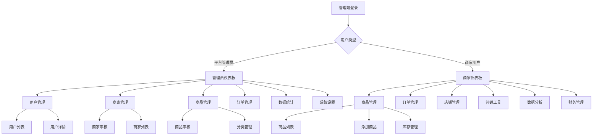

# 在线商城管理端页面开发计划

## 1. 项目概述

基于现有的在线商城项目，需要开发完整的管理端系统，包括平台管理员端和商家端两个独立的管理界面。管理端将采用现代化的后台管理系统设计，提供完整的商城运营和管理功能。

## 2. 核心功能模块

### 2.1 用户角色定义

| 角色 | 登录方式 | 核心权限 |
|------|----------|----------|
| 平台管理员 | 管理员账号密码登录 | 全平台数据管理、用户管理、商家管理、系统配置 |
| 商家用户 | 商家账号密码登录 | 店铺管理、商品管理、订单处理、数据分析 |

### 2.2 平台管理员端功能模块

我们的平台管理员端包含以下主要页面：

1. **管理员仪表板**: 数据概览、实时统计、快捷操作入口
2. **用户管理**: 用户列表、用户详情、用户状态管理、用户行为分析
3. **商家管理**: 商家审核、商家列表、商家详情、商家等级管理
4. **商品管理**: 商品审核、分类管理、品牌管理、商品举报处理
5. **订单管理**: 订单列表、订单详情、退款处理、纠纷处理
6. **数据统计**: 销售统计、用户统计、商品统计、平台运营报表
7. **系统设置**: 平台配置、公告管理、轮播图管理、系统参数配置
8. **权限管理**: 管理员账号管理、角色权限配置

### 2.3 商家端功能模块

我们的商家端包含以下主要页面：

1. **商家仪表板**: 销售概览、订单统计、商品统计、经营数据
2. **商品管理**: 商品列表、添加商品、编辑商品、库存管理、商品分析
3. **订单管理**: 订单列表、订单处理、发货管理、售后处理、退款管理
4. **店铺管理**: 店铺信息、店铺装修、客服设置、店铺公告
5. **营销工具**: 优惠券管理、促销活动、会员管理、营销数据
6. **数据分析**: 销售报表、商品分析、客户分析、流量统计
7. **财务管理**: 收入统计、提现管理、账单明细、结算记录
8. **设置中心**: 账号设置、通知设置、API配置

### 2.4 页面详情表

| 页面名称 | 模块名称 | 功能描述 |
|----------|----------|----------|
| 管理员仪表板 | 数据概览 | 显示平台核心数据、图表统计、快捷操作 |
| 管理员仪表板 | 实时监控 | 实时订单、用户活跃度、系统状态监控 |
| 用户管理 | 用户列表 | 分页展示用户、搜索筛选、批量操作 |
| 用户管理 | 用户详情 | 用户基本信息、订单历史、行为分析 |
| 商家管理 | 商家审核 | 商家入驻申请审核、资质验证、状态管理 |
| 商家管理 | 商家列表 | 商家信息展示、搜索筛选、状态管理 |
| 商品管理 | 商品审核 | 商品上架审核、违规商品处理、分类管理 |
| 商品管理 | 分类管理 | 商品分类树形结构、分类属性配置 |
| 订单管理 | 订单列表 | 全平台订单展示、状态筛选、批量处理 |
| 订单管理 | 退款处理 | 退款申请审核、退款流程管理 |
| 数据统计 | 销售统计 | 销售额趋势、商品销量排行、地区分析 |
| 数据统计 | 用户统计 | 用户增长趋势、活跃度分析、用户画像 |
| 系统设置 | 平台配置 | 系统参数配置、功能开关、基础设置 |
| 系统设置 | 公告管理 | 平台公告发布、轮播图管理、活动配置 |
| 商家仪表板 | 销售概览 | 店铺销售数据、订单趋势、商品表现 |
| 商家仪表板 | 经营分析 | 客户分析、流量统计、转化率分析 |
| 商品管理 | 商品列表 | 店铺商品展示、库存管理、价格调整 |
| 商品管理 | 添加商品 | 商品信息录入、图片上传、规格设置 |
| 订单管理 | 订单处理 | 订单确认、发货管理、物流跟踪 |
| 订单管理 | 售后处理 | 退换货处理、客户服务、纠纷解决 |
| 店铺管理 | 店铺装修 | 店铺首页设计、商品展示配置 |
| 店铺管理 | 客服设置 | 客服工具配置、自动回复设置 |
| 营销工具 | 优惠券管理 | 优惠券创建、发放规则、使用统计 |
| 营销工具 | 促销活动 | 活动创建、参与商品设置、效果分析 |
| 数据分析 | 销售报表 | 销售数据报表、趋势分析、对比分析 |
| 数据分析 | 商品分析 | 商品销量分析、库存预警、价格优化 |

## 3. 核心流程

### 3.1 平台管理员操作流程

管理员登录后进入仪表板，可以查看平台整体运营数据。通过用户管理模块处理用户相关事务，通过商家管理模块审核和管理入驻商家，通过商品管理模块审核商品和管理分类，通过订单管理模块处理平台订单和退款，通过数据统计模块分析平台运营情况，通过系统设置模块配置平台参数。

### 3.2 商家操作流程

商家登录后进入仪表板，查看店铺经营数据。通过商品管理模块管理店铺商品和库存，通过订单管理模块处理客户订单和售后，通过店铺管理模块维护店铺信息和装修，通过营销工具模块开展促销活动，通过数据分析模块分析经营情况，通过财务管理模块查看收入和提现。

### 3.3 页面导航流程图



## 4. 用户界面设计

### 4.1 设计风格

- **主色调**: 
  - 管理员端: 深蓝色 (#1890ff) 和白色 (#ffffff)
  - 商家端: 绿色 (#52c41a) 和白色 (#ffffff)
- **辅助色**: 灰色系 (#f0f2f5, #d9d9d9, #8c8c8c)
- **按钮样式**: 圆角按钮，支持多种状态（默认、悬停、禁用）
- **字体**: 系统默认字体，主要文字 14px，标题 16px-24px
- **布局风格**: 左侧导航 + 顶部面包屑 + 内容区域的经典后台布局
- **图标风格**: 使用 Element Plus 图标库，简洁现代

### 4.2 页面设计概览

| 页面名称 | 模块名称 | UI元素 |
|----------|----------|--------|
| 管理员仪表板 | 数据概览 | 卡片式数据展示、图表组件、快捷操作按钮 |
| 管理员仪表板 | 实时监控 | 实时数据刷新、状态指示器、告警提示 |
| 用户管理 | 用户列表 | 表格展示、搜索框、筛选器、分页组件 |
| 用户管理 | 用户详情 | 标签页布局、信息卡片、操作按钮组 |
| 商家管理 | 商家审核 | 审核流程步骤条、文件预览、审核表单 |
| 商品管理 | 商品审核 | 商品信息展示、图片预览、审核操作 |
| 订单管理 | 订单列表 | 订单状态标签、时间筛选、批量操作 |
| 数据统计 | 销售统计 | 图表组件、时间选择器、数据导出 |
| 系统设置 | 平台配置 | 表单组件、开关控件、保存按钮 |
| 商家仪表板 | 销售概览 | 数据卡片、趋势图表、快捷入口 |
| 商品管理 | 商品列表 | 商品卡片、状态管理、快速编辑 |
| 商品管理 | 添加商品 | 多步骤表单、图片上传、规格配置 |
| 订单管理 | 订单处理 | 订单详情、状态流转、操作日志 |
| 店铺管理 | 店铺装修 | 拖拽式编辑器、组件库、预览功能 |
| 营销工具 | 优惠券管理 | 优惠券模板、发放规则、使用统计 |
| 数据分析 | 销售报表 | 多维度图表、数据筛选、报表导出 |

### 4.3 响应式设计

- **桌面优先设计**: 主要面向桌面端使用，1200px以上最佳体验
- **平板适配**: 768px-1199px屏幕下侧边栏可折叠
- **移动端支持**: 768px以下提供基础功能访问，侧边栏变为抽屉式

## 5. 路由设计和权限控制

### 5.1 路由结构

```javascript
// 管理员端路由
/admin
  /dashboard          // 管理员仪表板
  /users             // 用户管理
    /list            // 用户列表
    /:id             // 用户详情
  /merchants         // 商家管理
    /audit           // 商家审核
    /list            // 商家列表
    /:id             // 商家详情
  /products          // 商品管理
    /audit           // 商品审核
    /categories      // 分类管理
    /brands          // 品牌管理
  /orders            // 订单管理
    /list            // 订单列表
    /refunds         // 退款处理
  /statistics        // 数据统计
    /sales           // 销售统计
    /users           // 用户统计
    /products        // 商品统计
  /settings          // 系统设置
    /platform        // 平台配置
    /announcements   // 公告管理
    /banners         // 轮播图管理

// 商家端路由
/merchant
  /dashboard         // 商家仪表板
  /products          // 商品管理
    /list            // 商品列表
    /add             // 添加商品
    /edit/:id        // 编辑商品
    /inventory       // 库存管理
  /orders            // 订单管理
    /list            // 订单列表
    /process/:id     // 订单处理
    /after-sales     // 售后处理
  /shop              // 店铺管理
    /info            // 店铺信息
    /decoration      // 店铺装修
    /service         // 客服设置
  /marketing         // 营销工具
    /coupons         // 优惠券管理
    /promotions      // 促销活动
    /members         // 会员管理
  /analytics         // 数据分析
    /sales           // 销售报表
    /products        // 商品分析
    /customers       // 客户分析
  /finance           // 财务管理
    /income          // 收入统计
    /withdraw        // 提现管理
    /bills           // 账单明细
  /settings          // 设置中心
    /account         // 账号设置
    /notifications   // 通知设置
```

### 5.2 权限控制机制

- **基于角色的访问控制 (RBAC)**: 区分管理员和商家两种角色
- **路由守卫**: 在路由层面进行权限验证
- **菜单权限**: 根据用户角色动态显示菜单
- **操作权限**: 在页面内部控制具体操作权限
- **数据权限**: 确保用户只能访问自己权限范围内的数据

## 6. API接口需求

### 6.1 管理员端API

**用户管理相关**
```
GET /admin/api/users - 获取用户列表
GET /admin/api/users/:id - 获取用户详情
PUT /admin/api/users/:id/status - 更新用户状态
DELETE /admin/api/users/:id - 删除用户
```

**商家管理相关**
```
GET /admin/api/merchants - 获取商家列表
GET /admin/api/merchants/:id - 获取商家详情
PUT /admin/api/merchants/:id/audit - 商家审核
PUT /admin/api/merchants/:id/status - 更新商家状态
```

**商品管理相关**
```
GET /admin/api/products - 获取商品列表
GET /admin/api/products/:id - 获取商品详情
PUT /admin/api/products/:id/audit - 商品审核
GET /admin/api/categories - 获取分类列表
POST /admin/api/categories - 创建分类
PUT /admin/api/categories/:id - 更新分类
DELETE /admin/api/categories/:id - 删除分类
```

**订单管理相关**
```
GET /admin/api/orders - 获取订单列表
GET /admin/api/orders/:id - 获取订单详情
GET /admin/api/refunds - 获取退款列表
PUT /admin/api/refunds/:id - 处理退款
```

**数据统计相关**
```
GET /admin/api/statistics/sales - 销售统计
GET /admin/api/statistics/users - 用户统计
GET /admin/api/statistics/products - 商品统计
GET /admin/api/statistics/overview - 数据概览
```

### 6.2 商家端API

**商品管理相关**
```
GET /merchant/api/products - 获取商品列表
POST /merchant/api/products - 创建商品
PUT /merchant/api/products/:id - 更新商品
DELETE /merchant/api/products/:id - 删除商品
PUT /merchant/api/products/:id/inventory - 更新库存
```

**订单管理相关**
```
GET /merchant/api/orders - 获取订单列表
GET /merchant/api/orders/:id - 获取订单详情
PUT /merchant/api/orders/:id/ship - 发货
PUT /merchant/api/orders/:id/status - 更新订单状态
GET /merchant/api/after-sales - 获取售后列表
PUT /merchant/api/after-sales/:id - 处理售后
```

**店铺管理相关**
```
GET /merchant/api/shop/info - 获取店铺信息
PUT /merchant/api/shop/info - 更新店铺信息
GET /merchant/api/shop/decoration - 获取店铺装修
PUT /merchant/api/shop/decoration - 更新店铺装修
```

**营销工具相关**
```
GET /merchant/api/coupons - 获取优惠券列表
POST /merchant/api/coupons - 创建优惠券
PUT /merchant/api/coupons/:id - 更新优惠券
GET /merchant/api/promotions - 获取促销活动列表
POST /merchant/api/promotions - 创建促销活动
```

**数据分析相关**
```
GET /merchant/api/analytics/sales - 销售报表
GET /merchant/api/analytics/products - 商品分析
GET /merchant/api/analytics/customers - 客户分析
GET /merchant/api/analytics/dashboard - 仪表板数据
```

## 7. 开发优先级和实施计划

### 7.1 第一阶段 (高优先级)

**管理员端核心功能**
1. 管理员登录和权限验证
2. 管理员仪表板 - 数据概览
3. 用户管理 - 用户列表和详情
4. 商家管理 - 商家列表和审核
5. 基础系统设置

**商家端核心功能**
1. 商家登录和权限验证
2. 商家仪表板 - 销售概览
3. 商品管理 - 商品列表和添加
4. 订单管理 - 订单列表和处理
5. 店铺基础信息管理

### 7.2 第二阶段 (中优先级)

**管理员端扩展功能**
1. 商品管理 - 商品审核和分类管理
2. 订单管理 - 订单列表和退款处理
3. 数据统计 - 基础统计报表
4. 系统设置 - 公告和轮播图管理

**商家端扩展功能**
1. 商品管理 - 库存管理和商品分析
2. 订单管理 - 售后处理和发货管理
3. 店铺管理 - 店铺装修和客服设置
4. 数据分析 - 销售报表和商品分析

### 7.3 第三阶段 (低优先级)

**高级功能**
1. 营销工具 - 优惠券和促销活动
2. 数据分析 - 高级统计和报表
3. 财务管理 - 收入统计和提现管理
4. 系统优化 - 性能优化和用户体验提升

### 7.4 技术实施要点

1. **技术栈**: Vue 3 + Element Plus + Vue Router + Pinia
2. **布局框架**: 使用 Element Plus 的 Container 布局组件
3. **状态管理**: 使用 Pinia 管理用户状态和权限
4. **路由管理**: 实现动态路由和权限控制
5. **API集成**: 统一的 HTTP 请求封装和错误处理
6. **组件复用**: 开发通用的表格、表单、图表组件
7. **响应式设计**: 确保在不同设备上的良好体验

## 8. 质量保证

### 8.1 代码规范

- 遵循 Vue 3 Composition API 最佳实践
- 使用 TypeScript 进行类型检查
- 统一的代码格式化和 ESLint 规则
- 组件和函数的完整注释

### 8.2 测试策略

- 单元测试覆盖核心业务逻辑
- 集成测试验证 API 调用
- E2E 测试覆盖关键用户流程
- 性能测试确保页面加载速度

### 8.3 用户体验

- 统一的交互设计语言
- 完善的加载状态和错误提示
- 键盘快捷键支持
- 无障碍访问支持

这个开发计划为在线商城管理端提供了完整的功能规划和实施路径，确保能够满足平台管理员和商家用户的核心需求，同时保证系统的可扩展性和用户体验。