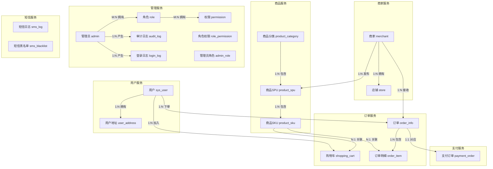
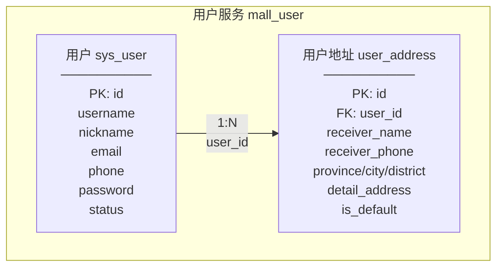
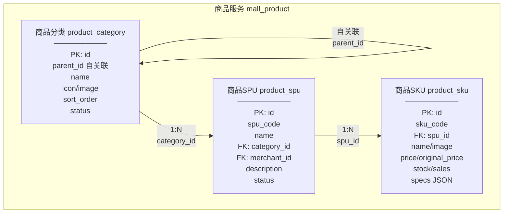
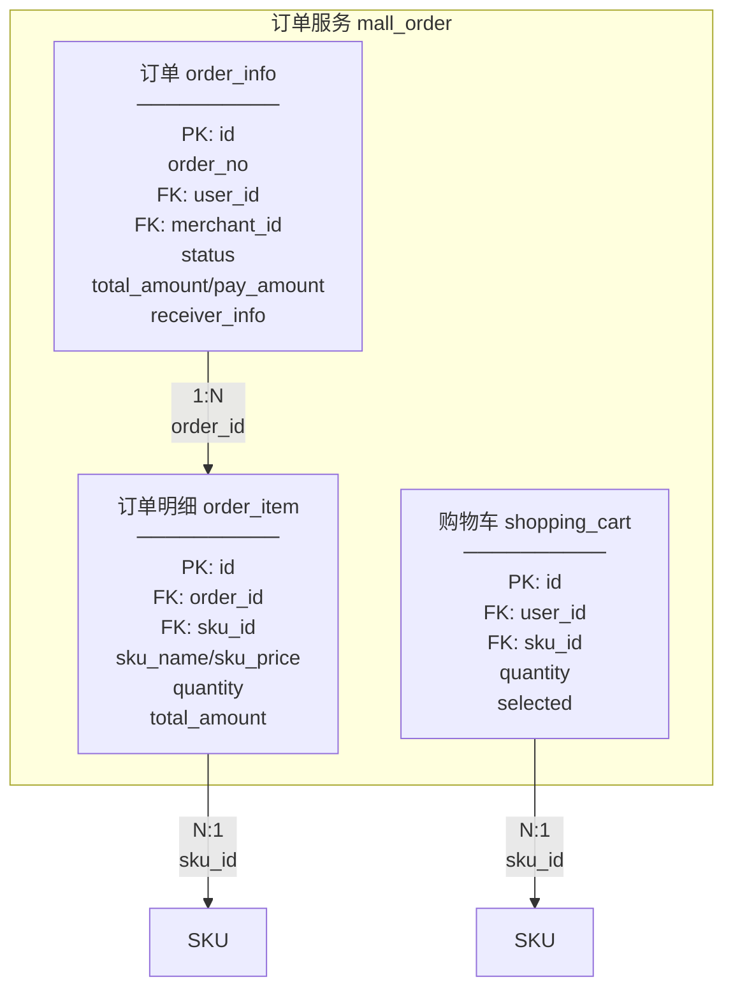
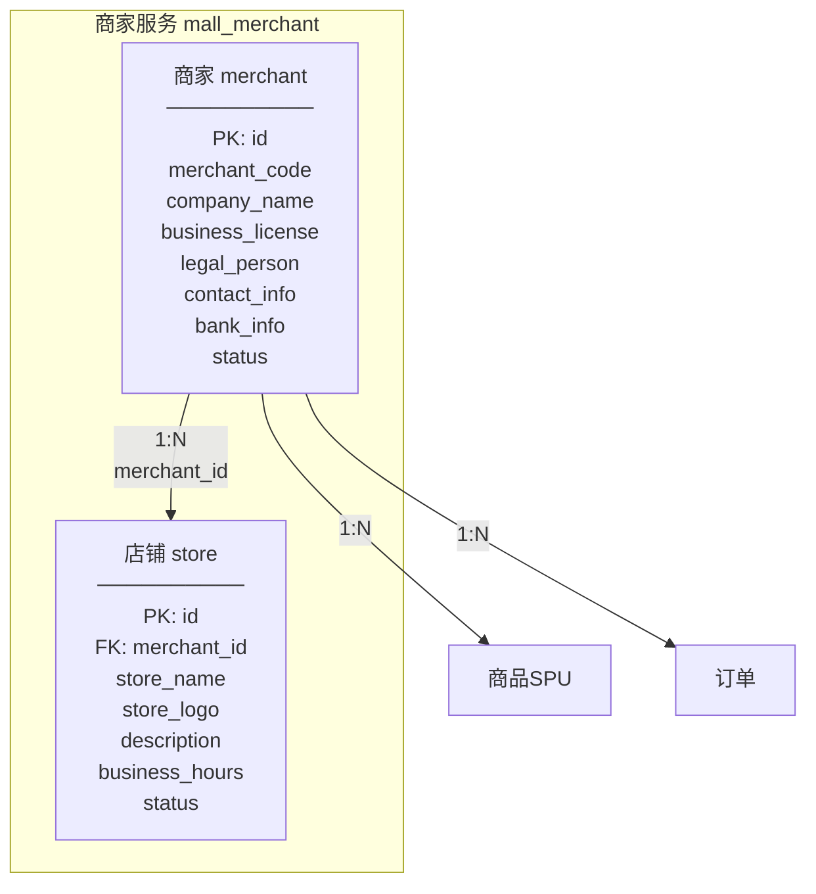
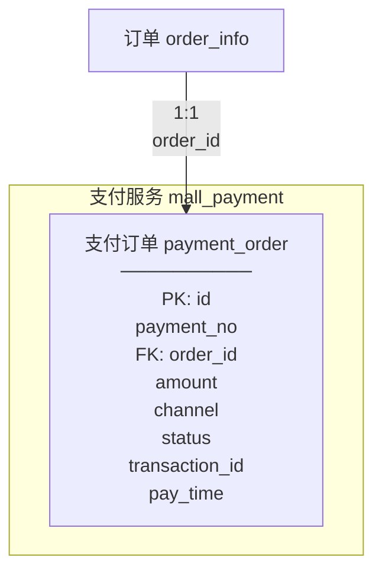
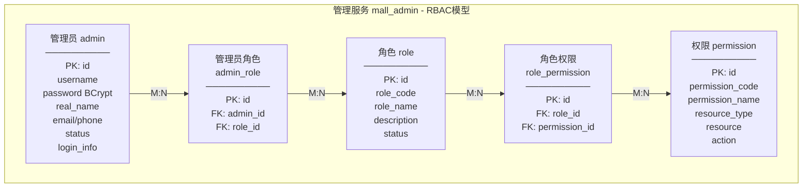
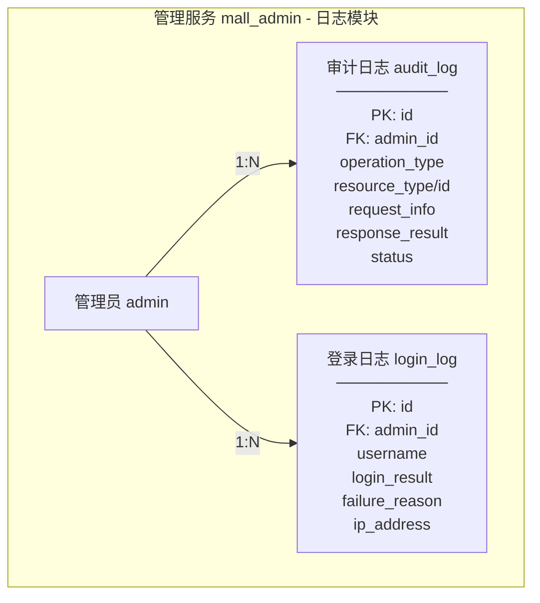
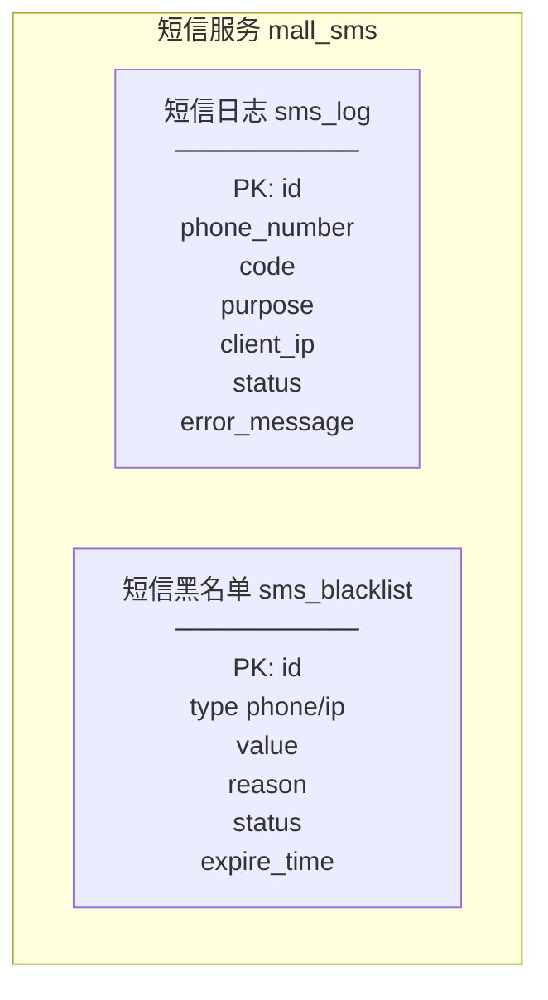

# Spring Cloud Mall 电商平台数据库设计文档

**版本**: V2.0  
**生成时间**: 2025-12-04  
**项目名称**: 基于 Spring Cloud 的在线商城系统  
**数据库版本**: MySQL 8.0  
**字符集**: utf8mb4_unicode_ci  
**Redis版本**: 7.0

---

## 目录

- [第一部分：数据库逻辑设计 (Database Logical Design)](#第一部分数据库逻辑设计-database-logical-design)
  - [1.1 系统总体ER图](#11-系统总体er图)
  - [1.2 用户服务实体设计](#12-用户服务实体设计)
  - [1.3 商品服务实体设计](#13-商品服务实体设计)
  - [1.4 订单服务实体设计](#14-订单服务实体设计)
  - [1.5 商家服务实体设计](#15-商家服务实体设计)
  - [1.6 支付服务实体设计](#16-支付服务实体设计)
  - [1.7 管理服务实体设计](#17-管理服务实体设计)
  - [1.8 短信服务实体设计](#18-短信服务实体设计)
- [第二部分：数据库表设计 (Database Table Design)](#第二部分数据库表设计-database-table-design)
  - [2.1 用户服务数据库 (mall_user)](#21-用户服务数据库-mall_user)
  - [2.2 商品服务数据库 (mall_product)](#22-商品服务数据库-mall_product)
  - [2.3 订单服务数据库 (mall_order)](#23-订单服务数据库-mall_order)
  - [2.4 商家服务数据库 (mall_merchant)](#24-商家服务数据库-mall_merchant)
  - [2.5 支付服务数据库 (mall_payment)](#25-支付服务数据库-mall_payment)
  - [2.6 管理服务数据库 (mall_admin)](#26-管理服务数据库-mall_admin)
  - [2.7 短信服务数据库 (mall_sms)](#27-短信服务数据库-mall_sms)
  - [2.8 购物车缓存设计 (Redis)](#28-购物车缓存设计-redis)

---

# 第一部分：数据库逻辑设计 (Database Logical Design)

本部分描述系统的逻辑数据模型，通过ER图展示实体、属性及实体间的关系。

## 1.1 系统总体ER图

### 1.1.1 系统核心实体关系总览

本系统采用微服务架构，每个微服务使用独立的MySQL数据库，实现数据隔离和服务自治。

| 数据库名称 | 服务名称 | 描述 | 服务端口 | 表数量 |
|-----------|---------|------|---------|--------|
| mall_user | user-service | 用户服务数据库 | 8082 | 2 |
| mall_product | product-service | 商品服务数据库 | 8084 | 3 |
| mall_order | order-service | 订单服务数据库 | 8085 | 3 |
| mall_merchant | merchant-service | 商家服务数据库 | 8087 | 2 |
| mall_payment | payment-service | 支付服务数据库 | 8086 | 1 |
| mall_admin | admin-service | 管理服务数据库 | 8088 | 7 |
| mall_sms | sms-service | 短信服务数据库 | 8089 | 2 |

**总计**: 7个MySQL数据库，20个数据表，另有Redis用于购物车缓存。




---

## 1.2 用户服务实体设计

### 1.2.1 用户服务ER图



### 1.2.2 实体说明

**用户实体 (sys_user)**：系统用户的核心数据实体，存储用户的账号信息、个人资料及登录状态。用户可以通过用户名、手机号或邮箱登录系统。

**用户地址实体 (user_address)**：用户的收货地址信息，支持多地址管理和默认地址设置。每个用户可以拥有多个收货地址，其中一个可设置为默认地址。

---

## 1.3 商品服务实体设计

### 1.3.1 商品服务ER图



### 1.3.2 实体说明

**商品分类实体 (product_category)**：商品的分类层级结构，支持多级分类（如：电子产品 > 手机 > 智能手机）。通过parent_id实现树形结构。

**商品SPU实体 (product_spu)**：标准化产品单元(Standard Product Unit)，描述商品的基本信息，如"iPhone 15"。一个SPU可以有多个不同规格的SKU。

**商品SKU实体 (product_sku)**：库存量单位(Stock Keeping Unit)，描述商品的具体规格，如"iPhone 15 黑色 128G"。包含价格、库存、销量等具体信息。

---

## 1.4 订单服务实体设计

### 1.4.1 订单服务ER图



### 1.4.2 实体说明

**购物车实体 (shopping_cart)**：用户的购物车项，记录用户添加的待购商品。生产环境中主要使用Redis存储以提高性能，MySQL表作为备份。

**订单实体 (order_info)**：用户的订单主信息，记录订单状态、金额、收货信息等。订单状态包括：待付款、待发货、已发货、已完成、已取消、退款中。

**订单明细实体 (order_item)**：订单中的商品明细，记录购买的具体商品信息（快照）。保存下单时的商品名称、价格等信息，避免后续商品信息变更影响历史订单。

---

## 1.5 商家服务实体设计

### 1.5.1 商家服务ER图



### 1.5.2 实体说明

**商家实体 (merchant)**：入驻平台的商家企业信息，包含企业资质、联系方式、结算账户等。商家需提交营业执照，经平台审核后方可运营。审核状态包括：待审核、已通过、已拒绝、已暂停。

**店铺实体 (store)**：商家在平台开设的店铺，面向消费者展示。一个商家可以拥有多个店铺，店铺状态包括：营业中、已关闭、已暂停。

---

## 1.6 支付服务实体设计

### 1.6.1 支付服务ER图



### 1.6.2 实体说明

**支付订单实体 (payment_order)**：支付流水记录，对接第三方支付渠道（微信/支付宝）。一个订单对应一个支付单。支付状态包括：待支付、支付成功、支付失败、已退款、已关闭。

---

## 1.7 管理服务实体设计

### 1.7.1 管理服务ER图 - RBAC权限模型



### 1.7.2 管理服务ER图 - 日志模块



### 1.7.3 实体说明

**管理员实体 (admin)**：系统后台管理员账号，用于平台运营管理。支持账号锁定机制，连续5次登录失败锁定30分钟。

**角色实体 (role)**：RBAC权限模型中的角色定义。预设角色包括：超级管理员、商家审核员、订单管理员、客服人员。

**权限实体 (permission)**：系统操作权限的最小单位。权限类型包括：菜单权限、按钮权限、API权限。

**审计日志实体 (audit_log)**：记录管理员的所有操作行为，用于安全审计。包括操作类型、资源信息、请求参数、响应结果等。

**登录日志实体 (login_log)**：记录管理员登录行为，包括成功和失败的登录尝试，用于安全监控。

---

## 1.8 短信服务实体设计

### 1.8.1 短信服务ER图



### 1.8.2 实体说明

**短信日志实体 (sms_log)**：记录短信验证码发送日志，用于追踪和防刷。包括手机号、验证码、用途（登录/注册/重置密码）、客户端IP、发送状态等。

**短信黑名单实体 (sms_blacklist)**：短信服务的黑名单管理，防止恶意请求。支持按手机号或IP地址加入黑名单，可设置过期时间或永久生效。

---

# 第二部分：数据库表设计 (Database Table Design)

本部分描述系统的物理数据库设计，包括详细的表结构、字段定义、索引设计和建表SQL语句。

## 2.1 用户服务数据库 (mall_user)

**服务名称**: user-service  
**服务端口**: 8082  
**业务用途**: 用户账号管理、收货地址管理

### 2.1.1 sys_user 表（用户信息表）

**表名**: sys_user  
**业务用途**: 存储系统用户的核心数据

#### 字段定义

| 字段名 | 数据类型 | 长度 | 允许为空 | 默认值 | 约束条件 | 说明 |
|-------|---------|------|---------|--------|---------|------|
| id | BIGINT | - | NOT NULL | AUTO_INCREMENT | PRIMARY KEY | 用户唯一标识ID |
| username | VARCHAR | 30 | NOT NULL | - | UNIQUE | 用户登录账号 |
| nickname | VARCHAR | 30 | NULL | NULL | - | 用户昵称 |
| email | VARCHAR | 50 | NULL | NULL | UNIQUE | 用户邮箱 |
| phone | VARCHAR | 11 | NULL | NULL | UNIQUE | 手机号码 |
| sex | CHAR | 1 | NULL | '2' | - | 用户性别：0男/1女/2未知 |
| avatar | VARCHAR | 100 | NULL | NULL | - | 头像URL地址 |
| password | VARCHAR | 100 | NULL | NULL | - | BCrypt加密密码 |
| status | CHAR | 1 | NULL | '0' | - | 状态：0正常/1停用 |
| login_ip | VARCHAR | 128 | NULL | NULL | - | 最后登录IP |
| login_date | DATETIME | - | NULL | NULL | - | 最后登录时间 |
| create_by | VARCHAR | 64 | NULL | NULL | - | 创建者 |
| create_time | DATETIME | - | NOT NULL | CURRENT_TIMESTAMP | - | 创建时间 |
| update_by | VARCHAR | 64 | NULL | NULL | - | 更新者 |
| update_time | DATETIME | - | NOT NULL | CURRENT_TIMESTAMP ON UPDATE | - | 更新时间 |
| remark | VARCHAR | 500 | NULL | NULL | - | 备注 |
| deleted | TINYINT | 1 | NULL | 0 | - | 逻辑删除：0存在/1删除 |
| version | INT | - | NULL | 0 | - | 乐观锁版本号 |

#### 索引设计

| 索引名称 | 索引类型 | 字段 | 作用 |
|---------|---------|------|------|
| PRIMARY | 主键索引 | id | 唯一标识每条记录 |
| uk_username | 唯一索引 | username | 确保用户名全局唯一 |
| uk_phone | 唯一索引 | phone | 确保手机号全局唯一，支持手机号登录 |
| uk_email | 唯一索引 | email | 确保邮箱全局唯一，支持邮箱登录 |

#### 建表SQL语句

```sql
-- 创建数据库
CREATE DATABASE IF NOT EXISTS `mall_user` DEFAULT CHARACTER SET utf8mb4 COLLATE utf8mb4_unicode_ci;
USE `mall_user`;

-- 用户信息表
CREATE TABLE `sys_user` (
  `id` bigint NOT NULL AUTO_INCREMENT COMMENT '用户ID',
  `username` varchar(30) NOT NULL COMMENT '用户账号',
  `nickname` varchar(30) DEFAULT NULL COMMENT '用户昵称',
  `email` varchar(50) DEFAULT NULL COMMENT '用户邮箱',
  `phone` varchar(11) DEFAULT NULL COMMENT '手机号码',
  `sex` char(1) DEFAULT '2' COMMENT '用户性别（0男 1女 2未知）',
  `avatar` varchar(100) DEFAULT NULL COMMENT '头像地址',
  `password` varchar(100) DEFAULT NULL COMMENT '密码(BCrypt加密)',
  `status` char(1) DEFAULT '0' COMMENT '帐号状态（0正常 1停用）',
  `login_ip` varchar(128) DEFAULT NULL COMMENT '最后登录IP',
  `login_date` datetime DEFAULT NULL COMMENT '最后登录时间',
  `create_by` varchar(64) DEFAULT NULL COMMENT '创建者',
  `create_time` datetime DEFAULT CURRENT_TIMESTAMP COMMENT '创建时间',
  `update_by` varchar(64) DEFAULT NULL COMMENT '更新者',
  `update_time` datetime DEFAULT CURRENT_TIMESTAMP ON UPDATE CURRENT_TIMESTAMP COMMENT '更新时间',
  `remark` varchar(500) DEFAULT NULL COMMENT '备注',
  `deleted` tinyint(1) DEFAULT '0' COMMENT '删除标志（0存在 1删除）',
  `version` int DEFAULT '0' COMMENT '版本号',
  PRIMARY KEY (`id`),
  UNIQUE KEY `uk_username` (`username`),
  UNIQUE KEY `uk_phone` (`phone`),
  UNIQUE KEY `uk_email` (`email`)
) ENGINE=InnoDB DEFAULT CHARSET=utf8mb4 COLLATE=utf8mb4_unicode_ci COMMENT='用户信息表';
```

### 2.1.2 user_address 表（用户地址表）

**表名**: user_address  
**业务用途**: 存储用户的收货地址信息

#### 字段定义

| 字段名 | 数据类型 | 长度 | 允许为空 | 默认值 | 约束条件 | 说明 |
|-------|---------|------|---------|--------|---------|------|
| id | BIGINT | - | NOT NULL | AUTO_INCREMENT | PRIMARY KEY | 地址唯一标识ID |
| user_id | BIGINT | - | NOT NULL | - | INDEX, FK | 用户ID |
| receiver_name | VARCHAR | 50 | NOT NULL | - | - | 收货人姓名 |
| receiver_phone | VARCHAR | 20 | NOT NULL | - | - | 收货人电话 |
| province | VARCHAR | 50 | NOT NULL | - | - | 省份 |
| city | VARCHAR | 50 | NOT NULL | - | - | 城市 |
| district | VARCHAR | 50 | NOT NULL | - | - | 区县 |
| detail_address | VARCHAR | 200 | NOT NULL | - | - | 详细地址 |
| postal_code | VARCHAR | 10 | NULL | NULL | - | 邮政编码 |
| is_default | TINYINT | 1 | NULL | 0 | - | 是否默认：0否/1是 |
| create_time | DATETIME | - | NOT NULL | CURRENT_TIMESTAMP | - | 创建时间 |
| update_time | DATETIME | - | NOT NULL | CURRENT_TIMESTAMP ON UPDATE | - | 更新时间 |
| deleted | TINYINT | 1 | NULL | 0 | - | 逻辑删除标志 |

#### 建表SQL语句

```sql
-- 用户地址表
CREATE TABLE `user_address` (
  `id` bigint NOT NULL AUTO_INCREMENT COMMENT '地址ID',
  `user_id` bigint NOT NULL COMMENT '用户ID',
  `receiver_name` varchar(50) NOT NULL COMMENT '收货人姓名',
  `receiver_phone` varchar(20) NOT NULL COMMENT '收货人电话',
  `province` varchar(50) NOT NULL COMMENT '省份',
  `city` varchar(50) NOT NULL COMMENT '城市',
  `district` varchar(50) NOT NULL COMMENT '区县',
  `detail_address` varchar(200) NOT NULL COMMENT '详细地址',
  `postal_code` varchar(10) DEFAULT NULL COMMENT '邮政编码',
  `is_default` tinyint(1) DEFAULT '0' COMMENT '是否默认地址（0否 1是）',
  `create_time` datetime DEFAULT CURRENT_TIMESTAMP COMMENT '创建时间',
  `update_time` datetime DEFAULT CURRENT_TIMESTAMP ON UPDATE CURRENT_TIMESTAMP COMMENT '更新时间',
  `deleted` tinyint(1) DEFAULT '0' COMMENT '删除标志',
  PRIMARY KEY (`id`),
  KEY `idx_user_id` (`user_id`)
) ENGINE=InnoDB DEFAULT CHARSET=utf8mb4 COLLATE=utf8mb4_unicode_ci COMMENT='用户地址表';
```


---

## 2.2 商品服务数据库 (mall_product)

**服务名称**: product-service  
**服务端口**: 8084  
**业务用途**: 商品分类管理、SPU/SKU商品管理、库存管理

### 2.2.1 product_category 表（商品分类表）

**表名**: product_category  
**业务用途**: 存储商品的分类层级结构，支持多级分类

#### 字段定义

| 字段名 | 数据类型 | 长度 | 允许为空 | 默认值 | 约束条件 | 说明 |
|-------|---------|------|---------|--------|---------|------|
| id | BIGINT | - | NOT NULL | AUTO_INCREMENT | PRIMARY KEY | 分类ID |
| parent_id | BIGINT | - | NULL | 0 | INDEX | 父分类ID，0表示顶级 |
| name | VARCHAR | 50 | NOT NULL | - | - | 分类名称 |
| icon | VARCHAR | 100 | NULL | NULL | - | 分类图标 |
| image | VARCHAR | 200 | NULL | NULL | - | 分类图片 |
| sort_order | INT | - | NULL | 0 | - | 排序值 |
| status | TINYINT | 1 | NULL | 1 | - | 状态：0禁用/1启用 |
| create_time | DATETIME | - | NOT NULL | CURRENT_TIMESTAMP | - | 创建时间 |
| update_time | DATETIME | - | NOT NULL | CURRENT_TIMESTAMP ON UPDATE | - | 更新时间 |
| deleted | TINYINT | 1 | NULL | 0 | - | 逻辑删除标志 |

#### 建表SQL语句

```sql
-- 创建数据库
CREATE DATABASE IF NOT EXISTS `mall_product` DEFAULT CHARACTER SET utf8mb4 COLLATE utf8mb4_unicode_ci;
USE `mall_product`;

-- 商品分类表
CREATE TABLE `product_category` (
  `id` bigint NOT NULL AUTO_INCREMENT COMMENT '分类ID',
  `parent_id` bigint DEFAULT '0' COMMENT '父分类ID',
  `name` varchar(50) NOT NULL COMMENT '分类名称',
  `icon` varchar(100) DEFAULT NULL COMMENT '分类图标',
  `image` varchar(200) DEFAULT NULL COMMENT '分类图片',
  `sort_order` int DEFAULT '0' COMMENT '排序',
  `status` tinyint(1) DEFAULT '1' COMMENT '状态（0禁用 1启用）',
  `create_time` datetime DEFAULT CURRENT_TIMESTAMP COMMENT '创建时间',
  `update_time` datetime DEFAULT CURRENT_TIMESTAMP ON UPDATE CURRENT_TIMESTAMP COMMENT '更新时间',
  `deleted` tinyint(1) DEFAULT '0' COMMENT '删除标志',
  PRIMARY KEY (`id`),
  KEY `idx_parent_id` (`parent_id`)
) ENGINE=InnoDB DEFAULT CHARSET=utf8mb4 COLLATE=utf8mb4_unicode_ci COMMENT='商品分类表';
```

### 2.2.2 product_spu 表（商品SPU表）

**表名**: product_spu  
**业务用途**: 存储标准化产品单元(SPU)信息，描述商品的基本属性

#### 字段定义

| 字段名 | 数据类型 | 长度 | 允许为空 | 默认值 | 约束条件 | 说明 |
|-------|---------|------|---------|--------|---------|------|
| id | BIGINT | - | NOT NULL | AUTO_INCREMENT | PRIMARY KEY | SPU ID |
| spu_code | VARCHAR | 50 | NOT NULL | - | UNIQUE | SPU编码 |
| name | VARCHAR | 200 | NOT NULL | - | - | 商品名称 |
| description | TEXT | - | NULL | NULL | - | 商品描述 |
| category_id | BIGINT | - | NOT NULL | - | INDEX, FK | 分类ID |
| brand_id | BIGINT | - | NULL | NULL | - | 品牌ID |
| merchant_id | BIGINT | - | NOT NULL | - | INDEX, FK | 商家ID |
| status | TINYINT | 1 | NULL | 0 | - | 状态：0下架/1上架 |
| sort_order | INT | - | NULL | 0 | - | 排序值 |
| create_time | DATETIME | - | NOT NULL | CURRENT_TIMESTAMP | - | 创建时间 |
| update_time | DATETIME | - | NOT NULL | CURRENT_TIMESTAMP ON UPDATE | - | 更新时间 |
| deleted | TINYINT | 1 | NULL | 0 | - | 逻辑删除标志 |

#### 建表SQL语句

```sql
-- 商品SPU表
CREATE TABLE `product_spu` (
  `id` bigint NOT NULL AUTO_INCREMENT COMMENT 'SPU ID',
  `spu_code` varchar(50) NOT NULL COMMENT 'SPU编码',
  `name` varchar(200) NOT NULL COMMENT '商品名称',
  `description` text COMMENT '商品描述',
  `category_id` bigint NOT NULL COMMENT '分类ID',
  `brand_id` bigint DEFAULT NULL COMMENT '品牌ID',
  `merchant_id` bigint NOT NULL COMMENT '商家ID',
  `status` tinyint(1) DEFAULT '0' COMMENT '状态（0下架 1上架）',
  `sort_order` int DEFAULT '0' COMMENT '排序',
  `create_time` datetime DEFAULT CURRENT_TIMESTAMP COMMENT '创建时间',
  `update_time` datetime DEFAULT CURRENT_TIMESTAMP ON UPDATE CURRENT_TIMESTAMP COMMENT '更新时间',
  `deleted` tinyint(1) DEFAULT '0' COMMENT '删除标志',
  PRIMARY KEY (`id`),
  UNIQUE KEY `uk_spu_code` (`spu_code`),
  KEY `idx_category_id` (`category_id`),
  KEY `idx_merchant_id` (`merchant_id`)
) ENGINE=InnoDB DEFAULT CHARSET=utf8mb4 COLLATE=utf8mb4_unicode_ci COMMENT='商品SPU表';
```

### 2.2.3 product_sku 表（商品SKU表）

**表名**: product_sku  
**业务用途**: 存储库存量单位(SKU)信息，描述商品的具体规格、价格和库存

#### 字段定义

| 字段名 | 数据类型 | 长度 | 允许为空 | 默认值 | 约束条件 | 说明 |
|-------|---------|------|---------|--------|---------|------|
| id | BIGINT | - | NOT NULL | AUTO_INCREMENT | PRIMARY KEY | SKU ID |
| sku_code | VARCHAR | 50 | NOT NULL | - | UNIQUE | SKU编码 |
| spu_id | BIGINT | - | NOT NULL | - | INDEX, FK | 所属SPU ID |
| name | VARCHAR | 200 | NOT NULL | - | - | SKU名称 |
| image | VARCHAR | 200 | NULL | NULL | - | SKU图片 |
| price | DECIMAL | 10,2 | NOT NULL | - | - | 销售价格 |
| original_price | DECIMAL | 10,2 | NULL | NULL | - | 原价/划线价 |
| cost_price | DECIMAL | 10,2 | NULL | NULL | - | 成本价 |
| stock | INT | - | NULL | 0 | - | 库存数量 |
| sales | INT | - | NULL | 0 | - | 销量 |
| weight | DECIMAL | 10,2 | NULL | NULL | - | 重量(kg) |
| volume | DECIMAL | 10,2 | NULL | NULL | - | 体积(m³) |
| specs | JSON | - | NULL | NULL | - | 规格属性JSON |
| status | TINYINT | 1 | NULL | 1 | - | 状态：0禁用/1启用 |
| create_time | DATETIME | - | NOT NULL | CURRENT_TIMESTAMP | - | 创建时间 |
| update_time | DATETIME | - | NOT NULL | CURRENT_TIMESTAMP ON UPDATE | - | 更新时间 |
| deleted | TINYINT | 1 | NULL | 0 | - | 逻辑删除标志 |

#### 建表SQL语句

```sql
-- 商品SKU表
CREATE TABLE `product_sku` (
  `id` bigint NOT NULL AUTO_INCREMENT COMMENT 'SKU ID',
  `sku_code` varchar(50) NOT NULL COMMENT 'SKU编码',
  `spu_id` bigint NOT NULL COMMENT 'SPU ID',
  `name` varchar(200) NOT NULL COMMENT 'SKU名称',
  `image` varchar(200) DEFAULT NULL COMMENT 'SKU图片',
  `price` decimal(10,2) NOT NULL COMMENT '价格',
  `original_price` decimal(10,2) DEFAULT NULL COMMENT '原价',
  `cost_price` decimal(10,2) DEFAULT NULL COMMENT '成本价',
  `stock` int DEFAULT '0' COMMENT '库存',
  `sales` int DEFAULT '0' COMMENT '销量',
  `weight` decimal(10,2) DEFAULT NULL COMMENT '重量(kg)',
  `volume` decimal(10,2) DEFAULT NULL COMMENT '体积(m³)',
  `specs` json DEFAULT NULL COMMENT '规格属性JSON',
  `status` tinyint(1) DEFAULT '1' COMMENT '状态（0禁用 1启用）',
  `create_time` datetime DEFAULT CURRENT_TIMESTAMP COMMENT '创建时间',
  `update_time` datetime DEFAULT CURRENT_TIMESTAMP ON UPDATE CURRENT_TIMESTAMP COMMENT '更新时间',
  `deleted` tinyint(1) DEFAULT '0' COMMENT '删除标志',
  PRIMARY KEY (`id`),
  UNIQUE KEY `uk_sku_code` (`sku_code`),
  KEY `idx_spu_id` (`spu_id`)
) ENGINE=InnoDB DEFAULT CHARSET=utf8mb4 COLLATE=utf8mb4_unicode_ci COMMENT='商品SKU表';
```

---

## 2.3 订单服务数据库 (mall_order)

**服务名称**: order-service  
**服务端口**: 8085  
**业务用途**: 购物车管理、订单管理、订单明细管理

### 2.3.1 shopping_cart 表（购物车表）

**表名**: shopping_cart  
**业务用途**: 存储用户购物车数据（MySQL备份，主存储使用Redis）

#### 字段定义

| 字段名 | 数据类型 | 长度 | 允许为空 | 默认值 | 约束条件 | 说明 |
|-------|---------|------|---------|--------|---------|------|
| id | BIGINT | - | NOT NULL | AUTO_INCREMENT | PRIMARY KEY | 购物车项ID |
| user_id | BIGINT | - | NOT NULL | - | INDEX | 用户ID |
| sku_id | BIGINT | - | NOT NULL | - | INDEX | SKU ID |
| quantity | INT | - | NOT NULL | 1 | - | 购买数量 |
| selected | TINYINT | 1 | NULL | 1 | - | 是否选中 |
| create_time | DATETIME | - | NOT NULL | CURRENT_TIMESTAMP | - | 创建时间 |
| update_time | DATETIME | - | NOT NULL | CURRENT_TIMESTAMP ON UPDATE | - | 更新时间 |

#### 建表SQL语句

```sql
-- 创建数据库
CREATE DATABASE IF NOT EXISTS `mall_order` DEFAULT CHARACTER SET utf8mb4 COLLATE utf8mb4_unicode_ci;
USE `mall_order`;

-- 购物车表
CREATE TABLE `shopping_cart` (
  `id` bigint NOT NULL AUTO_INCREMENT COMMENT '购物车ID',
  `user_id` bigint NOT NULL COMMENT '用户ID',
  `sku_id` bigint NOT NULL COMMENT 'SKU ID',
  `quantity` int NOT NULL DEFAULT '1' COMMENT '数量',
  `selected` tinyint(1) DEFAULT '1' COMMENT '是否选中',
  `create_time` datetime DEFAULT CURRENT_TIMESTAMP COMMENT '创建时间',
  `update_time` datetime DEFAULT CURRENT_TIMESTAMP ON UPDATE CURRENT_TIMESTAMP COMMENT '更新时间',
  PRIMARY KEY (`id`),
  UNIQUE KEY `uk_user_sku` (`user_id`, `sku_id`),
  KEY `idx_user_id` (`user_id`)
) ENGINE=InnoDB DEFAULT CHARSET=utf8mb4 COLLATE=utf8mb4_unicode_ci COMMENT='购物车表';
```

### 2.3.2 order_info 表（订单主表）

**表名**: order_info  
**业务用途**: 存储订单主信息，包括订单状态、金额、收货信息等

#### 字段定义

| 字段名 | 数据类型 | 长度 | 允许为空 | 默认值 | 约束条件 | 说明 |
|-------|---------|------|---------|--------|---------|------|
| id | BIGINT | - | NOT NULL | AUTO_INCREMENT | PRIMARY KEY | 订单ID |
| order_no | VARCHAR | 32 | NOT NULL | - | UNIQUE | 订单编号 |
| user_id | BIGINT | - | NOT NULL | - | INDEX | 用户ID |
| merchant_id | BIGINT | - | NOT NULL | - | INDEX | 商家ID |
| status | VARCHAR | 20 | NOT NULL | 'PENDING_PAYMENT' | - | 订单状态 |
| total_amount | DECIMAL | 10,2 | NOT NULL | - | - | 订单总金额 |
| pay_amount | DECIMAL | 10,2 | NULL | NULL | - | 实际支付金额 |
| freight_amount | DECIMAL | 10,2 | NULL | 0.00 | - | 运费 |
| discount_amount | DECIMAL | 10,2 | NULL | 0.00 | - | 优惠金额 |
| receiver_name | VARCHAR | 50 | NOT NULL | - | - | 收货人姓名 |
| receiver_phone | VARCHAR | 20 | NOT NULL | - | - | 收货人电话 |
| receiver_address | VARCHAR | 500 | NOT NULL | - | - | 收货地址 |
| remark | VARCHAR | 500 | NULL | NULL | - | 订单备注 |
| pay_time | DATETIME | - | NULL | NULL | - | 支付时间 |
| ship_time | DATETIME | - | NULL | NULL | - | 发货时间 |
| receive_time | DATETIME | - | NULL | NULL | - | 收货时间 |
| cancel_time | DATETIME | - | NULL | NULL | - | 取消时间 |
| create_time | DATETIME | - | NOT NULL | CURRENT_TIMESTAMP | - | 创建时间 |
| update_time | DATETIME | - | NOT NULL | CURRENT_TIMESTAMP ON UPDATE | - | 更新时间 |
| deleted | TINYINT | 1 | NULL | 0 | - | 逻辑删除标志 |

#### 建表SQL语句

```sql
-- 订单主表
CREATE TABLE `order_info` (
  `id` bigint NOT NULL AUTO_INCREMENT COMMENT '订单ID',
  `order_no` varchar(32) NOT NULL COMMENT '订单编号',
  `user_id` bigint NOT NULL COMMENT '用户ID',
  `merchant_id` bigint NOT NULL COMMENT '商家ID',
  `status` varchar(20) NOT NULL DEFAULT 'PENDING_PAYMENT' COMMENT '订单状态',
  `total_amount` decimal(10,2) NOT NULL COMMENT '订单总金额',
  `pay_amount` decimal(10,2) DEFAULT NULL COMMENT '实际支付金额',
  `freight_amount` decimal(10,2) DEFAULT '0.00' COMMENT '运费',
  `discount_amount` decimal(10,2) DEFAULT '0.00' COMMENT '优惠金额',
  `receiver_name` varchar(50) NOT NULL COMMENT '收货人姓名',
  `receiver_phone` varchar(20) NOT NULL COMMENT '收货人电话',
  `receiver_address` varchar(500) NOT NULL COMMENT '收货地址',
  `remark` varchar(500) DEFAULT NULL COMMENT '订单备注',
  `pay_time` datetime DEFAULT NULL COMMENT '支付时间',
  `ship_time` datetime DEFAULT NULL COMMENT '发货时间',
  `receive_time` datetime DEFAULT NULL COMMENT '收货时间',
  `cancel_time` datetime DEFAULT NULL COMMENT '取消时间',
  `create_time` datetime DEFAULT CURRENT_TIMESTAMP COMMENT '创建时间',
  `update_time` datetime DEFAULT CURRENT_TIMESTAMP ON UPDATE CURRENT_TIMESTAMP COMMENT '更新时间',
  `deleted` tinyint(1) DEFAULT '0' COMMENT '删除标志',
  PRIMARY KEY (`id`),
  UNIQUE KEY `uk_order_no` (`order_no`),
  KEY `idx_user_id` (`user_id`),
  KEY `idx_merchant_id` (`merchant_id`),
  KEY `idx_status` (`status`)
) ENGINE=InnoDB DEFAULT CHARSET=utf8mb4 COLLATE=utf8mb4_unicode_ci COMMENT='订单信息表';
```

### 2.3.3 order_item 表（订单明细表）

**表名**: order_item  
**业务用途**: 存储订单中的商品明细（下单时快照）

#### 字段定义

| 字段名 | 数据类型 | 长度 | 允许为空 | 默认值 | 约束条件 | 说明 |
|-------|---------|------|---------|--------|---------|------|
| id | BIGINT | - | NOT NULL | AUTO_INCREMENT | PRIMARY KEY | 明细ID |
| order_id | BIGINT | - | NOT NULL | - | INDEX | 订单ID |
| sku_id | BIGINT | - | NOT NULL | - | - | SKU ID |
| sku_name | VARCHAR | 200 | NOT NULL | - | - | SKU名称(快照) |
| sku_image | VARCHAR | 200 | NULL | NULL | - | SKU图片(快照) |
| sku_price | DECIMAL | 10,2 | NOT NULL | - | - | 商品单价(快照) |
| quantity | INT | - | NOT NULL | - | - | 购买数量 |
| total_amount | DECIMAL | 10,2 | NOT NULL | - | - | 小计金额 |
| specs | JSON | - | NULL | NULL | - | 规格属性 |
| create_time | DATETIME | - | NOT NULL | CURRENT_TIMESTAMP | - | 创建时间 |

#### 建表SQL语句

```sql
-- 订单明细表
CREATE TABLE `order_item` (
  `id` bigint NOT NULL AUTO_INCREMENT COMMENT '明细ID',
  `order_id` bigint NOT NULL COMMENT '订单ID',
  `sku_id` bigint NOT NULL COMMENT 'SKU ID',
  `sku_name` varchar(200) NOT NULL COMMENT 'SKU名称',
  `sku_image` varchar(200) DEFAULT NULL COMMENT 'SKU图片',
  `sku_price` decimal(10,2) NOT NULL COMMENT '商品单价',
  `quantity` int NOT NULL COMMENT '购买数量',
  `total_amount` decimal(10,2) NOT NULL COMMENT '小计金额',
  `specs` json DEFAULT NULL COMMENT '规格属性',
  `create_time` datetime DEFAULT CURRENT_TIMESTAMP COMMENT '创建时间',
  PRIMARY KEY (`id`),
  KEY `idx_order_id` (`order_id`)
) ENGINE=InnoDB DEFAULT CHARSET=utf8mb4 COLLATE=utf8mb4_unicode_ci COMMENT='订单明细表';
```


---

## 2.4 商家服务数据库 (mall_merchant)

**服务名称**: merchant-service  
**服务端口**: 8087  
**业务用途**: 商家入驻管理、店铺管理

### 2.4.1 merchant 表（商家信息表）

**表名**: merchant  
**业务用途**: 存储入驻平台的商家企业信息

#### 字段定义

| 字段名 | 数据类型 | 长度 | 允许为空 | 默认值 | 约束条件 | 说明 |
|-------|---------|------|---------|--------|---------|------|
| id | BIGINT | - | NOT NULL | AUTO_INCREMENT | PRIMARY KEY | 商家ID |
| merchant_code | VARCHAR | 32 | NOT NULL | - | UNIQUE | 商家编码 |
| company_name | VARCHAR | 100 | NOT NULL | - | - | 公司名称 |
| business_license | VARCHAR | 50 | NOT NULL | - | UNIQUE | 营业执照号 |
| legal_person | VARCHAR | 50 | NOT NULL | - | - | 法人代表 |
| contact_name | VARCHAR | 50 | NOT NULL | - | - | 联系人姓名 |
| contact_phone | VARCHAR | 20 | NOT NULL | - | - | 联系人电话 |
| contact_email | VARCHAR | 100 | NULL | NULL | - | 联系人邮箱 |
| bank_account | VARCHAR | 50 | NULL | NULL | - | 银行账号 |
| bank_name | VARCHAR | 100 | NULL | NULL | - | 开户银行 |
| status | VARCHAR | 20 | NOT NULL | 'PENDING' | INDEX | 审核状态 |
| reject_reason | VARCHAR | 500 | NULL | NULL | - | 拒绝原因 |
| create_time | DATETIME | - | NOT NULL | CURRENT_TIMESTAMP | - | 创建时间 |
| update_time | DATETIME | - | NOT NULL | CURRENT_TIMESTAMP ON UPDATE | - | 更新时间 |
| deleted | TINYINT | 1 | NULL | 0 | - | 逻辑删除标志 |

#### 建表SQL语句

```sql
-- 创建数据库
CREATE DATABASE IF NOT EXISTS `mall_merchant` DEFAULT CHARACTER SET utf8mb4 COLLATE utf8mb4_unicode_ci;
USE `mall_merchant`;

-- 商家信息表
CREATE TABLE `merchant` (
  `id` bigint NOT NULL AUTO_INCREMENT COMMENT '商家ID',
  `merchant_code` varchar(32) NOT NULL COMMENT '商家编码',
  `company_name` varchar(100) NOT NULL COMMENT '公司名称',
  `business_license` varchar(50) NOT NULL COMMENT '营业执照号',
  `legal_person` varchar(50) NOT NULL COMMENT '法人代表',
  `contact_name` varchar(50) NOT NULL COMMENT '联系人姓名',
  `contact_phone` varchar(20) NOT NULL COMMENT '联系人电话',
  `contact_email` varchar(100) DEFAULT NULL COMMENT '联系人邮箱',
  `bank_account` varchar(50) DEFAULT NULL COMMENT '银行账号',
  `bank_name` varchar(100) DEFAULT NULL COMMENT '开户银行',
  `status` varchar(20) NOT NULL DEFAULT 'PENDING' COMMENT '审核状态',
  `reject_reason` varchar(500) DEFAULT NULL COMMENT '拒绝原因',
  `create_time` datetime DEFAULT CURRENT_TIMESTAMP COMMENT '创建时间',
  `update_time` datetime DEFAULT CURRENT_TIMESTAMP ON UPDATE CURRENT_TIMESTAMP COMMENT '更新时间',
  `deleted` tinyint(1) DEFAULT '0' COMMENT '删除标志',
  PRIMARY KEY (`id`),
  UNIQUE KEY `uk_merchant_code` (`merchant_code`),
  UNIQUE KEY `uk_business_license` (`business_license`),
  KEY `idx_status` (`status`)
) ENGINE=InnoDB DEFAULT CHARSET=utf8mb4 COLLATE=utf8mb4_unicode_ci COMMENT='商家信息表';
```


### 2.4.2 store 表（店铺信息表）

**表名**: store  
**业务用途**: 存储商家开设的店铺信息

#### 字段定义

| 字段名 | 数据类型 | 长度 | 允许为空 | 默认值 | 约束条件 | 说明 |
|-------|---------|------|---------|--------|---------|------|
| id | BIGINT | - | NOT NULL | AUTO_INCREMENT | PRIMARY KEY | 店铺ID |
| merchant_id | BIGINT | - | NOT NULL | - | INDEX | 商家ID |
| store_name | VARCHAR | 100 | NOT NULL | - | - | 店铺名称 |
| store_logo | VARCHAR | 200 | NULL | NULL | - | 店铺LOGO |
| store_description | TEXT | - | NULL | NULL | - | 店铺简介 |
| business_hours | VARCHAR | 100 | NULL | NULL | - | 营业时间 |
| status | VARCHAR | 20 | NOT NULL | 'OPEN' | - | 店铺状态 |
| create_time | DATETIME | - | NOT NULL | CURRENT_TIMESTAMP | - | 创建时间 |
| update_time | DATETIME | - | NOT NULL | CURRENT_TIMESTAMP ON UPDATE | - | 更新时间 |
| deleted | TINYINT | 1 | NULL | 0 | - | 逻辑删除标志 |

#### 建表SQL语句

```sql
-- 店铺信息表
CREATE TABLE `store` (
  `id` bigint NOT NULL AUTO_INCREMENT COMMENT '店铺ID',
  `merchant_id` bigint NOT NULL COMMENT '商家ID',
  `store_name` varchar(100) NOT NULL COMMENT '店铺名称',
  `store_logo` varchar(200) DEFAULT NULL COMMENT '店铺LOGO',
  `store_description` text COMMENT '店铺简介',
  `business_hours` varchar(100) DEFAULT NULL COMMENT '营业时间',
  `status` varchar(20) NOT NULL DEFAULT 'OPEN' COMMENT '店铺状态',
  `create_time` datetime DEFAULT CURRENT_TIMESTAMP COMMENT '创建时间',
  `update_time` datetime DEFAULT CURRENT_TIMESTAMP ON UPDATE CURRENT_TIMESTAMP COMMENT '更新时间',
  `deleted` tinyint(1) DEFAULT '0' COMMENT '删除标志',
  PRIMARY KEY (`id`),
  KEY `idx_merchant_id` (`merchant_id`)
) ENGINE=InnoDB DEFAULT CHARSET=utf8mb4 COLLATE=utf8mb4_unicode_ci COMMENT='店铺信息表';
```

---

## 2.5 支付服务数据库 (mall_payment)

**服务名称**: payment-service  
**服务端口**: 8086  
**业务用途**: 支付订单管理、对接第三方支付

### 2.5.1 payment_order 表（支付订单表）

**表名**: payment_order  
**业务用途**: 存储支付流水记录，对接微信/支付宝等第三方支付平台

#### 字段定义

| 字段名 | 数据类型 | 长度 | 允许为空 | 默认值 | 约束条件 | 说明 |
|-------|---------|------|---------|--------|---------|------|
| id | BIGINT | - | NOT NULL | AUTO_INCREMENT | PRIMARY KEY | 支付订单ID |
| payment_no | VARCHAR | 32 | NOT NULL | - | UNIQUE | 支付流水号 |
| order_id | BIGINT | - | NOT NULL | - | INDEX | 关联订单ID |
| order_no | VARCHAR | 32 | NOT NULL | - | - | 关联订单号 |
| amount | DECIMAL | 10,2 | NOT NULL | - | - | 支付金额 |
| channel | VARCHAR | 20 | NOT NULL | - | - | 支付渠道 |
| status | VARCHAR | 20 | NOT NULL | 'PENDING' | INDEX | 支付状态 |
| transaction_id | VARCHAR | 64 | NULL | NULL | - | 第三方交易号 |
| pay_time | DATETIME | - | NULL | NULL | - | 支付成功时间 |
| expire_time | DATETIME | - | NULL | NULL | - | 支付过期时间 |
| callback_content | TEXT | - | NULL | NULL | - | 回调内容 |
| create_time | DATETIME | - | NOT NULL | CURRENT_TIMESTAMP | - | 创建时间 |
| update_time | DATETIME | - | NOT NULL | CURRENT_TIMESTAMP ON UPDATE | - | 更新时间 |

#### 建表SQL语句

```sql
-- 创建数据库
CREATE DATABASE IF NOT EXISTS `mall_payment` DEFAULT CHARACTER SET utf8mb4 COLLATE utf8mb4_unicode_ci;
USE `mall_payment`;

-- 支付订单表
CREATE TABLE `payment_order` (
  `id` bigint NOT NULL AUTO_INCREMENT COMMENT '支付ID',
  `payment_no` varchar(32) NOT NULL COMMENT '支付流水号',
  `order_id` bigint NOT NULL COMMENT '订单ID',
  `order_no` varchar(32) NOT NULL COMMENT '订单编号',
  `amount` decimal(10,2) NOT NULL COMMENT '支付金额',
  `channel` varchar(20) NOT NULL COMMENT '支付渠道(WECHAT/ALIPAY)',
  `status` varchar(20) NOT NULL DEFAULT 'PENDING' COMMENT '支付状态',
  `transaction_id` varchar(64) DEFAULT NULL COMMENT '第三方交易号',
  `pay_time` datetime DEFAULT NULL COMMENT '支付时间',
  `expire_time` datetime DEFAULT NULL COMMENT '过期时间',
  `callback_content` text COMMENT '回调内容',
  `create_time` datetime DEFAULT CURRENT_TIMESTAMP COMMENT '创建时间',
  `update_time` datetime DEFAULT CURRENT_TIMESTAMP ON UPDATE CURRENT_TIMESTAMP COMMENT '更新时间',
  PRIMARY KEY (`id`),
  UNIQUE KEY `uk_payment_no` (`payment_no`),
  KEY `idx_order_id` (`order_id`),
  KEY `idx_status` (`status`)
) ENGINE=InnoDB DEFAULT CHARSET=utf8mb4 COLLATE=utf8mb4_unicode_ci COMMENT='支付订单表';
```


---

## 2.6 管理服务数据库 (mall_admin)

**服务名称**: admin-service  
**服务端口**: 8088  
**业务用途**: 后台管理员管理、RBAC权限控制、日志审计

### 2.6.1 admin 表（管理员表）

**表名**: admin  
**业务用途**: 存储后台管理员账号信息

#### 字段定义

| 字段名 | 数据类型 | 长度 | 允许为空 | 默认值 | 约束条件 | 说明 |
|-------|---------|------|---------|--------|---------|------|
| id | BIGINT | - | NOT NULL | AUTO_INCREMENT | PRIMARY KEY | 管理员ID |
| username | VARCHAR | 50 | NOT NULL | - | UNIQUE | 登录账号 |
| password | VARCHAR | 255 | NOT NULL | - | - | BCrypt加密密码 |
| real_name | VARCHAR | 50 | NULL | NULL | - | 真实姓名 |
| email | VARCHAR | 100 | NULL | NULL | - | 邮箱地址 |
| phone | VARCHAR | 20 | NULL | NULL | - | 手机号码 |
| avatar | VARCHAR | 500 | NULL | NULL | - | 头像URL |
| status | TINYINT | - | NULL | 1 | - | 状态:1正常/0禁用 |
| last_login_time | DATETIME | - | NULL | NULL | - | 最后登录时间 |
| last_login_ip | VARCHAR | 50 | NULL | NULL | - | 最后登录IP |
| failed_login_count | INT | - | NULL | 0 | - | 连续登录失败次数 |
| locked_until | DATETIME | - | NULL | NULL | - | 账号锁定截止时间 |
| create_time | DATETIME | - | NOT NULL | CURRENT_TIMESTAMP | - | 创建时间 |
| update_time | DATETIME | - | NOT NULL | CURRENT_TIMESTAMP ON UPDATE | - | 更新时间 |
| deleted | TINYINT | 1 | NULL | 0 | - | 逻辑删除标志 |

#### 建表SQL语句

```sql
-- 创建数据库
CREATE DATABASE IF NOT EXISTS `mall_admin` DEFAULT CHARACTER SET utf8mb4 COLLATE utf8mb4_unicode_ci;
USE `mall_admin`;

-- 管理员表
CREATE TABLE `admin` (
  `id` bigint NOT NULL AUTO_INCREMENT COMMENT '管理员ID',
  `username` varchar(50) NOT NULL COMMENT '登录账号',
  `password` varchar(255) NOT NULL COMMENT '密码(BCrypt加密)',
  `real_name` varchar(50) DEFAULT NULL COMMENT '真实姓名',
  `email` varchar(100) DEFAULT NULL COMMENT '邮箱',
  `phone` varchar(20) DEFAULT NULL COMMENT '手机号',
  `avatar` varchar(500) DEFAULT NULL COMMENT '头像',
  `status` tinyint DEFAULT '1' COMMENT '状态(1正常 0禁用)',
  `last_login_time` datetime DEFAULT NULL COMMENT '最后登录时间',
  `last_login_ip` varchar(50) DEFAULT NULL COMMENT '最后登录IP',
  `failed_login_count` int DEFAULT '0' COMMENT '连续登录失败次数',
  `locked_until` datetime DEFAULT NULL COMMENT '锁定截止时间',
  `create_time` datetime DEFAULT CURRENT_TIMESTAMP COMMENT '创建时间',
  `update_time` datetime DEFAULT CURRENT_TIMESTAMP ON UPDATE CURRENT_TIMESTAMP COMMENT '更新时间',
  `deleted` tinyint(1) DEFAULT '0' COMMENT '删除标志',
  PRIMARY KEY (`id`),
  UNIQUE KEY `uk_username` (`username`)
) ENGINE=InnoDB DEFAULT CHARSET=utf8mb4 COLLATE=utf8mb4_unicode_ci COMMENT='管理员表';
```


### 2.6.2 role 表（角色表）

**表名**: role  
**业务用途**: 存储RBAC模型中的角色定义

#### 字段定义

| 字段名 | 数据类型 | 长度 | 允许为空 | 默认值 | 约束条件 | 说明 |
|-------|---------|------|---------|--------|---------|------|
| id | BIGINT | - | NOT NULL | AUTO_INCREMENT | PRIMARY KEY | 角色ID |
| role_code | VARCHAR | 50 | NOT NULL | - | UNIQUE | 角色编码 |
| role_name | VARCHAR | 50 | NOT NULL | - | - | 角色名称 |
| description | VARCHAR | 200 | NULL | NULL | - | 角色描述 |
| status | TINYINT | - | NULL | 1 | - | 状态:1正常/0禁用 |
| create_time | DATETIME | - | NOT NULL | CURRENT_TIMESTAMP | - | 创建时间 |
| update_time | DATETIME | - | NOT NULL | CURRENT_TIMESTAMP ON UPDATE | - | 更新时间 |
| deleted | TINYINT | 1 | NULL | 0 | - | 逻辑删除标志 |

#### 建表SQL语句

```sql
-- 角色表
CREATE TABLE `role` (
  `id` bigint NOT NULL AUTO_INCREMENT COMMENT '角色ID',
  `role_code` varchar(50) NOT NULL COMMENT '角色编码',
  `role_name` varchar(50) NOT NULL COMMENT '角色名称',
  `description` varchar(200) DEFAULT NULL COMMENT '角色描述',
  `status` tinyint DEFAULT '1' COMMENT '状态(1正常 0禁用)',
  `create_time` datetime DEFAULT CURRENT_TIMESTAMP COMMENT '创建时间',
  `update_time` datetime DEFAULT CURRENT_TIMESTAMP ON UPDATE CURRENT_TIMESTAMP COMMENT '更新时间',
  `deleted` tinyint(1) DEFAULT '0' COMMENT '删除标志',
  PRIMARY KEY (`id`),
  UNIQUE KEY `uk_role_code` (`role_code`)
) ENGINE=InnoDB DEFAULT CHARSET=utf8mb4 COLLATE=utf8mb4_unicode_ci COMMENT='角色表';
```

### 2.6.3 permission 表（权限表）

**表名**: permission  
**业务用途**: 存储系统操作权限的最小单位

#### 字段定义

| 字段名 | 数据类型 | 长度 | 允许为空 | 默认值 | 约束条件 | 说明 |
|-------|---------|------|---------|--------|---------|------|
| id | BIGINT | - | NOT NULL | AUTO_INCREMENT | PRIMARY KEY | 权限ID |
| permission_code | VARCHAR | 100 | NOT NULL | - | UNIQUE | 权限编码 |
| permission_name | VARCHAR | 50 | NOT NULL | - | - | 权限名称 |
| resource_type | VARCHAR | 20 | NOT NULL | - | - | 资源类型(menu/button/api) |
| resource | VARCHAR | 100 | NULL | NULL | - | 资源标识 |
| action | VARCHAR | 20 | NULL | NULL | - | 操作类型(view/create/update/delete) |
| description | VARCHAR | 200 | NULL | NULL | - | 权限描述 |
| status | TINYINT | - | NULL | 1 | - | 状态:1正常/0禁用 |
| create_time | DATETIME | - | NOT NULL | CURRENT_TIMESTAMP | - | 创建时间 |
| update_time | DATETIME | - | NOT NULL | CURRENT_TIMESTAMP ON UPDATE | - | 更新时间 |

#### 建表SQL语句

```sql
-- 权限表
CREATE TABLE `permission` (
  `id` bigint NOT NULL AUTO_INCREMENT COMMENT '权限ID',
  `permission_code` varchar(100) NOT NULL COMMENT '权限编码',
  `permission_name` varchar(50) NOT NULL COMMENT '权限名称',
  `resource_type` varchar(20) NOT NULL COMMENT '资源类型(menu/button/api)',
  `resource` varchar(100) DEFAULT NULL COMMENT '资源标识',
  `action` varchar(20) DEFAULT NULL COMMENT '操作类型',
  `description` varchar(200) DEFAULT NULL COMMENT '权限描述',
  `status` tinyint DEFAULT '1' COMMENT '状态(1正常 0禁用)',
  `create_time` datetime DEFAULT CURRENT_TIMESTAMP COMMENT '创建时间',
  `update_time` datetime DEFAULT CURRENT_TIMESTAMP ON UPDATE CURRENT_TIMESTAMP COMMENT '更新时间',
  PRIMARY KEY (`id`),
  UNIQUE KEY `uk_permission_code` (`permission_code`)
) ENGINE=InnoDB DEFAULT CHARSET=utf8mb4 COLLATE=utf8mb4_unicode_ci COMMENT='权限表';
```


### 2.6.4 admin_role 表（管理员-角色关联表）

**表名**: admin_role  
**业务用途**: 实现管理员与角色的多对多关联

#### 字段定义

| 字段名 | 数据类型 | 长度 | 允许为空 | 默认值 | 约束条件 | 说明 |
|-------|---------|------|---------|--------|---------|------|
| id | BIGINT | - | NOT NULL | AUTO_INCREMENT | PRIMARY KEY | 关联ID |
| admin_id | BIGINT | - | NOT NULL | - | INDEX | 管理员ID |
| role_id | BIGINT | - | NOT NULL | - | INDEX | 角色ID |
| create_time | DATETIME | - | NOT NULL | CURRENT_TIMESTAMP | - | 创建时间 |

#### 建表SQL语句

```sql
-- 管理员-角色关联表
CREATE TABLE `admin_role` (
  `id` bigint NOT NULL AUTO_INCREMENT COMMENT 'ID',
  `admin_id` bigint NOT NULL COMMENT '管理员ID',
  `role_id` bigint NOT NULL COMMENT '角色ID',
  `create_time` datetime DEFAULT CURRENT_TIMESTAMP COMMENT '创建时间',
  PRIMARY KEY (`id`),
  UNIQUE KEY `uk_admin_role` (`admin_id`, `role_id`),
  KEY `idx_admin_id` (`admin_id`),
  KEY `idx_role_id` (`role_id`)
) ENGINE=InnoDB DEFAULT CHARSET=utf8mb4 COLLATE=utf8mb4_unicode_ci COMMENT='管理员-角色关联表';
```

### 2.6.5 role_permission 表（角色-权限关联表）

**表名**: role_permission  
**业务用途**: 实现角色与权限的多对多关联

#### 字段定义

| 字段名 | 数据类型 | 长度 | 允许为空 | 默认值 | 约束条件 | 说明 |
|-------|---------|------|---------|--------|---------|------|
| id | BIGINT | - | NOT NULL | AUTO_INCREMENT | PRIMARY KEY | 关联ID |
| role_id | BIGINT | - | NOT NULL | - | INDEX | 角色ID |
| permission_id | BIGINT | - | NOT NULL | - | INDEX | 权限ID |
| create_time | DATETIME | - | NOT NULL | CURRENT_TIMESTAMP | - | 创建时间 |

#### 建表SQL语句

```sql
-- 角色-权限关联表
CREATE TABLE `role_permission` (
  `id` bigint NOT NULL AUTO_INCREMENT COMMENT 'ID',
  `role_id` bigint NOT NULL COMMENT '角色ID',
  `permission_id` bigint NOT NULL COMMENT '权限ID',
  `create_time` datetime DEFAULT CURRENT_TIMESTAMP COMMENT '创建时间',
  PRIMARY KEY (`id`),
  UNIQUE KEY `uk_role_permission` (`role_id`, `permission_id`),
  KEY `idx_role_id` (`role_id`),
  KEY `idx_permission_id` (`permission_id`)
) ENGINE=InnoDB DEFAULT CHARSET=utf8mb4 COLLATE=utf8mb4_unicode_ci COMMENT='角色-权限关联表';
```

### 2.6.6 audit_log 表（审计日志表）

**表名**: audit_log  
**业务用途**: 记录管理员的所有操作行为，用于安全审计

#### 字段定义

| 字段名 | 数据类型 | 长度 | 允许为空 | 默认值 | 约束条件 | 说明 |
|-------|---------|------|---------|--------|---------|------|
| id | BIGINT | - | NOT NULL | AUTO_INCREMENT | PRIMARY KEY | 日志ID |
| admin_id | BIGINT | - | NOT NULL | - | INDEX | 管理员ID |
| admin_username | VARCHAR | 50 | NOT NULL | - | - | 管理员账号 |
| operation_type | VARCHAR | 50 | NOT NULL | - | - | 操作类型 |
| resource_type | VARCHAR | 50 | NOT NULL | - | - | 资源类型 |
| resource_id | VARCHAR | 50 | NULL | NULL | - | 资源ID |
| request_method | VARCHAR | 10 | NULL | NULL | - | 请求方法 |
| request_url | VARCHAR | 500 | NULL | NULL | - | 请求URL |
| request_params | TEXT | - | NULL | NULL | - | 请求参数 |
| response_result | TEXT | - | NULL | NULL | - | 响应结果 |
| status | TINYINT | - | NOT NULL | - | - | 操作状态:1成功/0失败 |
| error_message | TEXT | - | NULL | NULL | - | 错误信息 |
| ip_address | VARCHAR | 50 | NULL | NULL | - | IP地址 |
| user_agent | VARCHAR | 500 | NULL | NULL | - | 用户代理 |
| execution_time | BIGINT | - | NULL | NULL | - | 执行时间(ms) |
| create_time | DATETIME | - | NOT NULL | CURRENT_TIMESTAMP | - | 创建时间 |

#### 建表SQL语句

```sql
-- 审计日志表
CREATE TABLE `audit_log` (
  `id` bigint NOT NULL AUTO_INCREMENT COMMENT '日志ID',
  `admin_id` bigint NOT NULL COMMENT '管理员ID',
  `admin_username` varchar(50) NOT NULL COMMENT '管理员账号',
  `operation_type` varchar(50) NOT NULL COMMENT '操作类型',
  `resource_type` varchar(50) NOT NULL COMMENT '资源类型',
  `resource_id` varchar(50) DEFAULT NULL COMMENT '资源ID',
  `request_method` varchar(10) DEFAULT NULL COMMENT '请求方法',
  `request_url` varchar(500) DEFAULT NULL COMMENT '请求URL',
  `request_params` text COMMENT '请求参数',
  `response_result` text COMMENT '响应结果',
  `status` tinyint NOT NULL COMMENT '操作状态(1成功 0失败)',
  `error_message` text COMMENT '错误信息',
  `ip_address` varchar(50) DEFAULT NULL COMMENT 'IP地址',
  `user_agent` varchar(500) DEFAULT NULL COMMENT '用户代理',
  `execution_time` bigint DEFAULT NULL COMMENT '执行时间(ms)',
  `create_time` datetime DEFAULT CURRENT_TIMESTAMP COMMENT '创建时间',
  PRIMARY KEY (`id`),
  KEY `idx_admin_id` (`admin_id`),
  KEY `idx_create_time` (`create_time`)
) ENGINE=InnoDB DEFAULT CHARSET=utf8mb4 COLLATE=utf8mb4_unicode_ci COMMENT='审计日志表';
```


### 2.6.7 login_log 表（登录日志表）

**表名**: login_log  
**业务用途**: 记录管理员登录行为，包括成功和失败

#### 字段定义

| 字段名 | 数据类型 | 长度 | 允许为空 | 默认值 | 约束条件 | 说明 |
|-------|---------|------|---------|--------|---------|------|
| id | BIGINT | - | NOT NULL | AUTO_INCREMENT | PRIMARY KEY | 日志ID |
| admin_id | BIGINT | - | NULL | NULL | INDEX | 管理员ID |
| username | VARCHAR | 50 | NOT NULL | - | - | 登录账号 |
| login_result | TINYINT | - | NOT NULL | - | - | 登录结果:1成功/0失败 |
| failure_reason | VARCHAR | 200 | NULL | NULL | - | 失败原因 |
| ip_address | VARCHAR | 50 | NULL | NULL | - | IP地址 |
| user_agent | VARCHAR | 500 | NULL | NULL | - | 用户代理 |
| login_time | DATETIME | - | NOT NULL | CURRENT_TIMESTAMP | - | 登录时间 |

#### 建表SQL语句

```sql
-- 登录日志表
CREATE TABLE `login_log` (
  `id` bigint NOT NULL AUTO_INCREMENT COMMENT '日志ID',
  `admin_id` bigint DEFAULT NULL COMMENT '管理员ID',
  `username` varchar(50) NOT NULL COMMENT '登录账号',
  `login_result` tinyint NOT NULL COMMENT '登录结果(1成功 0失败)',
  `failure_reason` varchar(200) DEFAULT NULL COMMENT '失败原因',
  `ip_address` varchar(50) DEFAULT NULL COMMENT 'IP地址',
  `user_agent` varchar(500) DEFAULT NULL COMMENT '用户代理',
  `login_time` datetime DEFAULT CURRENT_TIMESTAMP COMMENT '登录时间',
  PRIMARY KEY (`id`),
  KEY `idx_admin_id` (`admin_id`),
  KEY `idx_login_time` (`login_time`)
) ENGINE=InnoDB DEFAULT CHARSET=utf8mb4 COLLATE=utf8mb4_unicode_ci COMMENT='登录日志表';
```

---

## 2.7 短信服务数据库 (mall_sms)

**服务名称**: sms-service  
**服务端口**: 8089  
**业务用途**: 短信验证码发送、短信日志记录、防刷黑名单管理

### 2.7.1 sms_log 表（短信日志表）

**表名**: sms_log  
**业务用途**: 记录短信验证码发送日志，用于追踪和防刷

#### 字段定义

| 字段名 | 数据类型 | 长度 | 允许为空 | 默认值 | 约束条件 | 说明 |
|-------|---------|------|---------|--------|---------|------|
| id | BIGINT | - | NOT NULL | AUTO_INCREMENT | PRIMARY KEY | 日志ID |
| phone_number | VARCHAR | 20 | NOT NULL | - | INDEX | 接收手机号 |
| code | VARCHAR | 10 | NOT NULL | - | - | 验证码 |
| purpose | VARCHAR | 50 | NOT NULL | - | - | 用途(login/register/reset_password) |
| client_ip | VARCHAR | 45 | NULL | NULL | INDEX | 请求客户端IP |
| status | TINYINT | - | NOT NULL | - | - | 发送状态:0失败/1成功 |
| error_message | VARCHAR | 500 | NULL | NULL | - | 错误信息 |
| response | TEXT | - | NULL | NULL | - | 第三方接口响应 |
| expire_time | DATETIME | - | NOT NULL | - | - | 验证码过期时间 |
| create_time | DATETIME | - | NOT NULL | CURRENT_TIMESTAMP | - | 创建时间 |

#### 建表SQL语句

```sql
-- 创建数据库
CREATE DATABASE IF NOT EXISTS `mall_sms` DEFAULT CHARACTER SET utf8mb4 COLLATE utf8mb4_unicode_ci;
USE `mall_sms`;

-- 短信日志表
CREATE TABLE `sms_log` (
  `id` bigint NOT NULL AUTO_INCREMENT COMMENT '日志ID',
  `phone_number` varchar(20) NOT NULL COMMENT '手机号',
  `code` varchar(10) NOT NULL COMMENT '验证码',
  `purpose` varchar(50) NOT NULL COMMENT '用途(login/register/reset_password)',
  `client_ip` varchar(45) DEFAULT NULL COMMENT '客户端IP',
  `status` tinyint NOT NULL COMMENT '发送状态(0失败 1成功)',
  `error_message` varchar(500) DEFAULT NULL COMMENT '错误信息',
  `response` text COMMENT '第三方响应',
  `expire_time` datetime NOT NULL COMMENT '过期时间',
  `create_time` datetime DEFAULT CURRENT_TIMESTAMP COMMENT '创建时间',
  PRIMARY KEY (`id`),
  KEY `idx_phone_number` (`phone_number`),
  KEY `idx_client_ip` (`client_ip`),
  KEY `idx_create_time` (`create_time`)
) ENGINE=InnoDB DEFAULT CHARSET=utf8mb4 COLLATE=utf8mb4_unicode_ci COMMENT='短信日志表';
```

### 2.7.2 sms_blacklist 表（短信黑名单表）

**表名**: sms_blacklist  
**业务用途**: 短信服务的黑名单管理，防止恶意请求

#### 字段定义

| 字段名 | 数据类型 | 长度 | 允许为空 | 默认值 | 约束条件 | 说明 |
|-------|---------|------|---------|--------|---------|------|
| id | BIGINT | - | NOT NULL | AUTO_INCREMENT | PRIMARY KEY | 黑名单ID |
| type | VARCHAR | 20 | NOT NULL | - | - | 类型:phone手机号/ip地址 |
| value | VARCHAR | 50 | NOT NULL | - | UNIQUE | 黑名单值 |
| reason | VARCHAR | 200 | NULL | NULL | - | 加入黑名单原因 |
| status | TINYINT | - | NULL | 1 | - | 状态:0禁用/1启用 |
| expire_time | DATETIME | - | NULL | NULL | - | 过期时间,NULL表示永久 |
| create_time | DATETIME | - | NOT NULL | CURRENT_TIMESTAMP | - | 创建时间 |
| update_time | DATETIME | - | NOT NULL | CURRENT_TIMESTAMP ON UPDATE | - | 更新时间 |

#### 建表SQL语句

```sql
-- 短信黑名单表
CREATE TABLE `sms_blacklist` (
  `id` bigint NOT NULL AUTO_INCREMENT COMMENT '黑名单ID',
  `type` varchar(20) NOT NULL COMMENT '类型(phone/ip)',
  `value` varchar(50) NOT NULL COMMENT '黑名单值',
  `reason` varchar(200) DEFAULT NULL COMMENT '加入原因',
  `status` tinyint DEFAULT '1' COMMENT '状态(0禁用 1启用)',
  `expire_time` datetime DEFAULT NULL COMMENT '过期时间',
  `create_time` datetime DEFAULT CURRENT_TIMESTAMP COMMENT '创建时间',
  `update_time` datetime DEFAULT CURRENT_TIMESTAMP ON UPDATE CURRENT_TIMESTAMP COMMENT '更新时间',
  PRIMARY KEY (`id`),
  UNIQUE KEY `uk_type_value` (`type`, `value`)
) ENGINE=InnoDB DEFAULT CHARSET=utf8mb4 COLLATE=utf8mb4_unicode_ci COMMENT='短信黑名单表';
```

---

## 2.8 购物车缓存设计 (Redis)

**存储引擎**: Redis 7.0  
**业务用途**: 购物车数据缓存，提供高性能读写

### 2.8.1 购物车数据结构

**数据类型**: Redis Hash  
**Key设计**: `cart:{userId}`  
**Field**: SKU ID  
**Value**: 购物车项JSON对象

#### Key命名规范

| Key模式 | 数据类型 | 说明 | 示例 |
|----------|---------|------|------|
| cart:{userId} | Hash | 用户购物车 | cart:10001 |
| cart:{userId}:selected | Set | 选中的SKU集合 | cart:10001:selected |

#### Value数据结构

```json
{
  "skuId": 100001,
  "spuId": 10001,
  "skuName": "iPhone 15 Pro 黑色 256GB",
  "skuImage": "https://cdn.mall.com/sku/iphone15pro_black.jpg",
  "price": 8999.00,
  "quantity": 2,
  "selected": true,
  "specs": {
    "颜色": "黑色",
    "存储": "256GB"
  },
  "merchantId": 1001,
  "addTime": "2025-12-04T10:30:00"
}
```

#### 购物车业务规则

| 规则项 | 说明 |
|---------|------|
| 最大商品数 | 每个用户购物车最多100种商品 |
| 单品最大数量 | 每种商品最多购买999件 |
| 数据过期 | 购物车数据30天无操作后过期 |
| 同步策略 | 异步同步到MySQL作为备份 |

---

**文档结束**  
*本文档基于 Spring Cloud Mall 项目实际代码和数据库结构编写，可用于指导数据库实施和开发参考。*
