# 在线商城系统 - 核心业务流程图（Mermaid 版）

本文档使用 Mermaid 语法绘制系统核心业务流程图，按照用户角色进行详细设计，包括普通用户、商家用户和管理员三个角色的功能模块设计。每个角色的功能模块包括功能设计、核心流程、数据库设计和关键技术实现。

---

## 目录

- [一、普通用户功能模块](#一普通用户功能模块)
  - [1.1 用户认证与账户管理](#11-用户认证与账户管理)
  - [1.2 商品浏览与搜索](#12-商品浏览与搜索)
  - [1.3 购物车管理](#13-购物车管理)
  - [1.4 订单管理](#14-订单管理)
- [二、商家用户功能模块](#二商家用户功能模块)
  - [2.1 商家入驻](#21-商家入驻)
  - [2.2 商品与库存管理](#22-商品与库存管理)
  - [2.3 订单处理](#23-订单处理)
- [三、管理员功能模块](#三管理员功能模块)
  - [3.1 商家审核与管理](#31-商家审核与管理)
  - [3.2 订单管理](#32-订单管理)
- [四、系统核心技术流程](#四系统核心技术流程)

---

## 一、普通用户功能模块

普通用户功能模块主要包括用户认证、商品浏览、购物车管理和订单管理四个核心子模块。

### 1.1 用户认证与账户管理

#### 功能设计

用户认证与账户管理模块是系统安全的基础，涉及 Auth Service 和 User Service 两个微服务协同工作。该模块首先提供用户注册功能，支持用户通过手机号进行注册，系统会验证手机验证码的有效性，并使用 BCrypt 算法对用户密码进行加密存储以确保安全。注册完成后，用户可以通过密码登录或验证码登录两种方式进入系统，登录成功后系统会生成包含用户 ID 和角色信息的 JWT Token 用于后续的身份验证。在账户管理方面，用户可以随时修改登录密码或通过手机验证码找回密码，同时还可以修改个人昵称、头像等基本信息。此外，该模块还提供完整的收货地址管理功能，用户可以添加多个收货地址、修改已有地址信息或删除不需要的地址，并设置默认收货地址以便下单时快速选择

#### 核心流程设计

##### 1.1.1 用户登录流程

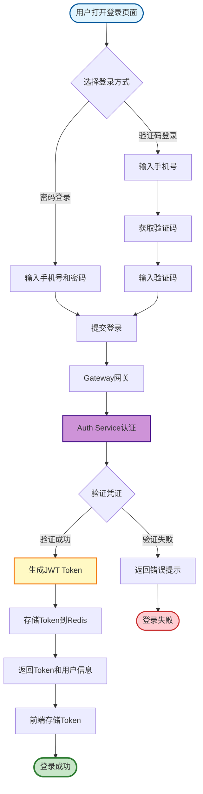

**流程说明：**

用户打开登录页面后，可以选择密码登录或验证码登录两种方式。若选择密码登录，用户需输入手机号和密码；若选择验证码登录，则输入手机号并获取短信验证码。提交登录请求后，请求首先经过 Gateway 网关转发至 Auth Service 进行认证处理。Auth Service 根据登录方式验证用户凭证：密码登录时调用 User Service 验证密码正确性，验证码登录时则校验 Redis 中存储的验证码是否匹配，若用户不存在则自动完成注册流程。验证通过后，系统使用 HS512 算法生成 JWT Token，Token 中包含用户 ID 和角色信息，并将其存储到 Redis 中以便后续验证。最终，系统将 Token 和用户基本信息返回给前端，前端将 Token 存储到 localStorage，后续所有请求都会携带此 Token，由网关层统一拦截验证 Token 有效性后再转发至目标服务

##### 1.1.2 密码修改流程

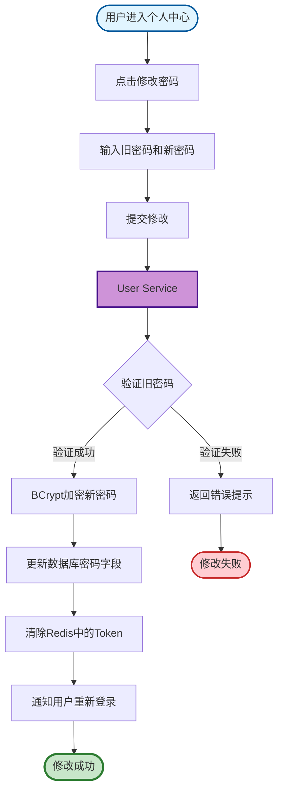

**流程说明：**

用户在个人中心点击修改密码后，需要输入旧密码和新密码并提交修改请求。User Service 接收到请求后，首先使用 BCrypt 算法验证旧密码是否与数据库中存储的加密密码匹配。若验证失败则返回错误提示；若验证成功，系统将使用 BCrypt 算法对新密码进行加密处理，然后更新数据库中的密码字段。为确保账户安全，系统会清除 Redis 中该用户的所有 Token，强制用户使用新密码重新登录，最后返回密码修改成功的结果

#### 数据库设计

**用户表(user)设计：**

| 字段名      | 类型         | 说明                      | 约束      |
| ----------- | ------------ | ------------------------- | --------- |
| id          | BIGINT       | 用户 ID                   | 主键,自增 |
| phone       | VARCHAR(11)  | 手机号                    | 唯一,非空 |
| password    | VARCHAR(100) | 加密后的密码              | 非空      |
| nickname    | VARCHAR(50)  | 昵称                      |           |
| avatar      | VARCHAR(255) | 头像 URL                  |           |
| role        | VARCHAR(20)  | 角色(USER/ADMIN/MERCHANT) | 默认 USER |
| status      | TINYINT      | 状态(0 禁用/1 启用)       | 默认 1    |
| create_time | DATETIME     | 创建时间                  |           |
| update_time | DATETIME     | 更新时间                  |           |

**收货地址表(user_address)设计：**

| 字段名     | 类型         | 说明         | 约束      |
| ---------- | ------------ | ------------ | --------- |
| id         | BIGINT       | 地址 ID      | 主键,自增 |
| user_id    | BIGINT       | 用户 ID      | 索引      |
| receiver   | VARCHAR(50)  | 收货人       | 非空      |
| phone      | VARCHAR(11)  | 联系电话     | 非空      |
| province   | VARCHAR(50)  | 省份         |           |
| city       | VARCHAR(50)  | 城市         |           |
| district   | VARCHAR(50)  | 区县         |           |
| detail     | VARCHAR(200) | 详细地址     |           |
| is_default | TINYINT      | 是否默认地址 | 默认 0    |

#### 关键技术实现

1. **安全性设计**：

   - 密码安全：使用 BCrypt 算法加密，cost=10，每个密码使用不同的盐值
   - Token 安全：使用 HS512 签名算法，密钥长度 512 位，Token 有效期 24 小时
   - 验证码安全：验证码存储在 Redis，有效期 5 分钟，同一手机号 60 秒内只能发送一次

2. **网关鉴权**：
   - 在 Spring Cloud Gateway 中实现全局过滤器，拦截所有请求
   - 验证 Authorization 请求头中的 JWT Token
   - 解析 Token 获取用户 ID 和角色，写入请求头传递给下游服务

---

### 1.2 商品浏览与搜索

#### 功能设计

商品浏览与搜索模块由 Product Service 提供核心支撑，为用户提供多维度的商品发现和查看能力。用户可以通过商品分类树形结构逐级浏览不同类目下的商品，也可以在搜索框中输入关键词对商品名称和描述进行模糊搜索。为了帮助用户快速定位目标商品，系统支持按价格区间、品牌等条件进行筛选，并可按综合评分、销量高低或价格升降等维度进行排序。当用户找到感兴趣的商品后，可以进入商品详情页查看完整的商品图片轮播、详细描述、规格参数、实时价格和当前库存等信息。同时，用户还可以浏览其他买家对该商品的评价和评分，作为购买决策的参考依据

#### 核心流程设计

##### 1.2.1 商品搜索流程

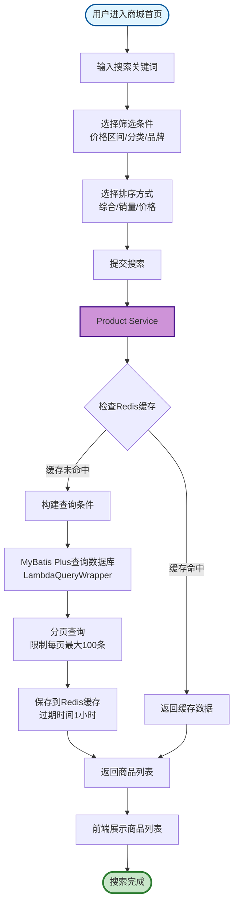

**流程说明：**

用户进入商城首页后，在搜索框输入关键词，并可选择价格区间、分类、品牌等筛选条件以及综合、销量、价格等排序方式。提交搜索请求后，Product Service 首先检查 Redis 缓存中是否存在匹配的查询结果。若缓存命中则直接返回缓存数据；若缓存未命中，则使用 MyBatis Plus 的 LambdaQueryWrapper 构建查询条件，对商品名称和描述进行模糊匹配，同时添加价格区间、分类、品牌等筛选条件。系统执行分页查询并限制每页最大返回 100 条记录以防止恶意查询，查询结果会被保存到 Redis 缓存中并设置 1 小时的过期时间。最终，商品列表返回给前端进行展示

##### 1.2.2 商品详情查看流程

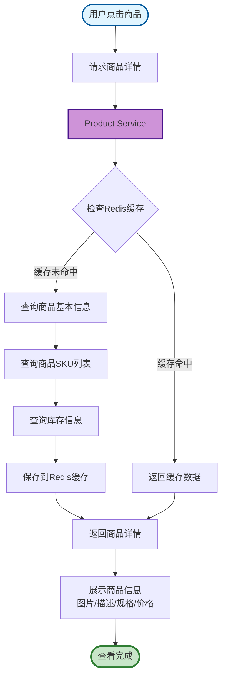

#### 数据库设计

**商品表(product)设计：**

| 字段名       | 类型         | 说明                | 约束      |
| ------------ | ------------ | ------------------- | --------- |
| id           | BIGINT       | 商品 ID             | 主键,自增 |
| product_name | VARCHAR(200) | 商品名称            | 非空      |
| category_id  | BIGINT       | 分类 ID             | 索引      |
| merchant_id  | BIGINT       | 商家 ID             | 索引      |
| brand        | VARCHAR(100) | 品牌                |           |
| description  | TEXT         | 商品描述            |           |
| main_image   | VARCHAR(255) | 主图                |           |
| images       | TEXT         | 轮播图(JSON 数组)   |           |
| status       | TINYINT      | 状态(0 下架/1 上架) | 默认 1    |
| create_time  | DATETIME     | 创建时间            |           |
| update_time  | DATETIME     | 更新时间            |           |

**商品 SKU 表(product_sku)设计：**

| 字段名     | 类型          | 说明           | 约束      |
| ---------- | ------------- | -------------- | --------- |
| id         | BIGINT        | SKU ID         | 主键,自增 |
| product_id | BIGINT        | 商品 ID        | 索引      |
| sku_name   | VARCHAR(200)  | SKU 名称       |           |
| sku_attrs  | TEXT          | SKU 属性(JSON) |           |
| price      | DECIMAL(10,2) | 价格           | 非空      |
| stock      | INT           | 库存           | 默认 0    |
| image      | VARCHAR(255)  | SKU 图片       |           |

#### 关键技术实现

1. **缓存策略**：

   - 热门商品缓存：使用 Redis 缓存热门商品信息，过期时间 1 小时
   - 缓存穿透防护：对不存在的商品也缓存空值，过期时间 5 分钟

2. **分页优化**：
   - 使用 MyBatis Plus 的 Page 分页插件
   - 限制每页最大数量为 100，防止恶意查询

---

### 1.3 购物车管理

#### 功能设计

购物车管理模块由 Cart Service 负责实现，采用 Redis 存储以提供高性能的购物车操作体验。用户在商品详情页选择具体的 SKU 规格和购买数量后，可以将商品加入购物车暂存。在购物车页面中，用户可以随时修改商品的购买数量、删除不需要的商品或一键清空整个购物车。系统会实时查询并展示当前用户购物车中的所有商品列表，包括商品图片、名称、规格、单价和小计金额等信息。当用户决定购买时，可以勾选需要结算的商品，点击结算按钮跳转到订单确认页面。特别地，为了提升用户体验，系统支持购物车同步功能：未登录时购物车数据暂存在浏览器本地，用户登录后系统会自动将本地购物车与服务器购物车进行合并，相同 SKU 的商品数量会累加

#### 核心流程设计

##### 1.3.1 添加购物车流程

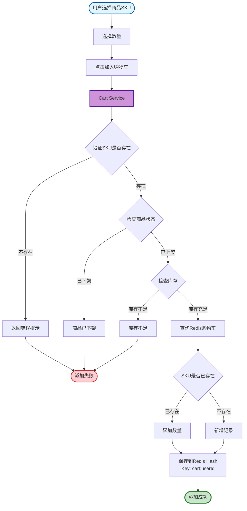

**流程说明：**

用户在商品详情页选择具体的 SKU 规格并设置购买数量后，点击加入购物车按钮触发添加请求。Cart Service 接收请求后，首先验证该 SKU 是否存在，若不存在则返回错误提示。接着检查商品状态，若商品已下架则提示用户商品已下架。随后验证库存是否充足，若库存不足则返回库存不足提示。验证通过后，系统查询 Redis 中该用户的购物车数据，判断是否已存在相同 SKU 的商品。若已存在则累加数量，若不存在则新增购物车记录。最终将购物车数据以 Hash 结构存储到 Redis 中，Key 为 cart:userId，Field 为 skuId，Value 为商品详细信息的 JSON 字符串，并返回添加成功的结果

##### 1.3.2 购物车同步流程

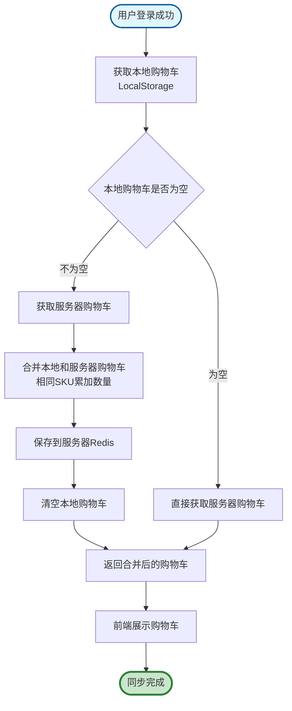

#### 数据库设计

购物车主要使用 Redis 存储，不使用 MySQL 持久化，以提高性能。

**Redis 数据结构：**

```
Key: cart:{userId}
Type: Hash
Field: skuId
Value: {
  "skuId": 1,
  "productId": 100,
  "productName": "iPhone 15",
  "skuName": "iPhone 15 黑色 128G",
  "price": 5999.00,
  "quantity": 2,
  "image": "http://xxx.jpg",
  "checked": true
}
```

#### 关键技术实现

1. **Redis Hash 结构**：

   - 使用 Hash 存储购物车，支持单个 SKU 的增删改查
   - Field 为 skuId，Value 为商品详细信息 JSON 字符串

2. **数据同步**：
   - 未登录时购物车存储在浏览器 LocalStorage
   - 登录后合并本地购物车到服务器 Redis

---

### 1.4 订单管理

#### 功能设计

订单管理模块是电商系统的核心环节，涉及 Order Service、Payment Service、Product Service 等多个微服务的协同配合。用户可以通过购物车结算或商品详情页的立即购买按钮创建订单，填写收货地址和选择支付方式后提交订单。订单创建成功后，系统会跳转到支付页面，用户需在规定时间内完成支付。在个人中心的订单列表中，用户可以按待付款、待发货、待收货、已完成等不同状态查询历史订单。点击具体订单可查看详细信息，包括订单中的商品明细、价格构成、收货地址以及物流跟踪信息。对于尚未支付的订单，用户可以主动取消以释放库存；对于已发货的订单，用户收到商品后可以点击确认收货完成交易，若用户未操作则系统会在发货 7 天后自动确认收货。此外，用户在订单完成后如遇到商品质量问题，还可以申请退款或退货等售后服务

#### 核心流程设计

##### 1.4.1 订单创建流程

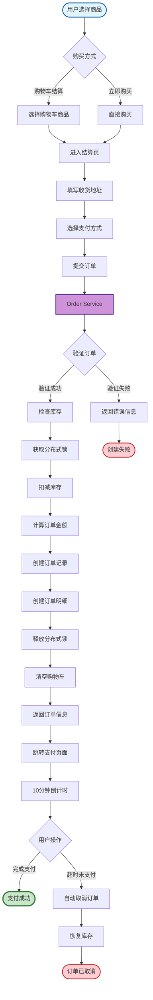

**流程说明：**

用户可以通过购物车结算或直接购买两种方式进入结算流程。在结算页面填写或选择收货地址、选择支付方式后提交订单。Order Service 接收请求后首先验证订单信息的有效性，包括验证收货地址是否存在、调用 Product Service 验证商品信息和价格是否正确。验证通过后，系统使用 Redisson 分布式锁锁定相关 SKU 并执行库存扣减操作，随后计算订单总金额（商品总额加运费减优惠），创建订单记录并设置状态为待支付，同时创建订单明细记录。完成后释放分布式锁并清空购物车中已下单的商品。系统返回订单信息并跳转至支付页面，开始 10 分钟支付倒计时。用户在规定时间内完成支付则订单状态更新为已支付；若超时未支付，系统将自动取消订单并恢复商品库存

##### 1.4.2 支付回调流程

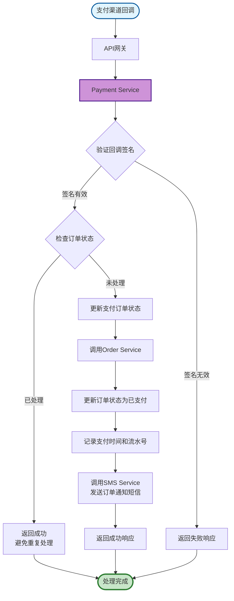

**流程说明：**

当用户在支付渠道完成支付后，支付渠道会向系统发起回调通知。回调请求经过 API 网关转发至 Payment Service，Payment Service 首先验证回调请求的签名是否有效，若签名无效则直接返回失败响应以防止恶意请求。签名验证通过后，系统检查订单当前状态以确保幂等性，若订单已处理过则直接返回成功响应避免重复处理。若订单尚未处理，Payment Service 更新支付订单状态为已支付，然后调用 Order Service 更新业务订单状态。Order Service 将订单状态更新为已支付，记录支付完成时间和第三方交易流水号，并调用 SMS Service 向用户发送订单支付成功的通知短信。所有操作完成后，系统向支付渠道返回成功响应

##### 1.4.3 订单状态流转

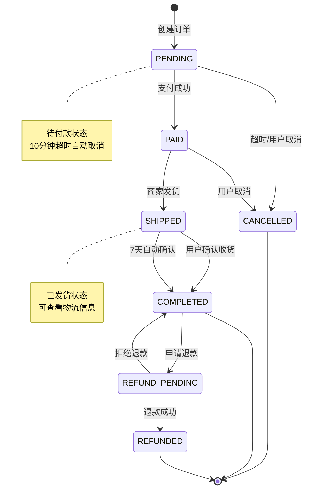


#### 数据库设计

**订单表(order)设计：**

| 字段名       | 类型          | 说明        | 约束      |
| ------------ | ------------- | ----------- | --------- |
| id           | BIGINT        | 订单 ID     | 主键,自增 |
| order_no     | VARCHAR(32)   | 订单号      | 唯一,非空 |
| user_id      | BIGINT        | 用户 ID     | 索引      |
| total_amount | DECIMAL(10,2) | 订单总额    | 非空      |
| status       | VARCHAR(20)   | 订单状态    | 非空      |
| address_id   | BIGINT        | 收货地址 ID |           |
| pay_time     | DATETIME      | 支付时间    |           |
| create_time  | DATETIME      | 创建时间    | 索引      |
| update_time  | DATETIME      | 更新时间    |           |

**订单明细表(order_item)设计：**

| 字段名       | 类型          | 说明     | 约束      |
| ------------ | ------------- | -------- | --------- |
| id           | BIGINT        | 明细 ID  | 主键,自增 |
| order_id     | BIGINT        | 订单 ID  | 索引      |
| sku_id       | BIGINT        | SKU ID   |           |
| product_name | VARCHAR(200)  | 商品名称 |           |
| sku_name     | VARCHAR(200)  | SKU 名称 |           |
| price        | DECIMAL(10,2) | 单价     |           |
| quantity     | INT           | 数量     |           |
| amount       | DECIMAL(10,2) | 小计     |           |

**支付订单表(payment_order)设计：**

| 字段名         | 类型          | 说明         | 约束      |
| -------------- | ------------- | ------------ | --------- |
| id             | BIGINT        | 支付订单 ID  | 主键,自增 |
| payment_no     | VARCHAR(32)   | 支付单号     | 唯一      |
| order_id       | BIGINT        | 业务订单 ID  | 索引      |
| amount         | DECIMAL(10,2) | 支付金额     |           |
| channel        | VARCHAR(20)   | 支付渠道     |           |
| status         | VARCHAR(20)   | 支付状态     |           |
| transaction_id | VARCHAR(64)   | 第三方交易号 |           |
| pay_time       | DATETIME      | 支付时间     |           |
| create_time    | DATETIME      | 创建时间     |           |

#### 关键技术实现

1. **分布式事务处理**：

   - 本地事务：单个服务内使用@Transactional 保证原子性
   - 分布式锁：库存扣减使用 Redisson 分布式锁，防止超卖
   - 幂等性设计：支付回调使用订单状态判断，防止重复处理
   - 补偿机制：订单取消时恢复库存，支付失败时回滚订单状态

2. **订单状态机**：
   - 待支付 → 已支付 → 待发货 → 已发货 → 已完成
   - 支持取消订单(待支付状态) → 已取消
   - 支持申请售后(已完成状态) → 售后中

---

## 二、商家用户功能模块

商家用户功能模块负责商家的商品发布、库存管理和订单处理等核心业务。

### 2.1 商家入驻

#### 功能设计

商家入驻模块由 Merchant Service 提供支持，为有意在平台开店的商家提供完整的入驻申请流程。商家首先需要在平台注册一个账号，然后进入入驻申请页面填写店铺名称、经营类目等基本信息。接下来，商家需要按照平台要求上传相关资质材料，包括营业执照、法人身份证正反面照片以及用于收款的银行账户信息。资料填写完整后，商家提交入驻申请，系统将申请记录保存并设置为待审核状态，同时通知平台管理员进行审核。在等待期间，商家可以随时登录系统查看审核进度和当前状态。若审核通过，商家即可开始上架商品进行经营；若审核未通过，商家可以根据管理员反馈的审核意见修改相关资料，然后重新提交申请

#### 核心流程设计

##### 2.1.1 商家入驻流程

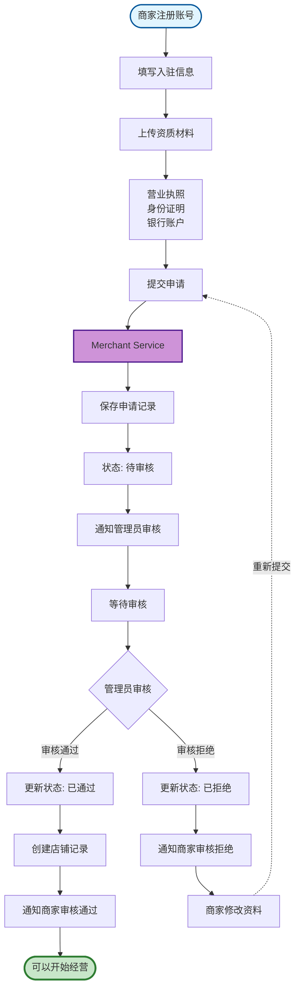

**流程说明：**

商家首先在平台注册账号，然后进入入驻申请页面填写店铺名称、经营类目等基本信息，并上传营业执照、法人身份证明、银行账户等资质材料。提交申请后，Merchant Service 将申请记录保存到数据库并设置状态为待审核，同时向管理员发送审核通知。商家进入等待状态，可以随时查看审核进度。管理员收到通知后登录后台系统进行审核，验证资质材料的真实性和合规性。审核通过则将状态更新为已通过，系统自动为商家创建店铺记录，并发送审核通过通知；审核拒绝则将状态更新为已拒绝，记录审核意见并发送拒绝通知。审核通过的商家可以登录商家后台开始经营，审核未通过的商家可以根据审核意见修改资料后重新提交申请

#### 数据库设计

**商家表(merchant)设计：**

| 字段名           | 类型         | 说明                       | 约束       |
| ---------------- | ------------ | -------------------------- | ---------- |
| id               | BIGINT       | 商家 ID                    | 主键,自增  |
| user_id          | BIGINT       | 关联用户 ID                | 唯一       |
| shop_name        | VARCHAR(100) | 店铺名称                   | 非空       |
| business_license | VARCHAR(255) | 营业执照图片               |            |
| id_card_front    | VARCHAR(255) | 身份证正面                 |            |
| id_card_back     | VARCHAR(255) | 身份证反面                 |            |
| bank_account     | VARCHAR(50)  | 银行账户                   |            |
| status           | VARCHAR(20)  | 状态(待审核/已通过/已拒绝) | 默认待审核 |
| audit_comment    | TEXT         | 审核意见                   |            |
| create_time      | DATETIME     | 创建时间                   |            |
| update_time      | DATETIME     | 更新时间                   |            |

#### 关键技术实现

1. **文件上传**：

   - 使用 OSS 对象存储服务存储资质图片
   - 限制文件大小和格式(JPG/PNG，最大 5MB)

2. **状态管理**：
   - 待审核 → 已通过/已拒绝
   - 已拒绝可修改后重新提交

---

### 2.2 商品与库存管理

#### 功能设计

商品与库存管理是商家最核心的功能模块，由 Product Service 提供全面支撑。在商品发布环节，商家需要创建商品 SPU（标准化产品单元），填写商品名称、选择所属分类、设置品牌、编写详细描述，并上传商品主图和轮播图。每个 SPU 下可以添加多个 SKU（库存量单位）来表示不同的规格组合，商家需要为每个 SKU 分别设置价格和初始库存。商品发布后，商家可以随时对商品信息、价格、图片等进行编辑修改。通过商品上下架功能，商家可以灵活控制商品的销售状态，下架的商品用户将无法浏览和购买。在库存管理方面，商家可以查询各 SKU 的实时库存、进行入库和出库操作、定期进行库存盘点以确保数据准确。系统还提供库存预警功能，当某个 SKU 的库存数量低于设定的阈值时，会自动发送预警通知提醒商家及时补货

#### 核心流程设计

##### 2.2.1 商品发布流程

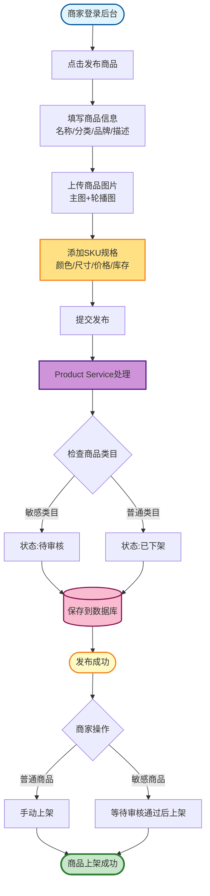

**流程说明：**

商家登录后台系统后，点击发布商品进入商品发布页面。首先填写商品基本信息，包括商品名称、选择分类、设置品牌、编写商品描述等。然后上传商品主图和最多 5 张轮播图，接着添加 SKU 规格，包括选择颜色、尺寸等规格属性，并为每个 SKU 设置价格和库存。提交发布后，Product Service 创建商品 SPU 和各 SKU 记录，并根据商品类目设置不同的初始状态。若属于需要平台审核的敏感类目，商品状态设置为待审核，需等待管理员审核通过后才能上架；若属于普通类目，状态设置为已下架，商家可以随时手动上架商品。商品上架后前端用户即可浏览和购买

##### 2.2.2 库存扣减流程


**流程说明：**

当用户提交订单时，Order Service 调用库存扣减接口启动库存扣减流程。系统首先尝试获取 Redis 分布式锁，锁的 Key 为 stock:lock:{skuId}，若获取失败则等待后重试，若获取成功则进入库存校验阶段。系统查询当前 SKU 的库存数量，判断是否满足订单需求。若库存不足，立即释放分布式锁并返回库存不足错误。若库存充足，则使用乐观锁机制（检查 version 字段）执行数据库库存扣减操作。若更新失败表示发生并发冲突，释放锁后返回冲突错误；若更新成功，则同步更新 Redis 缓存中的库存数据，并记录库存变动日志以便后续审计和问题追溯。最后释放分布式锁，返回扣减成功结果

#### 数据库设计

**库存记录表(stock_record)设计：**

| 字段名       | 类型         | 说明                           | 约束      |
| ------------ | ------------ | ------------------------------ | --------- |
| id           | BIGINT       | 记录 ID                        | 主键,自增 |
| sku_id       | BIGINT       | SKU ID                         | 索引      |
| type         | VARCHAR(20)  | 类型(入库/出库/盘点/扣减/回滚) |           |
| quantity     | INT          | 数量(正负数)                   |           |
| before_stock | INT          | 变动前库存                     |           |
| after_stock  | INT          | 变动后库存                     |           |
| operator     | VARCHAR(50)  | 操作人                         |           |
| remark       | VARCHAR(200) | 备注                           |           |
| create_time  | DATETIME     | 创建时间                       |           |

#### 关键技术实现

1. **SPU 与 SKU 设计**：

   - SPU(Standard Product Unit)：标准化产品单元，表示一个抽象的产品
   - SKU(Stock Keeping Unit)：库存量单位，表示具体的商品规格
   - 一个 SPU 可以有多个 SKU

2. **并发控制**：
   - 分布式锁：使用 Redisson 实现分布式锁，防止库存超卖
   - 乐观锁：在数据库表中增加 version 字段，更新时检查版本号
   - 缓存同步：每次库存变化后同步更新 Redis 缓存

---

### 2.3 订单处理

#### 功能设计

商家订单处理模块由 Order Service 提供核心能力，帮助商家高效管理店铺订单。商家登录后台后，可以按待发货、已发货、已完成等不同状态筛选查看订单列表，快速定位需要处理的订单。点击具体订单可以查看详细信息，包括用户购买的商品明细、购买数量、订单金额以及收货人姓名、电话和详细地址等信息。商家根据订单信息准备并打包商品后，需要在系统中填写物流公司名称和物流单号，点击确认发货将订单状态更新为已发货，系统会自动通知用户发货信息。发货后，商家可以通过物流跟踪功能查看包裹的配送进度。此外，当用户提交退款或退货申请时，商家可以在售后处理模块中查看申请详情并进行相应处理

#### 核心流程设计

##### 2.3.1 商家订单处理流程

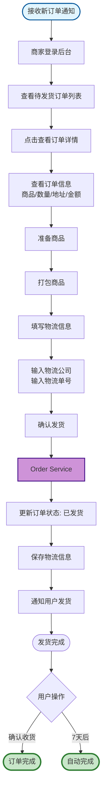

**流程说明：**

商家收到新订单通知后，登录商家后台查看待发货订单列表。点击某一订单进入详情页面，查看订单中的商品信息、购买数量、收货地址和订单金额等详细内容。商家根据订单信息准备商品并进行打包处理，然后将包裹交给物流公司。在系统中填写物流公司名称和物流单号，点击确认发货后，Order Service 将订单状态更新为已发货，并保存物流信息到数据库。系统自动向用户发送发货通知，用户可以通过物流单号查询物流进度。用户收到商品后可以点击确认收货完成订单，若用户未操作，系统将在发货 7 天后自动确认收货并完成订单

#### 数据库设计

**物流信息表(logistics)设计：**

| 字段名            | 类型        | 说明     | 约束      |
| ----------------- | ----------- | -------- | --------- |
| id                | BIGINT      | 物流 ID  | 主键,自增 |
| order_id          | BIGINT      | 订单 ID  | 唯一      |
| logistics_company | VARCHAR(50) | 物流公司 | 非空      |
| logistics_no      | VARCHAR(50) | 物流单号 | 非空      |
| create_time       | DATETIME    | 创建时间 |           |
| update_time       | DATETIME    | 更新时间 |           |

#### 关键技术实现

1. **订单通知**：

   - 新订单通过 WebSocket 实时推送给商家
   - 商家可以设置订单提醒

2. **物流跟踪**：
   - 集成第三方物流查询 API
   - 定时同步物流状态

---

## 三、管理员功能模块

管理员功能模块负责平台的运营管理、商家审核、系统监控等工作。

### 3.1 商家审核与管理

#### 功能设计

商家审核与管理是管理员最重要的职责之一，涉及 Admin Service 和 Merchant Service 两个微服务的协同工作。管理员的首要任务是对商家提交的入驻申请进行审核，仔细查阅商家上传的营业执照、身份证明、银行账户等资质材料，验证其真实性和合规性。审核完成后，管理员可以选择通过或驳回申请，并填写相应的审核意见反馈给商家。在日常管理中，管理员可以查看平台所有商家的列表，支持按审核状态、入驻时间等条件进行筛选。点击具体商家可以进入详情页面，全面了解该商家的资质信息、店铺运营情况、在售商品以及历史订单等数据。管理员还拥有商家状态管理权限，可以对违规或存在问题的商家账号进行冻结，问题解决后再予以解冻恢复正常经营。对于严重违规的商家，管理员可以根据平台规则进行警告、罚款甚至关店等处罚措施

#### 核心流程设计

##### 3.1.1 商家审核流程

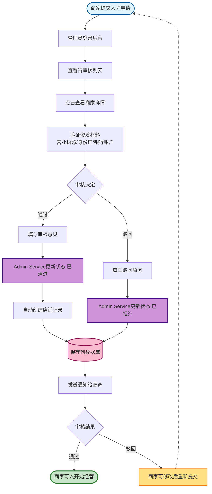

**流程说明：**

当商家提交入驻申请后，管理员登录后台系统查看待审核商家列表。点击某一申请进入详情页面，仔细查阅商家上传的资质材料，包括营业执照、法人身份证、银行账户等信息，验证其真实性和合规性。审核完成后，管理员根据验证结果选择通过或驳回，并填写相应的审核意见。Admin Service 根据审核结果更新商家状态：若审核通过，状态更新为已通过，系统自动为该商家创建店铺记录；若审核驳回，状态更新为已拒绝，并记录驳回原因。审核结果保存到数据库后，系统通过短信或站内消息向商家发送审核结果通知。审核通过的商家可以立即登录商家后台开始经营，审核未通过的商家可以根据驳回原因修改资料后重新提交申请

#### 数据库设计

**审核记录表(audit_log)设计：**

| 字段名      | 类型        | 说明                         | 约束      |
| ----------- | ----------- | ---------------------------- | --------- |
| id          | BIGINT      | 记录 ID                      | 主键,自增 |
| target_type | VARCHAR(20) | 审核对象类型(商家/商品/提现) |           |
| target_id   | BIGINT      | 审核对象 ID                  | 索引      |
| auditor     | VARCHAR(50) | 审核人                       |           |
| result      | VARCHAR(20) | 审核结果(通过/驳回)          |           |
| comment     | TEXT        | 审核意见                     |           |
| create_time | DATETIME    | 创建时间                     |           |

#### 关键技术实现

1. **分级审核**：

   - 初审：检查资料完备性和格式正确性
   - 复审：验证资质真实性和合规性

2. **通知机制**：
   - 审核结果通过短信通知商家
   - 驳回时说明驳回原因，商家可以修改后重新提交

---

### 3.2 订单管理

#### 功能设计

管理员订单管理模块涉及 Order Service 和 Payment Service，为平台运营提供全局订单监控和处理能力。管理员可以查看平台所有订单，支持按订单状态、下单时间、用户信息、所属商家等多维度条件进行筛选，快速定位目标订单。点击具体订单可以查看完整的订单信息，包括商品明细、价格构成、支付信息、物流状态、收货地址等全部数据。当用户提交退款申请后，管理员需要核实退款原因的合理性，审核通过后系统会调用支付服务将款项原路退回用户账户。管理员还可以通过订单统计功能查看平台的订单数量、交易金额、退款率等关键运营数据，为业务决策提供数据支撑。此外，管理员还需要处理各类异常订单，包括支付超时、买卖双方纠纷等情况，确保平台交易的正常进行

#### 核心流程设计

##### 3.2.1 订单退款处理流程

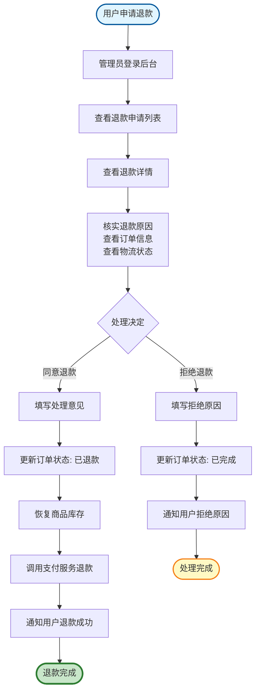

**流程说明：**

用户提交退款申请后，管理员登录后台系统查看退款申请列表。点击某一申请进入详情页面，仔细查看用户提交的退款原因，同时查阅订单商品信息和物流状态以核实退款请求的合理性。核实完成后，管理员根据实际情况做出处理决定。若同意退款，系统将订单状态更新为已退款，同时恢复相关商品的库存数量，然后调用 Payment Service 的退款接口将款项原路退回用户账户，并发送退款成功通知给用户。若拒绝退款，则将订单状态更新为已完成，填写拒绝原因并发送通知向用户说明情况

#### 数据库设计

**退款记录表(refund_record)设计：**

| 字段名      | 类型          | 说明                       | 约束       |
| ----------- | ------------- | -------------------------- | ---------- |
| id          | BIGINT        | 退款 ID                    | 主键,自增  |
| order_id    | BIGINT        | 订单 ID                    | 索引       |
| refund_no   | VARCHAR(32)   | 退款单号                   | 唯一       |
| amount      | DECIMAL(10,2) | 退款金额                   | 非空       |
| reason      | VARCHAR(200)  | 退款原因                   |            |
| status      | VARCHAR(20)   | 状态(待处理/已同意/已拒绝) | 默认待处理 |
| handler     | VARCHAR(50)   | 处理人                     |            |
| comment     | TEXT          | 处理意见                   |            |
| create_time | DATETIME      | 创建时间                   |            |
| update_time | DATETIME      | 更新时间                   |            |

#### 关键技术实现

1. **退款处理**：

   - 调用支付渠道退款 API
   - 记录退款流水号
   - 恢复商品库存

2. **数据统计**：
   - 使用 Redis 缓存统计数据
   - 定时任务同步统计数据到数据库

---

## 四、系统核心技术流程

### 4.1 库存扣减流程（防止超卖）

#### 功能设计

库存扣减是电商系统的核心功能之一，直接关系到用户下单体验和商家库存准确性。在高并发场景下，多个用户可能同时购买同一商品，如果没有完善的并发控制机制，就会出现超卖问题，即实际售出数量超过库存数量。为解决这一问题，系统采用 Redis 分布式锁配合数据库乐观锁的双重保障机制，确保在任意时刻只有一个请求能够成功扣减库存，同时通过 Redis 缓存同步机制保证库存数据的实时性和一致性

#### 核心流程设计

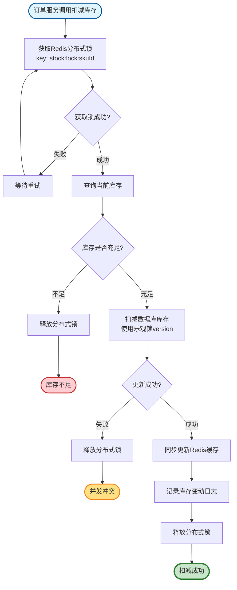

#### 关键技术实现

1. **分布式锁**：

   - 使用 Redisson 实现分布式锁
   - 锁的粒度为 SKU 级别，提高并发性能
   - 设置锁超时时间，防止死锁

2. **乐观锁**：

   - 在 product_sku 表增加 version 字段
   - 更新时检查 version，防止并发冲突

3. **缓存同步**：
   - 库存变化后立即更新 Redis 缓存
   - 缓存 Key: `stock:{skuId}`

---

### 4.2 支付回调处理流程

#### 功能设计

支付回调处理是连接第三方支付渠道与平台订单系统的关键环节。当用户在支付渠道完成支付后，支付渠道会向平台发送支付成功的回调通知。由于网络不稳定或其他原因，支付渠道可能会多次发送相同的回调请求，因此系统必须保证幂等性，即无论收到多少次相同的回调请求，都只会处理一次，避免重复更新订单状态或重复发送通知等数据异常问题。系统通过检查订单当前状态来实现幂等性控制，已处理过的订单会直接返回成功响应而不再重复处理

#### 核心流程设计

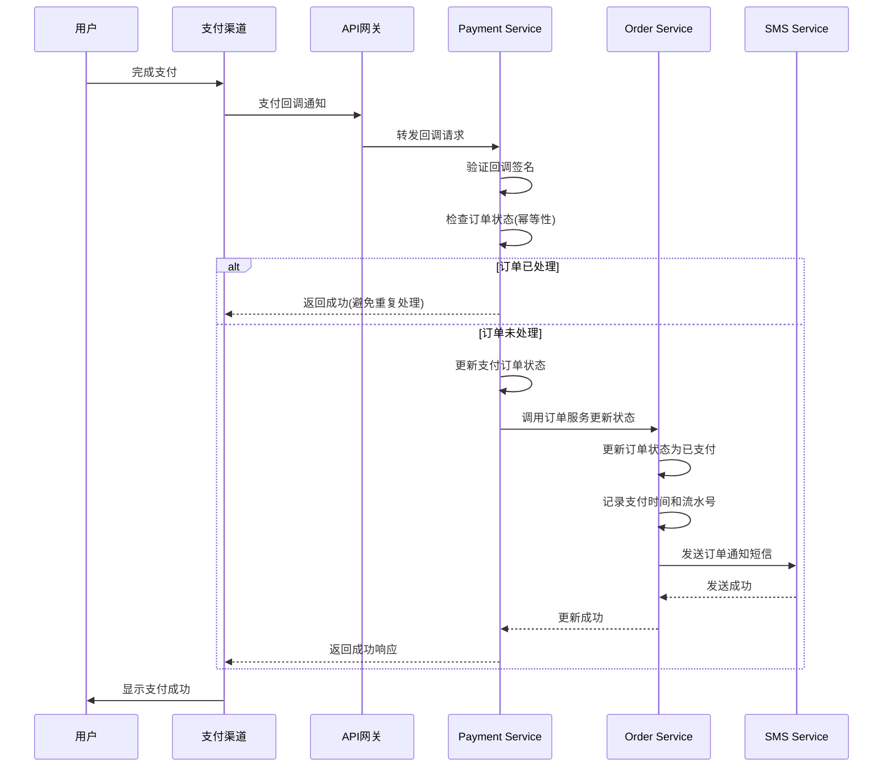

#### 关键技术实现

1. **签名验证**：

   - 验证支付渠道的回调签名
   - 防止恶意请求

2. **幂等性设计**：

   - 检查订单状态，已处理的订单直接返回成功
   - 使用数据库唯一约束防止重复处理

3. **异步通知**：
   - 使用消息队列发送短信通知
   - 提高响应速度

---

### 4.3 订单超时自动取消流程

#### 功能设计

订单超时自动取消功能是保障库存流转效率的重要机制。用户创建订单后会锁定相应的商品库存，如果用户长时间不支付，这些库存将被无效占用，影响其他用户的正常购买。为解决这一问题，系统通过定时任务自动扫描并取消超过 10 分钟未支付的订单。定时任务每 5 分钟执行一次，查询所有创建时间超过 10 分钟且状态仍为待付款的订单，将这些订单状态更新为已取消，同时恢复被占用的商品库存。为防止在分布式部署环境下多个服务实例重复执行，系统使用 Redis 分布式锁确保同一时间只有一个实例执行取消任务

#### 核心流程设计

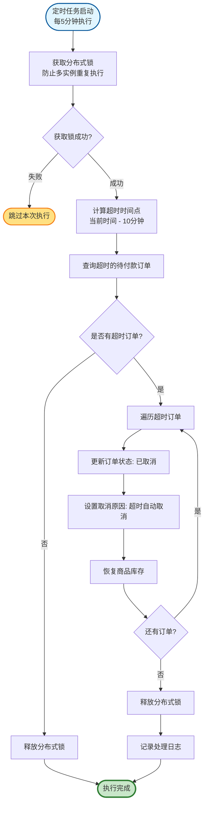

#### 关键技术实现

1. **定时任务**：

   - 使用 Spring @Scheduled 注解实现定时任务
   - 每 5 分钟执行一次

2. **分布式锁**：

   - 使用 Redis 分布式锁防止多实例重复执行
   - 锁的 Key: `order:cancel:lock`

3. **批量处理**：
   - 一次查询多个超时订单
   - 批量更新订单状态和恢复库存

---

## 五、微服务交互流程

### 5.1 完整订单生命周期交互

#### 功能设计

完整订单生命周期交互展示了从用户下单到订单完成的全流程中各微服务之间的协作关系。整个流程涉及 API 网关、Order Service、Product Service、Cart Service、Payment Service 等多个服务的协同工作。用户提交订单时，请求首先经过网关转发到订单服务，订单服务调用商品服务验证商品信息和价格、执行库存扣减，然后创建订单记录并清空购物车。支付环节由支付服务处理，支付成功后回调通知订单服务更新状态。随后订单服务通知商家发货，商家完成发货后用户确认收货，整个订单生命周期结束。这一流程充分体现了微服务架构下服务间通过 OpenFeign 进行 HTTP 调用、使用 Sentinel 实现熔断降级、通过 Sleuth 实现链路追踪的技术特点

#### 核心流程设计

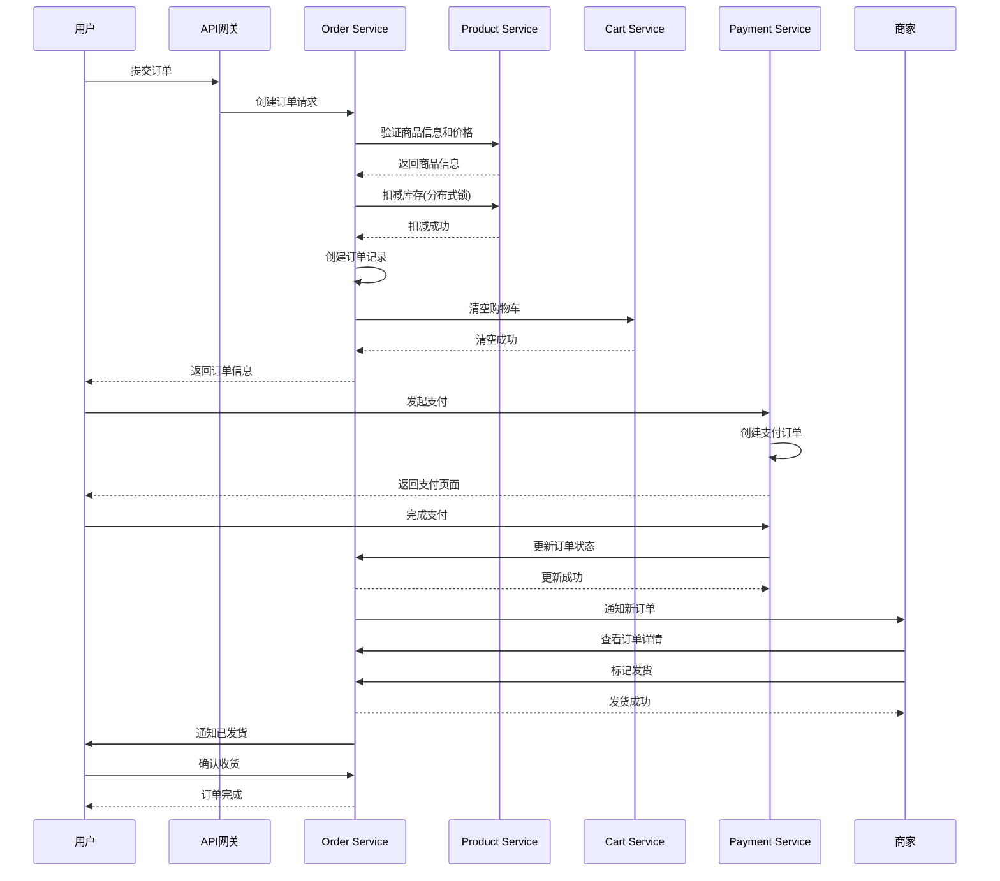

#### 关键技术实现

1. **服务间通信**：

   - 使用 OpenFeign 实现服务间 HTTP 调用
   - 使用 Ribbon 实现客户端负载均衡

2. **熔断降级**：

   - 使用 Sentinel 实现熔断降级
   - 防止服务雪崩

3. **链路追踪**：
   - 使用 Sleuth + Zipkin 实现分布式链路追踪
   - 方便问题排查

---

## 六、总结

### 6.1 普通用户功能模块总结

**核心功能：**

- 用户认证与账户管理：注册、登录、密码管理、个人信息管理、收货地址管理
- 商品浏览与搜索：分类浏览、关键词搜索、筛选排序、商品详情、商品评价
- 购物车管理：添加购物车、购物车编辑、购物车查询、购物车结算、购物车同步
- 订单管理：订单创建、订单支付、订单查询、订单详情、订单取消、确认收货、申请售后

**关键技术：**

- BCrypt 密码加密
- JWT Token 认证
- Redis 缓存
- MyBatis Plus 分页查询
- Redisson 分布式锁
- 支付回调幂等性设计

### 6.2 商家用户功能模块总结

**核心功能：**

- 商家入驻：注册账号、填写入驻信息、上传资质材料、提交审核、查看审核状态
- 商品与库存管理：商品发布、SKU 管理、商品编辑、商品上下架、库存管理、库存预警
- 订单处理：订单查询、订单详情、订单发货、物流跟踪、售后处理

**关键技术：**

- OSS 对象存储
- SPU 与 SKU 设计
- Redisson 分布式锁防止超卖
- 乐观锁版本控制
- WebSocket 实时推送

### 6.3 管理员功能模块总结

**核心功能：**

- 商家审核与管理：商家入驻审核、审核处理、商家列表、商家详情、商家状态管理、违规处理
- 订单管理：订单查询、订单详情、退款处理、订单统计、异常订单处理

**关键技术：**

- 分级审核机制
- 短信通知
- 退款 API 调用
- 数据统计与缓存

### 6.4 系统核心技术总结

**分布式事务：**

- 本地事务：@Transactional
- 分布式锁：Redisson
- 幂等性设计：订单状态判断
- 补偿机制：库存回滚

**高并发处理：**

- Redis 缓存
- 分布式锁
- 乐观锁
- 消息队列

**微服务架构：**

- Spring Cloud Gateway 网关
- OpenFeign 服务调用
- Sentinel 熔断降级
- Sleuth + Zipkin 链路追踪

---

## 文档信息

- **版本**: 2.0
- **创建日期**: 2025-12-02
- **更新日期**: 2025-12-04
- **作者**: lingbai
- **说明**: 本文档使用 Mermaid 语法绘制流程图，按照用户角色进行详细设计，包括功能设计、核心流程、数据库设计和关键技术实现。可在 GitHub、GitLab、Typora 等支持 Mermaid 的平台查看。
