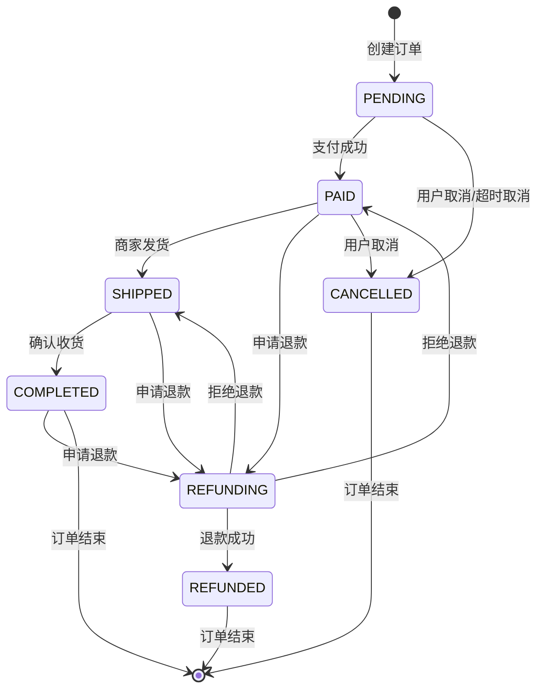

# 订单状态流程说明

## 订单状态定义

系统定义了以下订单状态：

### 后端枚举状态（order-service）

| 枚举名称 | code | 中文名称 | 说明 |
|----------|------|----------|------|
| PENDING | pending | 待付款 | 订单已创建，等待用户付款 |
| PENDING_PAYMENT | pending | 待付款 | PENDING 的别名 |
| PAID | paid | 已付款 | 用户已完成付款，等待商家发货 |
| SHIPPED | shipped | 已发货 | 商家已发货，商品在配送途中 |
| COMPLETED | completed | 已完成 | 用户已确认收货，订单完成 |
| CANCELLED | cancelled | 已取消 | 订单被取消（用户取消或系统自动取消） |
| REFUNDING | refunding | 退款中 | 用户申请退款，等待处理 |
| REFUND_PENDING | refund_pending | 退款待处理 | 退款申请已提交 |
| REFUNDED | refunded | 已退款 | 退款已完成 |

### merchant-service 数字状态码

merchant-service 的 `MerchantOrderServiceImpl.convertStatusToInt` 方法将枚举转换为数字：

| 数字状态码 | 枚举名称 | 前端状态 | 中文名称 | 颜色 |
|------------|----------|----------|----------|------|
| 0 | - | pending_payment | 待付款 | 橙色 |
| 1 | PENDING | pending_payment | 待付款 | 橙色 |
| 2 | PAID | pending_shipment | 待发货 | 蓝色 |
| 3 | SHIPPED | shipped | 已发货 | 青色 |
| 4 | - | completed | 已收货 | 绿色 |
| 5 | COMPLETED | completed | 已完成 | 绿色 |
| 6 | CANCELLED | cancelled | 已取消 | 红色 |
| 7 | REFUNDING | refunding | 待退款 | 橙色 |
| 8 | REFUNDED | refunded | 已退款 | 灰色 |

## 订单状态流程图



## 状态转换规则

### 1. 待付款 (PENDING)
- **可转换为**: PAID（支付成功）、CANCELLED（取消）
- **触发条件**: 
  - 用户完成支付 → PAID
  - 用户主动取消 → CANCELLED
  - 超时未支付（30分钟）→ CANCELLED

### 2. 已付款/待发货 (PAID)
- **可转换为**: SHIPPED（发货）、REFUNDING（申请退款）、CANCELLED（取消）
- **触发条件**:
  - 商家发货 → SHIPPED
  - 用户申请退款 → REFUNDING
  - 用户取消订单 → CANCELLED（需退款）

### 3. 已发货 (SHIPPED)
- **可转换为**: COMPLETED（确认收货）、REFUNDING（申请退款）
- **触发条件**:
  - 用户确认收货 → COMPLETED
  - 自动确认收货（15天）→ COMPLETED
  - 用户申请退款 → REFUNDING

### 4. 已完成 (COMPLETED)
- **可转换为**: REFUNDING（申请退款）
- **触发条件**:
  - 用户申请售后退款 → REFUNDING（7天内）
- **终态**: 是（正常流程终点）

### 5. 已取消 (CANCELLED)
- **可转换为**: 无
- **终态**: 是

### 6. 待退款 (REFUNDING)
- **可转换为**: REFUNDED（退款成功）、原状态（拒绝退款）
- **触发条件**:
  - 商家同意退款 → REFUNDED
  - 商家拒绝退款 → 恢复原状态

### 7. 已退款 (REFUNDED)
- **可转换为**: 无
- **终态**: 是

## 可能触发"未知"状态的场景

1. **后端返回 null 或 undefined**
   - 原因：数据库字段为空或查询异常
   - 处理：前端默认显示为"待付款"

2. **后端返回数字但映射表中没有对应值**
   - 原因：使用了旧版本的数字状态码
   - 处理：前端增加数字状态码映射

3. **后端返回新增的状态但前端未更新**
   - 原因：后端新增状态，前端未同步更新
   - 处理：记录警告日志，显示"未知"

4. **数据库中存储了非法状态值**
   - 原因：数据迁移错误或手动修改数据
   - 处理：数据库校验，前端容错处理

5. **状态字段类型不匹配**
   - 原因：后端返回的类型与预期不符（如数字vs字符串）
   - 处理：前端同时支持数字和字符串类型

## 状态颜色说明

| 状态 | 颜色 | 色值 | 含义 |
|------|------|------|------|
| 待付款 | 橙色 | #fa8c16 | 需要用户操作 |
| 待发货 | 蓝色 | #1890ff | 需要商家操作 |
| 已发货 | 青色 | #13c2c2 | 配送中 |
| 已完成 | 绿色 | #52c41a | 成功完成 |
| 已取消 | 红色 | #ff4d4f | 异常终止 |
| 待退款 | 橙色 | #fa8c16 | 等待退款处理 |
| 已退款 | 灰色 | #8c8c8c | 退款完成 |

## 前后端状态映射

### 后端枚举 → 前端状态

```javascript
const statusMap = {
  // 后端枚举名称（大写）
  'PENDING': 'pending_payment',
  'PENDING_PAYMENT': 'pending_payment',
  'PAID': 'pending_shipment',
  'SHIPPED': 'shipped',
  'COMPLETED': 'completed',
  'CANCELLED': 'cancelled',
  'REFUNDING': 'refunding',
  'REFUNDED': 'refunded'
}
```

### 数字状态码 → 前端状态

merchant-service 返回的数字状态码映射：

```javascript
const numericStatusMap = {
  0: 'pending_payment',    // 默认/未知状态
  1: 'pending_payment',    // PENDING - 待付款
  2: 'pending_shipment',   // PAID - 待发货（已付款）
  3: 'shipped',            // SHIPPED - 已发货
  4: 'completed',          // 已收货（兼容旧系统）
  5: 'completed',          // COMPLETED - 已完成
  6: 'cancelled',          // CANCELLED - 已取消
  7: 'refunding',          // REFUNDING - 待退款
  8: 'refunded'            // REFUNDED - 已退款
}
```

### 前端状态 → 后端枚举

```javascript
const statusMap = {
  'pending_payment': 'PENDING',
  'pending_shipment': 'PAID',
  'shipped': 'SHIPPED',
  'completed': 'COMPLETED',
  'cancelled': 'CANCELLED',
  'refunding': 'REFUNDING',
  'refunded': 'REFUNDED'
}
```

## 状态变更日志

系统会在以下情况记录状态变更日志：

1. 订单创建时记录初始状态
2. 每次状态变更时记录：
   - 变更时间
   - 原状态
   - 新状态
   - 操作人（用户/商家/系统）
   - 变更原因

日志格式示例：
```
[2025-12-29 10:30:00] 订单 ORD123456 状态变更: PENDING → PAID (用户支付)
[2025-12-29 11:00:00] 订单 ORD123456 状态变更: PAID → SHIPPED (商家发货)
[2025-12-29 15:00:00] 订单 ORD123456 状态变更: SHIPPED → COMPLETED (用户确认收货)
```
